# Dermatology — Revision Pearls

*(67 raw pearls consolidated into 44 — near-duplicates and fragments of the same pearl merged)*

---

## 1. Nevus Anemicus — The "Pharmacological" Nevus

**PEARL:** Nevus anemicus is due to localized vasoconstriction (hypersensitivity of vessels to catecholamines), not pigment loss. On diascopy, the lesion becomes indistinguishable from surrounding blanched skin. In vitiligo, melanin is lost, so the lesion stays paler.

**UNDERSTAND:** Press a glass slide on normal skin → blood is squeezed out → normal skin becomes as pale as the nevus → the border vanishes. Vitiligo has no melanin, so blanching cannot equalize it.

**MUST KNOW:**

- Rubbing/heat → surrounding skin flushes, lesion does **not** (no reactive hyperemia).
- Wood's lamp: vitiligo enhances (chalky white); nevus anemicus does **not**.
- Associated with NF1 and tuberous sclerosis.

**EXAM CONNECTION:** Differentiating hypopigmented macules — nevus anemicus (vascular), nevus depigmentosus (functional melanocyte defect), vitiligo (melanocyte destruction).

**REMEMBER:** *Nevus anemicus = pale because of vessels, not pigment — diascopy makes it disappear.*

---

## 2. Melanoma Susceptibility Gene

**PEARL:** CDKN2A on chromosome 9p21 is the best-established high-risk locus for melanoma susceptibility.

**MUST KNOW:**

- CDKN2A encodes p16(INK4a) and p14(ARF) → CDK4/6 inhibition; loss = unchecked cell cycle.
- Also causes familial atypical multiple mole–melanoma (FAMMM) syndrome, with pancreatic cancer risk.
- Low-penetrance risk gene: MC1R (red hair, fair skin).

**REMEMBER:** *CDKN2A (9p21) = familial melanoma gene; MC1R = red-hair risk gene.*

---

## 3. Syringoma

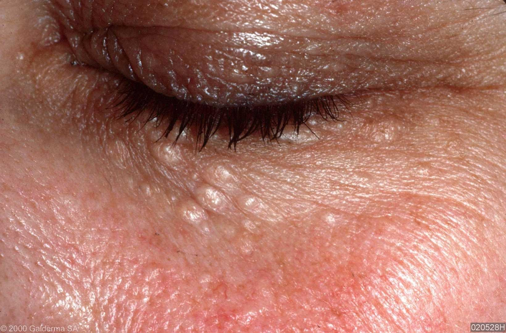

**PEARL:** Multiple skin/tan-colored, flat-topped papules — a benign tumor of eccrine sweat **ducts**.

**MUST KNOW:**

- Classic site: **lower eyelids** in young women; eruptive form on chest/thighs/vulva.
- Histology: **tadpole/comma-shaped** ducts in a sclerotic stroma.
- Increased frequency in **Down syndrome**.

**EXAM CONNECTION:** Don't confuse with **syringocystadenoma papilliferum** (verrucous plaque on scalp, arises in nevus sebaceus) — different entity despite similar names.

**REMEMBER:** *Syringoma = eyelid papules + tadpole ducts + Down syndrome.*

---

## 4. Systemic Sclerosis — Autoantibodies

**PEARL:**

- **Anticentromere (ACA)** → **limited** cutaneous SSc.
- **Anti-topoisomerase 1 (Scl-70)** and **anti-RNA polymerase III** → **diffuse** SSc.

**MUST KNOW:**

- Anti-Scl-70 → interstitial lung disease.
- Anti-RNA pol III → **scleroderma renal crisis** + malignancy association.
- ACA → pulmonary arterial hypertension (CREST).

**EXAM CONNECTION:** "Renal crisis" in the stem → RNA polymerase III. "Lung fibrosis" → Scl-70. "CREST/PAH" → centromere.

**REMEMBER:** *Centromere = limited/PAH; Scl-70 = lung; RNA Pol III = kidney.*

---

## 5. Systemic Sclerosis — Cutaneous Features

**PEARL:** Thickened, indurated skin (scleroderma) is the hallmark of systemic sclerosis; F:M = 4:1.

**MUST KNOW:**

- Hands/feet: Raynaud's, non-pitting edema, digital ulcers healing with **pitted scars**, sclerodactyly, contractures, acro-osteolysis.
- Face: mask-like facies, microstomia, telangiectasias, periorbital edema.
- **Salt-and-pepper appearance** = perifollicular pigment retention within depigmented skin (classic image question).
- 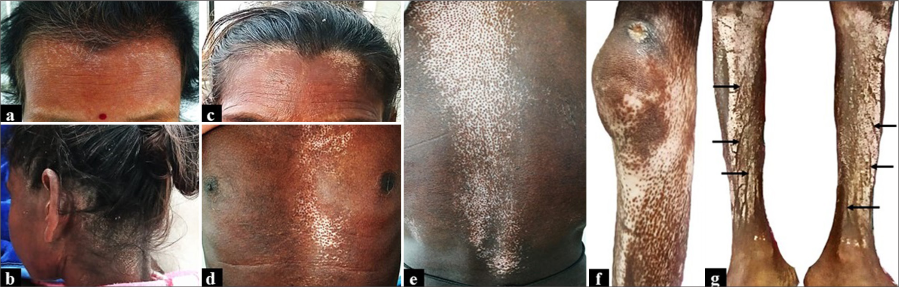
- Loss of sweat glands and hair over sclerotic skin.

**EXAM CONNECTION:** Raynaud's is usually the **first** symptom; abnormal nailfold capillaroscopy (dilated + dropout) distinguishes it from primary Raynaud's.

**REMEMBER:** *Tight shiny skin + Raynaud's + salt-and-pepper pigmentation = systemic sclerosis.*

---

## 6. Autosomal Recessive Congenital Ichthyosis (ARCI) Spectrum

**PEARL:** ARCI includes Harlequin ichthyosis, Bathing-suit ichthyosis, Lamellar ichthyosis, Congenital ichthyosiform erythroderma (CIE), Self-improving congenital ichthyosis, and the transient **collodion baby**.

**MUST KNOW:**

- Collodion baby = a *presentation*, not a diagnosis — the neonate is encased in a shiny parchment-like membrane.
- Ichthyosis vulgaris is **NOT** part of ARCI (it is autosomal dominant and absent at birth).
- Most ARCI genes: **TGM1** (commonest), ALOX12B, ABCA12.

**REMEMBER:** *Collodion baby → think ARCI; ichthyosis vulgaris is never present at birth.*

---

## 7. Lamellar Ichthyosis

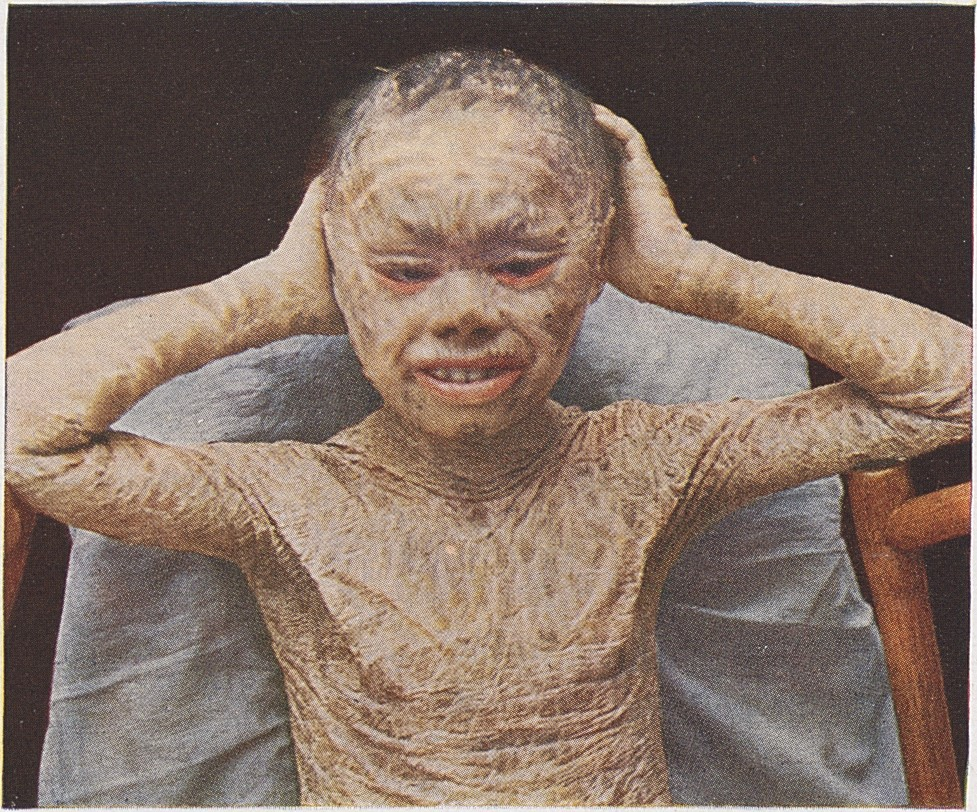

**PEARL:** ARCI due to **TGM1** (transglutaminase-1) mutation, with large plate-like **dark brown** scales over the whole body; mild palmoplantar involvement. Its opposite-end phenotype is CIE (erythroderma with fine white scale).

**MUST KNOW:**

- Presents as collodion baby → sheds into large plates.
- Ectropion and eclabium are common.
- Treatment: emollients, keratolytics, oral retinoids (acitretin).

**REMEMBER:** *Lamellar = big dark plates, TGM1; CIE = red skin, fine scale — two ends of one spectrum.*

---

## 8. Bathing Suit Ichthyosis

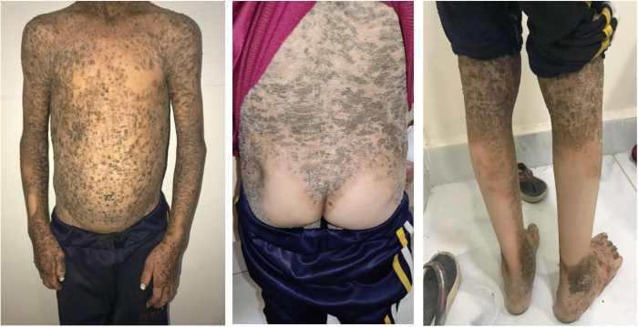

**PEARL:** A TGM1 (temperature-sensitive) variant of ARCI — starts as a collodion baby, then large dark scales affect **trunk and scalp, sparing face and extremities**, resembling a bathing suit.

**UNDERSTAND:** The mutant enzyme works at cooler peripheral temperatures but fails at warmer core body temperature — hence scaling confined to warm central areas, worse in summer, better in winter.

**REMEMBER:** *Bathing suit ichthyosis = temperature-sensitive TGM1 — hot trunk scales, cool limbs spared.*

---

## 9. Harlequin Ichthyosis

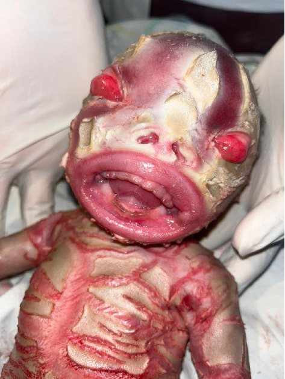

**PEARL:** The most severe ARCI — **ABCA12** mutation → armor-like thick truncal plates with deep fissures.

**MUST KNOW:**

- ABCA12 = lipid transporter for **lamellar body** formation in the stratum granulosum; defective lamellar bodies on EM are **pathognomonic**.
- Bilateral **ectropion + eclabium**, absent/rudimentary ears.
- Main cause of death: **respiratory failure** (restricted chest wall, alveolar collapse); also sepsis, dehydration, hypernatremia.
- Treatment: intensive supportive care + early **oral retinoids** (acitretin/etretinate) markedly improve survival.

**REMEMBER:** *Harlequin = ABCA12 + armor plates + ectropion/eclabium; dies of breathing, not skin.*

---

## 10. Ichthyosis Vulgaris

**PEARL:** The **commonest** ichthyosis — autosomal dominant, **filaggrin (FLG)** mutation. Not present at birth; appears in the first months of life.

**MUST KNOW:**

- Filaggrin aggregates keratin and generates natural moisturizing factor in the stratum corneum.
- Fine light-grey scales on **extensor** surfaces + trunk, with **flexural sparing**; hyperlinear palms and soles; keratosis pilaris.
- Strong association with **atopic dermatitis**, asthma, allergic rhinitis.
- Histology: **reduced/absent granular layer**; immunohistochemistry shows reduced filaggrin.

**EXAM CONNECTION:** Flexural **sparing** = ichthyosis vulgaris; flexural **involvement** = X-linked ichthyosis (steroid sulfatase deficiency, dark scales, neck involvement, corneal opacities, maternal failure of labour).

**REMEMBER:** *Filaggrin fails → dry extensors, hyperlinear palms, atopy; flexures spared.*

---

## 11. Genodermatoses with Defective DNA Repair + Photosensitivity

**PEARL:** Rothmund–Thomson syndrome and Cockayne syndrome are DNA-repair genodermatoses with photosensitivity.

**MUST KNOW:**

- Rothmund–Thomson: **RECQL4** helicase; poikiloderma, sparse hair, cataracts, **osteosarcoma** risk.
- Cockayne: defective transcription-coupled repair (ERCC6/8); cachectic dwarfism, "salt-and-pepper" retinopathy, premature aging — **no** increased skin cancer.
- Xeroderma pigmentosum: defective **nucleotide excision repair** → massive skin cancer risk.
- Bloom syndrome: BLM helicase; malar telangiectatic erythema, leukemia risk.

**EXAM CONNECTION:** Photosensitivity + **cancer** = XP/Bloom/Rothmund–Thomson. Photosensitivity **without** skin cancer = Cockayne.

**REMEMBER:** *XP = cancer, Cockayne = aging without cancer, Rothmund–Thomson = poikiloderma + osteosarcoma.*

---

## 12. Dowling–Degos Disease

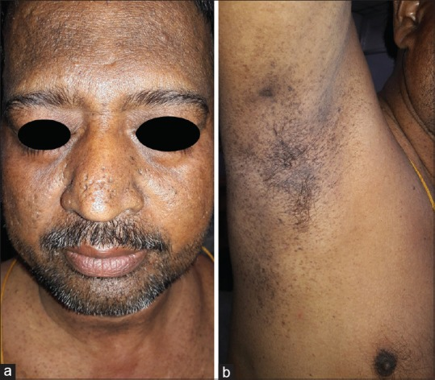

**PEARL:** Reticulate (lacy, net-like) hyperpigmentation, especially in **flexures***.

**MUST KNOW:**

- Autosomal dominant; **KRT5** mutation.
- Also comedo-like lesions and pitted perioral scars.
- Histology: filiform, antler-like downgrowth of pigmented rete ridges.
- 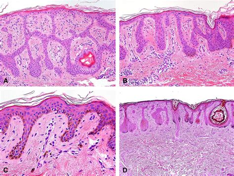

**EXAM CONNECTION:** Reticulate pigmentation differential — Dowling–Degos (flexural, AD), dyschromatosis symmetrica (dorsa of hands), Naegeli–Franceschetti–Jadassohn (with absent dermatoglyphics + hypohidrosis).

**REMEMBER:** *Dowling–Degos = KRT5, flexural fishnet pigmentation.*

---

## 13. Muir–Torre Syndrome

**PEARL:** Autosomal dominant **DNA mismatch repair** defect (MSH2 > MLH1, MSH6) = **sebaceous neoplasms + keratoacanthomas** with internal GI and genitourinary malignancy.

**MUST KNOW:**

- It is a **variant of Lynch syndrome** (HNPCC) — commonest internal cancer is **colorectal**, then endometrial/urothelial.
- MSH2 is the most frequently implicated gene.
- Any sebaceous adenoma/carcinoma outside the eyelid should trigger MMR immunohistochemistry.

**REMEMBER:** *Sebaceous tumour + colon cancer = Muir–Torre = skin Lynch.*

---

## 14. Hereditary Angioedema (HAE) — Genetics & Triggers

**PEARL:**

- Types I & II: **SERPING1** (C1-inhibitor) mutation, autosomal dominant, chromosome **11q12.1**.
- Type III (normal C1-INH): **gain-of-function F12** mutation in ~20%; oestrogen-dependent, female-predominant.
- All types are **aggravated by oestrogen** (OCPs, HRT) — **not** by NSAIDs.

**MUST KNOW:**

- Type I = low C1-INH level (85%); Type II = normal level, low function (15%).
- **C4 is low in all attacks** → best screening test; C1q low only in *acquired* angioedema (lymphoproliferative disease).
- **Bradykinin**-mediated → non-pruritic, non-urticarial swelling; **no response to antihistamines/steroids/adrenaline**.
- Acute treatment: C1-INH concentrate, icatibant (B2 blocker), ecallantide. Prophylaxis: danazol, tranexamic acid, lanadelumab.

**EXAM CONNECTION:** ACE inhibitor angioedema is also bradykinin-mediated — same non-response to antihistamines. NSAID/aspirin aggravation is a feature of **chronic urticaria**, not HAE.

**REMEMBER:** *HAE = bradykinin, low C4, oestrogen worsens, antihistamines useless.*

---

## 15. Dermatitis Herpetiformis (Duhring's Disease)

**PEARL:** Intensely itchy grouped vesicles on **extensor elbows and knees**; DIF shows **granular IgA deposits in the dermal papillae**. Antigen = **epidermal transglutaminase (TG3)**; associated HLA **DQ2/DQ8**.

**MUST KNOW:**

- Histology: **neutrophilic microabscesses at dermal papillary tips**, subepidermal split.
- Almost all have (usually silent) **celiac disease**; gluten-free diet is the definitive treatment.
- **Dapsone** gives dramatic itch relief within 24–48 h (does not treat gut disease).
- Also linked to autoimmune thyroid disease and intestinal lymphoma.

**EXAM CONNECTION:** **Granular** IgA in papillae = DH. **Linear** IgA along BMZ = linear IgA disease/chronic bullous disease of childhood (and drug-induced by **vancomycin**).

**REMEMBER:** *DH = itchy extensor vesicles + granular IgA + gluten + dapsone.*

---

## 16. Chronic Bullous Disease of Childhood

**PEARL:** Presents with bullae in a **"string of pearls" / cluster of jewels** arrangement (new blisters ringing an old lesion), classically perioral and perineal.

**MUST KNOW:**

- = Linear IgA disease of childhood; DIF shows **linear IgA** at the basement membrane zone.
- Antigen: LAD-1/BP180 fragment; treatment: **dapsone**.
- Adult drug-induced form: **vancomycin** (commonest culprit).

**REMEMBER:** *Cluster of jewels = linear IgA = child; vancomycin = adult.*

---

## 17. Buttonhole Sign — NF1

**PEARL:** In von Recklinghausen's disease (NF1), a neurofibroma can be invaginated into the subcutis with the fingertip and pops back out on release — the **buttonhole sign**.

**MUST KNOW:**

- Due to dermal defect/soft lax tumour; also seen in anetoderma.
- NF1 diagnostic criteria: ≥6 café-au-lait macules, ≥2 neurofibromas or 1 plexiform, axillary/inguinal **freckling (Crowe's sign)**, **Lisch nodules**, optic glioma, bony dysplasia, first-degree relative.
- Gene: **NF1** on **17q** (neurofibromin, a Ras-GAP). NF2 = **22q**, bilateral acoustic schwannomas.

**REMEMBER:** *Buttonhole neurofibroma + Crowe's sign + Lisch nodules = NF1 (17q).*

---

## 18. Types of Dermographism

**PEARL:**

- **Simple:** triple response — erythema → wheal → axon-reflex flare after stroking.
- **White:** vasoconstrictive white line on light stroking — pronounced in **atopic eczema**.
- **Black:** black streak from metallic (silver/gold) object deposit — not a true vascular reaction.
- **Cholinergic:** erythematous line studded with **punctate wheals** — in cholinergic urticaria.

**EXAM CONNECTION:** White dermographism is the atopy marker; symptomatic (red, itchy) dermographism is the commonest physical urticaria, treated with antihistamines.

**REMEMBER:** *White = atopic eczema; punctate wheals = cholinergic; black = metal rub.*

---

## 19. Cutaneous Malakoplakia

**PEARL:** Painless, progressive nodular/ulcerated yellow-erythematous plaques in an **immunosuppressed** patient, with **Michaelis–Gutmann bodies** on histology.

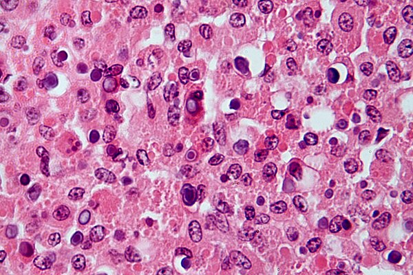

**UNDERSTAND:** Defective macrophage phagolysosomal killing (low cGMP) means ingested bacteria are not digested; calcium and iron deposit on the residue → laminated basophilic targetoid inclusions.

**MUST KNOW:**

- Commonest organism: **E. coli** (also Proteus); commonest site overall = **urinary tract**; cutaneous form favours perianal/genital skin.
- Classic setting: **renal transplant**/immunosuppression.
- Michaelis–Gutmann bodies: **PAS+, von Kossa+ (calcium), Perls+ (iron)**.
- "Malakoplakia" = soft plaque. Cells = von Hansemann histiocytes.

**REMEMBER:** *Soft yellow plaque + E. coli + targetoid Michaelis–Gutmann bodies = malakoplakia.*

---

## 20. Morphea and the "Box Sign"

**PEARL:** Morphea (localized scleroderma) shows the **"box sign"** — biopsy with squared-off edges ("boxed dermis") from dense collagen sclerosis extending through the reticular dermis into the subcutaneous septa.

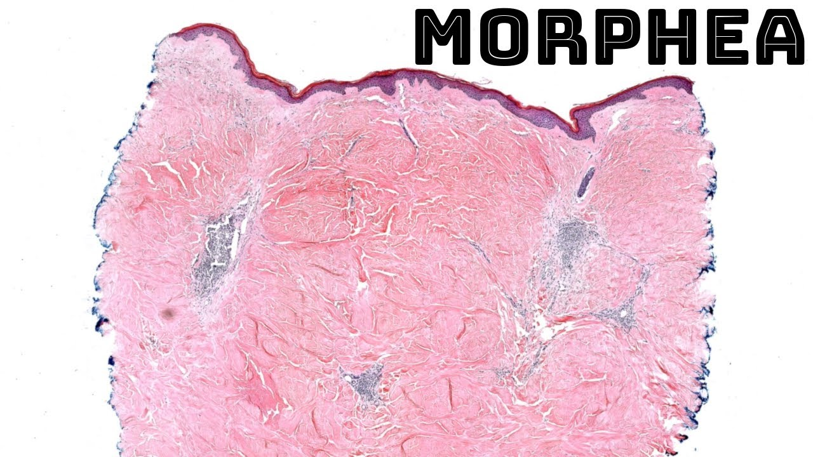
**MUST KNOW:**

- Histology: thickened horizontal collagen bundles, **loss of adnexa** (hair follicles, eccrine glands trapped/absent), fat replaced by collagen; epidermis normal or flattened.
- **No Raynaud's, no sclerodactyly, no internal organ involvement, no nailfold capillary changes** — this is what separates morphea from systemic sclerosis.
- Same squared-off edges may occur in morphea–lichen sclerosus overlap and scleredema.
- Treatment: topical steroids/tacrolimus for localized; phototherapy (UVA1/nbUVB) or **methotrexate ± systemic steroids** for extensive/rapidly progressive disease.

**EXAM CONNECTION:** Linear morphea of the forehead = *en coup de sabre (image below)*; associated with Parry–Romberg hemifacial atrophy.

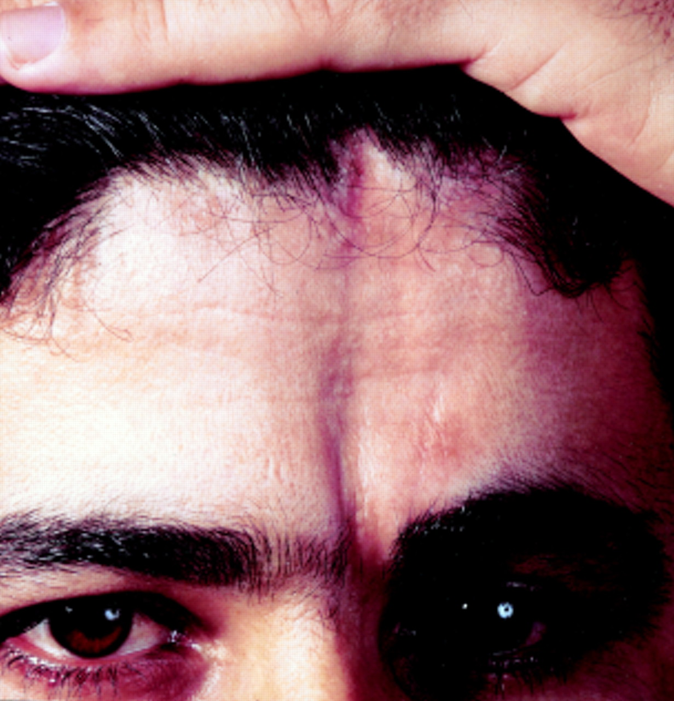

**REMEMBER:** *Box sign = morphea; morphea = skin only, no Raynaud's.*

---

## 21. Grenz Zone in Leprosy

**PEARL:** The Grenz zone (a narrow band of uninvolved papillary dermis just beneath the epidermis) is most prominent in **lepromatous leprosy**, because granulomas are scarce and do not fill that space. Also seen across the borderline spectrum.

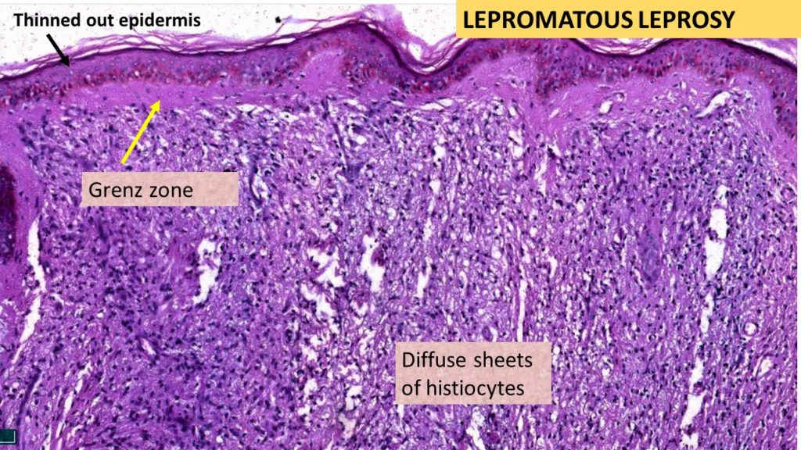

**MUST KNOW:**

- **Tuberculoid leprosy: Grenz zone is absent** — epithelioid granulomas erode the basal layer.
- Grenz zone is also classic in **granuloma faciale**, lepromatous leprosy, and B-cell pseudolymphoma/leukemia cutis.
- Lepromatous histology: foamy **Virchow (lepra) cells**, abundant bacilli, globi.

**REMEMBER:** *Grenz zone present = lepromatous; absent = tuberculoid.*

---

## 22. Leprosy — Nerve Involvement

**PEARL:** Caused by *Mycobacterium leprae*; the most commonly affected peripheral nerve is the **posterior tibial**, then **ulnar**, median, and lateral popliteal. The commonest **cranial** nerve involved is the **facial** nerve. Incubation 2–12 years.

**MUST KNOW:**

- Commonest presentation: hypopigmented/erythematous **anaesthetic** macule.
- Ulnar is the commonest nerve to be **clinically thickened/palpated**; posterior tibial is the commonest **involved** (and causes plantar trophic ulcers).
- Facial nerve involvement (zygomatic branch) → lagophthalmos; trigeminal → corneal anaesthesia.
- Nerve of predilection at sites of **cool temperature and superficial course**.

**EXAM CONNECTION:** Borderline leprosy classically gives lesions that **cross the midline** on the back with rash-like/annular morphology; pure neuritic leprosy is skin-lesion-free.

**REMEMBER:** *Posterior tibial = most involved; ulnar = most thickened; facial = commonest cranial.*

---

## 23. Follicular Psoriasis

**PEARL:** Follicle-based psoriasis on trunk and limbs, with lesions **smaller than guttate psoriasis**, occurring alone or with plaque psoriasis. In children it mimics **pityriasis rubra pilaris**.

**REMEMBER:** *Tiny follicular scaly papules in a child = follicular psoriasis, not PRP.*

---

## 24. Lichen Planus & Wickham Striae

**PEARL:** The 6 Ps — pruritic, purple, polygonal, planar, papules and plaques — topped by white lace-like **Wickham striae**, produced by focal **hypergranulosis**.

**MUST KNOW:**

- Histology: hyperkeratosis **without parakeratosis**, wedge-shaped hypergranulosis, **saw-tooth rete ridges**, band-like lymphocytic infiltrate, basal cell degeneration, **Civatte bodies**.
- Koebner phenomenon positive; heals with marked post-inflammatory hyperpigmentation.
- Associations: **hepatitis C**, drugs (antimalarials, thiazides, gold, β-blockers).
- Oral erosive LP has a small risk of squamous cell carcinoma.

**EXAM CONNECTION:** Lichenoid **drug** eruption favours parakeratosis + **eosinophils**, which classic LP lacks.

**REMEMBER:** *Wickham striae = hypergranulos+ Civatte bodies.*

---

## 25. Darier's Disease (Keratosis Follicularis)

**PEARL:** Autosomal dominant, **ATP2A2** mutation affecting the **SERCA2** calcium pump → greasy, warty hyperkeratotic papules in **seborrheic areas**. Neuropsychiatric features (depression, psychosis, intellectual disability) may occur.

**MUST KNOW:**

- Loss of calcium-dependent desmosomal adhesion → **acantholysis + dyskeratosis** (**corps ronds and grains**).
- 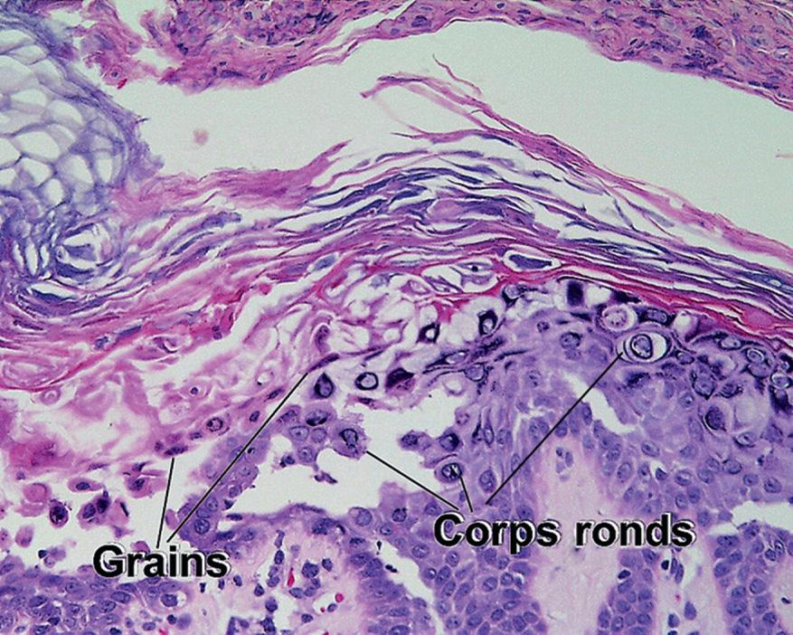
- Nails: **red and white longitudinal bands with V-shaped distal notching**; palmar pits.
- 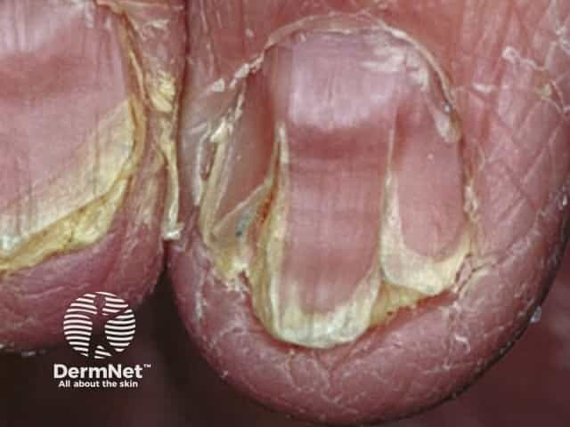
- Worsened by heat, sweating and **UV light**.
- Hailey–Hailey disease = **ATP2C1** (Golgi Ca²⁺ pump), flexural erosions, "dilapidated brick wall" acantholysis without much dyskeratosis.

**REMEMBER:** *Darier = ATP2A2/SERCA2, greasy papules, V-nicked nails, corps ronds.*

---

## 26. Pityriasis Rubra Pilaris (PRP)

**PEARL:** Salmon/orange-red scaly plaques that coalesce, leaving classic **"islands of sparing"**; commonest site is the trunk. Elbows/wrists show **nutmeg-grater** follicular papules, and there is thick orange-yellow palmoplantar keratoderma ("**keratotic sandal**"). Nails are thickened and distally discoloured with splinter hemorrhages.

**MUST KNOW:**

- Histology: **alternating ortho- and parakeratosis in a checkerboard pattern**, follicular plugging with a **"shoulder" of parakeratosis**, **dilated but non-tortuous** dermal capillaries, sparse lymphocytic infiltrate, focal acantholysis.
- Type I (classic adult) is commonest and often resolves in 1–3 years; type VI is HIV-associated.
- Treatment: **oral retinoids** (first line), methotrexate.

**EXAM CONNECTION:** Psoriasis vs PRP — psoriasis has **tortuous dilated** capillaries, confluent parakeratosis, Munro microabscesses, and **no** islands of sparing; PRP nails **do not pit**.

**REMEMBER:** *Islands of sparing + nutmeg grater + orange sandal keratoderma = PRP.*

---

## 27. Munro vs Pautrier

**PEARL:** **M**unro microabscess → **P**soriasis; **P**autrier microabscess → **M**ycosis fungoides. (Cross the letters.)

**MUST KNOW:**

- Munro = **neutrophils** in the stratum corneum; spongiform pustule of Kogoj = neutrophils in the stratum spinosum (also psoriasis).
- Pautrier = intraepidermal collections of **atypical CD4+ lymphocytes** with epidermotropism.

**REMEMBER:** *M in P, P in M.*

---

## 28. LAMB and NAME — Carney Complex

**PEARL:**

- **LAMB** = Lentigines, Atrial myxoma, Mucocutaneous myxomas, Blue nevi.
- **NAME** = Nevi, Atrial myxoma, Myxoid neurofibroma, Ephelides.
  Both are subsets of **Carney complex** — autosomal dominant, multiple neoplasms + pigmentary abnormalities.

**MUST KNOW:**

- Gene: **PRKAR1A** (17q).
- Endocrine: primary pigmented nodular adrenocortical disease (Cushing), GH-secreting pituitary adenoma, testicular large-cell calcifying Sertoli cell tumour.
- **Atrial myxoma** is the lethal component — echo screening is mandatory.

**EXAM CONNECTION:** Lentigines syndromes — Carney (myxomas), **Peutz–Jeghers** (perioral, GI polyps), **LEOPARD/Noonan with lentigines** (PTPN11), Laugier–Hunziker (acquired, benign).

**REMEMBER:** *Spotty skin + atrial myxoma + Cushing = Carney (PRKAR1A).*

---

## 29. Vitiligo — Definition and Types

**PEARL:** Acquired depigmentation from **autoimmune destruction of dopa-positive melanocytes** in the basal layer → milky-white, sharply demarcated macules.

**MUST KNOW:**

- **Segmental:** unilateral, band/dermatomal pattern, early onset, stabilizes fast, poor response to medical therapy — best for **surgical grafting**.
- **Non-segmental (generalized):** bilateral symmetrical macules, acrofacial or scattered; associated with other autoimmune disease (**thyroid** commonest) — screen TSH.
- **Acrofacial:** periorificial (eyes, lips) + acral (periungual, palms, soles); **therapy-resistant because of the absence of hair follicles** (follicular melanocyte reservoir supplies repigmentation).
- Repigmentation is typically **perifollicular** — hence hairy sites respond best; NB-UVB is the standard for extensive disease.

**EXAM CONNECTION:** Wood's lamp accentuates vitiligo (chalky/blue-white); leucotrichia indicates a poor prognosis.

**REMEMBER:** *No hair follicles = no melanocyte reservoir = acrofacial vitiligo resists treatment.*

---

## 30. Kyasanur Forest Disease

**PEARL:** Tick-borne hemorrhagic fever of **Karnataka** — abrupt fever, headache, conjunctivitis, myalgia, severe prostration, with **petechial** skin lesions and **NO eschar**.

**MUST KNOW:**

- Flavivirus; vector **Haemaphysalis spinigera** tick; monkeys are amplifying hosts ("monkey fever").
- Biphasic illness — second phase with meningoencephalitis.
- Vaccine (formalin-inactivated) available for endemic districts.

**EXAM CONNECTION:** **Eschar present** → scrub typhus / Indian tick typhus. **Eschar absent + petechiae + Karnataka** → KFD.

**REMEMBER:** *KFD = Karnataka monkey fever, petechiae, no eschar.*

---

## 31. Trichothiodystrophy

**PEARL:** Polarizing microscopy of hair shows **"tiger-tail" alternating light and dark bands**.

**MUST KNOW:**

- Sulphur-deficient brittle hair (low cysteine in keratin).
- Mnemonic **PIBIDS**: Photosensitivity, Ichthyosis, Brittle hair, Intellectual impairment, Decreased fertility, Short stature.
- Photosensitive form shares defective nucleotide excision repair with XP — but **no** increased skin cancer risk.

**REMEMBER:** *Tiger-tail hair = trichothiodystrophy = PIBIDS.*

---

## 32. Uncombable Hair Syndrome

**PEARL:** Hair has a **triangular cross-section with a longitudinal groove** along one side, making it stiff and unmanageable ("spun glass" hair).

**MUST KNOW:**

- Also called pili trianguli et canaliculi; needs **scanning EM/cross-section** to diagnose.
- Blond, dry, standing-away hair in a child; usually improves spontaneously by puberty.

**REMEMBER:** *Triangular grooved shaft = uncombable (spun-glass) hair.*

---

## 33. Menkes Kinky Hair Syndrome

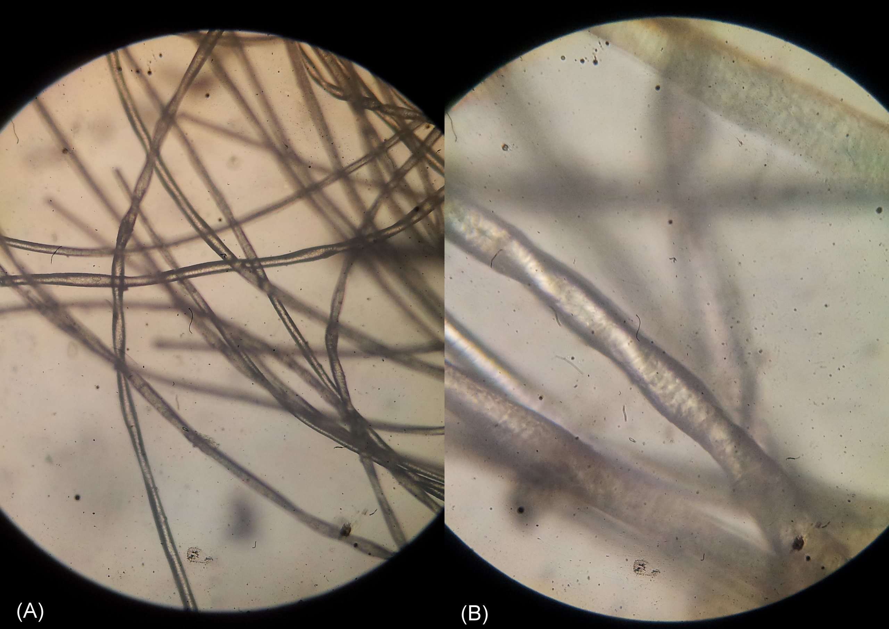

**PEARL:** X-linked recessive disorder of **copper metabolism** (ATP7A) showing **pili torti** (twisted hair) and monilethrix-like beading.

**MUST KNOW:**

- Copper is absorbed but trapped in enterocytes → **low serum copper and ceruloplasmin**.
- Failing cuproenzymes: lysyl oxidase (tortuous vessels, laxity), dopamine-β-hydroxylase, cytochrome-c oxidase → progressive neurodegeneration, seizures, hypothermia, wormian bones.
- Treatment: parenteral copper histidine, effective only if started very early.

**EXAM CONNECTION:** Menkes = copper **deficiency**; Wilson (ATP7B) = copper **overload**. Both have low ceruloplasmin.

**REMEMBER:** *Menkes = ATP7A, kinky pili torti hair, copper can't leave the gut.*

---

## 34. Trichorrhexis Nodosa

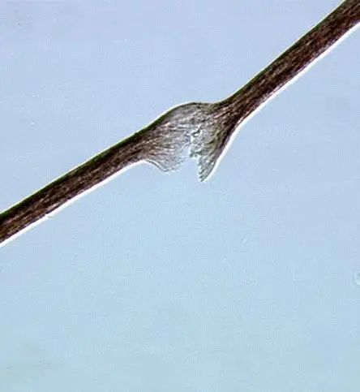

**PEARL:** Node formation with fracture of the hair shaft giving a **"two paintbrushes pushed together"** appearance; caused by trauma/chemical damage and by **argininosuccinic aciduria**.

**MUST KNOW:**

- The commonest hair shaft abnormality overall; usually acquired (heat, dye, straightening).
- Also seen in Menkes and biotin deficiency.

**REMEMBER:** *Paintbrush hair = trichorrhexis nodosa; if inherited, think argininosuccinic aciduria.*

---

## 35. Netherton Syndrome — Bamboo Hair

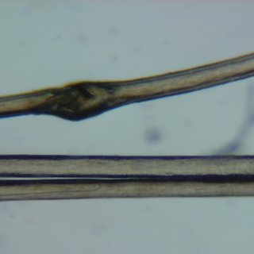

**PEARL:** **Trichorrhexis invaginata** (bamboo hair — distal shaft telescoped into the proximal shaft, "golf-tee"/ball-and-socket) + **ichthyosis linearis circumflexa** + atopy.

**MUST KNOW:**

- Autosomal recessive **SPINK5** mutation → loss of LEKTI protease inhibitor → unchecked epidermal protease activity.
- Presents with neonatal erythroderma, failure to thrive, hypernatremic dehydration, recurrent infections, very high IgE.
- **Avoid topical tacrolimus/calcineurin inhibitors** — a defective barrier causes toxic systemic absorption.

**REMEMBER:** *Bamboo hair + serpiginous double-edged scale + atopy = Netherton (SPINK5).*

---

## 36. Erythema Multiforme — Commonest Trigger

**PEARL:** Target lesions (including palms) — the commonest trigger is **infection, especially herpes simplex virus**.

**MUST KNOW:**

- Typical target = 3 zones, acral/extensor distribution, mucosa may be involved (EM major).
- *Mycoplasma pneumoniae* is the leading cause in **children**.
- Recurrent EM → suppressive **acyclovir**.
- **SJS/TEN is drug-induced** and pathogenetically distinct — dusky atypical targets, truncal onset, extensive mucosal involvement.

**REMEMBER:** *EM = HSV; SJS/TEN = drugs.*

---

## 37. Epidermolysis Bullosa

**PEARL:** A neonate blistering at sites of **friction**, with a family history and a sibling who died early → epidermolysis bullosa (genetically fragile skin blistering with minimal trauma).

**MUST KNOW:**

- **Simplex** — split within basal keratinocytes (KRT5/14), AD, heals **without scarring**.
- **Junctional** — split in lamina lucida (**laminin-332**); Herlitz type is lethal, with perioral granulation tissue.
- **Dystrophic** — split below lamina densa (**COL7A1**, anchoring fibrils); scarring, milia, mitten deformity, SCC risk.
- Diagnosis: skin biopsy with immunofluorescence antigen mapping / EM (defines the level of split).

**EXAM CONNECTION:** Level of blister determines scarring — the deeper the split, the more scarring. Acquired counterpart, **EB acquisita**, has autoantibodies to COL7.

**REMEMBER:** *Simplex = intraepidermal/no scar; Junctional = laminin-332/lethal; Dystrophic = COL7/scars.*

---

## 38. Berloque Dermatitis

**PEARL:** Acute **phototoxic** reaction to perfume — **5-methoxypsoralen (bergapten)** in bergamot oil potentiates UVA-stimulated melanogenesis → drip-shaped hyperpigmentation on the neck/behind the ears.

**MUST KNOW:**

- Phototoxic (dose-dependent, first exposure) — **not** allergic; needs UVA.
- Same psoralen mechanism as **phytophotodermatitis** (lime, celery, parsnip, fig — Rutaceae/Umbelliferae) and therapeutic PUVA.

**REMEMBER:** *Perfume + sun = bergapten pendant-shaped pigmentation.*

---

## 39. Layers of the Epidermis — Cell Residents

**PEARL:** Keratinocytes, **melanocytes**, and **Merkel cells** reside in the **stratum basale**. **Langerhans cells are NOT basal — they are predominantly in the stratum spinosum.**

**MUST KNOW:**

- Langerhans cells = bone-marrow-derived antigen-presenting dendritic cells; **CD1a+, S100+, Langerin (CD207)+**, contain **Birbeck granules** (tennis-racquet shaped).
- Melanocyte:basal keratinocyte ratio ≈ 1:10 (constant across races — racial colour differences are due to melanosome size/dispersion, not melanocyte number).
- Merkel cells = touch (slow-adapting type I) mechanoreceptors, **CK20+**.

**REMEMBER:** *Basal = Keratinocyte + Melanocyte + Merkel; Spinous = Langerhans.*

---

## 40. Granuloma Inguinale (Donovanosis)

**PEARL:** STI caused by *Klebsiella (Calymmatobacterium) granulomatis*; incubation **8–80 days, average ~50**.

**MUST KNOW:**

- Beefy-red, friable, painless ulcer that **bleeds easily**; **no regional lymphadenopathy** (pseudobuboes are subcutaneous granulomas).
- Diagnosis: **Donovan bodies** in macrophages on tissue smear (Giemsa/Wright); not cultured routinely.
- 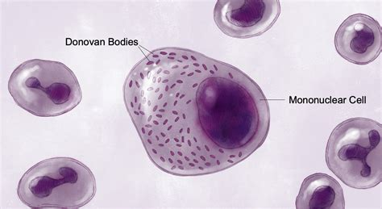
- Treatment: **azithromycin** (first line), doxycycline as an alternative, until healed.

**EXAM CONNECTION:** Painless genital ulcer — syphilis (clean, indurated, painless, **with** lymphadenopathy), donovanosis (beefy, bleeding, **no** nodes), LGV (transient ulcer, prominent groove sign nodes). Painful — chancroid, herpes.

**REMEMBER:** *Beefy bleeding painless ulcer + Donovan bodies + azithromycin.*

---

## 41. Classic Triads — Behçet, Reiter, Disseminated Gonococcal

**PEARL:**

- **Behçet:** recurrent oral aphthae + genital ulcers + uveitis.
- **Reiter (reactive arthritis):** arthritis + conjunctivitis + non-specific urethritis — follows *Chlamydia*, *Campylobacter*, *Salmonella*, *Shigella*, *Yersinia*.
- **Disseminated gonococcal infection:** tenosynovitis + dermatitis + migratory asymmetric polyarthralgia.

**MUST KNOW:**

- Behçet: **pathergy test** positive; HLA-**B51**; oral ulcers are the required criterion; Silk Route distribution.
- Reiter: HLA-**B27**; keratoderma blennorrhagicum (soles), circinate balanitis; "can't see, can't pee, can't climb a tree".
- DGI: few **pustular/hemorrhagic** skin lesions on distal limbs; blood cultures often negative — culture all mucosal sites; treat with ceftriaxone.

**REMEMBER:** *Behçet = mouth+genital+eye (B51); Reiter = joint+eye+urethra (B27); DGI = tendon+skin+joint.*

---

## 42. Flagellate Dermatitis

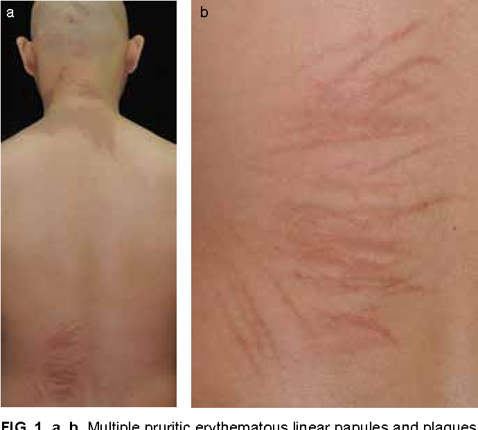

**PEARL:** Linear "whiplash" streaks of hyperpigmentation — caused by **bleomycin**.

**MUST KNOW:**

- Appears in scratched/pressure areas, dose-independent, may occur weeks after therapy.
- Other bleomycin skin toxicity: Raynaud's, digital gangrene, and its dose-limiting **pulmonary fibrosis**.
- Non-drug mimic: **shiitake mushroom** dermatitis.

**REMEMBER:** *Whiplash pigmentation = bleomycin (or shiitake).*

---

## 43. Roseola Infantum aka 6th disease & Nagayama Spots

**PEARL:** High fever, then a **rose-coloured morbilliform rash on the trunk** as fever breaks, with ulcers/erythematous papules at the **uvulopalatoglossal junction (Nagayama spots)** — roseola infantum.

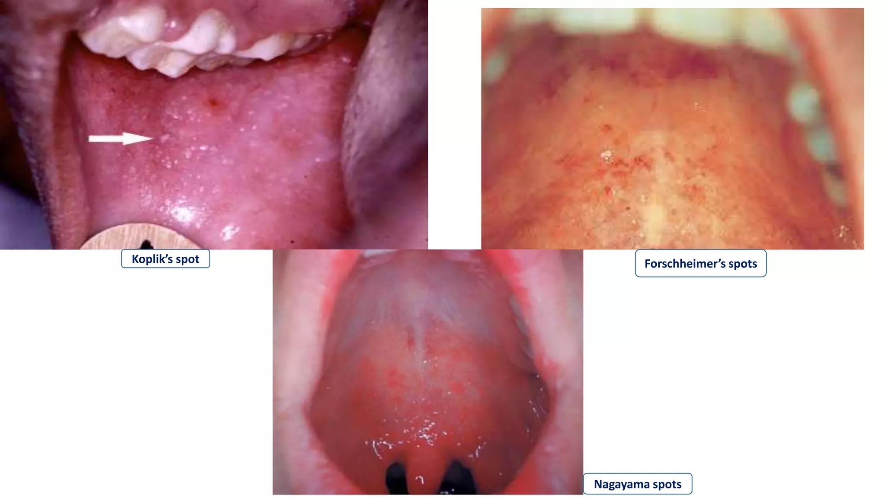

**MUST KNOW:**

- **HHV-6** (also HHV-7); infants 6 months–2 years.
- Commonest cause of **febrile seizures** in this age group; also causes a bulging fontanelle.
- Rash appears **after** defervescence — the key clue (in measles, rash appears **with** peak fever and Koplik spots precede it).

**REMEMBER:** *Fever falls, rash appears = roseola; Nagayama spots on the palate.*

---

## 44. Pitted Keratolysis

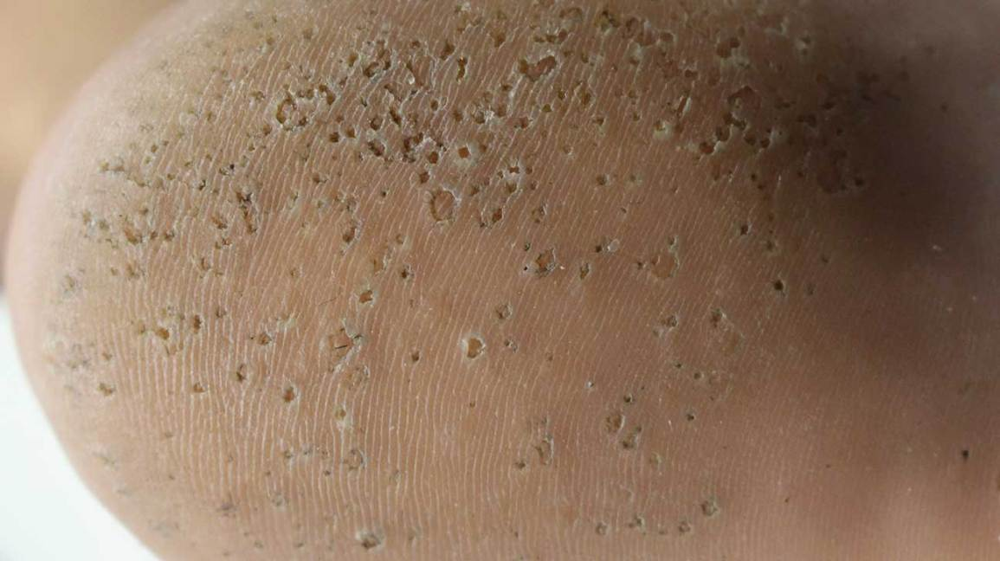

**PEARL:** Caused most commonly by ***Corynebacterium*** species, also *Kytococcus sedentarius* (and *Dermatophilus congolensis*).

**MUST KNOW:**

- Crater-like pits on **pressure-bearing soles** with hyperhidrosis and **malodour** (sulphur compounds); occlusive footwear is the trigger.
- Protease digestion of the stratum corneum creates the pits.
- Treatment: topical **clindamycin/erythromycin** or benzoyl peroxide + control of sweating (aluminium chloride).

**EXAM CONNECTION:** Other *Corynebacterium* skin diseases — **erythrasma** (coral-red Wood's lamp) and trichomycosis axillaris. Erythrasma fluoresces; pitted keratolysis does not.

**REMEMBER:** *Smelly sweaty pitted soles = Corynebacterium.*

---
