# ENT — Bookmark-Derived Pearls

*Distilled from bookmarked INI-CET / NEET-PG MCQs. Only high-yield, revisable learning points were kept; points already covered by the existing pearl collection were dropped.*

---

## 1. Conductive Hearing Loss — How Much Does Each Lesion Cost?

**PEARL:** **Ossicular discontinuity WITH AN INTACT DRUM causes the MAXIMUM conductive loss (~54–60 dB)** — more than the same discontinuity **with a perforation (~38 dB)**. Complete canal obstruction ~30 dB; TM perforation 10–40 dB; malleus fixation 10–25 dB; closure of the oval window ~60 dB.

**UNDERSTAND:** This looks paradoxical until you realise there are **two routes for sound to reach the cochlea**. With an intact drum but a broken ossicular chain, the intact membrane **blocks sound from reaching the round window directly**, so there is **no alternative pathway at all** — the loss is maximal. A perforation, by letting sound reach the round window, **paradoxically restores a little hearing**.

**MUST KNOW:**

- **The maximum possible conductive loss is ~60 dB** — the difference between ossicular (middle-ear) transmission and direct sound reaching the oval window. **An air–bone gap >60 dB means the loss is NOT purely conductive.**
- The middle ear achieves its ~**60 dB gain** by two mechanisms: the **AREAL RATIO of the tympanic membrane to the stapes footplate (~14–17:1, the major contributor)** and the **OSSICULAR LEVER ratio (~1.3:1)**, giving a **total transformer ratio of ~22:1**.
- **Perforation size and site matter:** **posterior perforations cause greater loss** (they expose the round window directly); larger perforations lose more.
- **Carhart's notch** — a dip in bone conduction at **2000 Hz** — is characteristic of **otosclerosis** and reverses after successful stapedectomy.
- **Otosclerosis** progresses from **partial to complete footplate fixation**; the classic triad is **progressive conductive loss, TINNITUS, and PARACUSIS WILLISII (hearing better in noisy surroundings)**, with a **positive Schwartze sign** (flamingo-pink promontory).

**EXAM CONNECTION:** "What causes maximum hearing loss?" → **malleus–incus discontinuity with an INTACT tympanic membrane**.

**REMEMBER:** *A broken chain behind an intact drum is the worst of both worlds — no ossicles and no back door.*

`Q9900`

---

## 2. Glomus Tumour of the Middle Ear

**PEARL:** **Pulsatile tinnitus + conductive hearing loss + an audible bruit over the mastoid** = **GLOMUS TUMOUR (paraganglioma)** — the commonest benign neoplasm of the middle ear, arising from **neural-crest-derived paraganglionic cells**. Otoscopic signs: **RISING SUN sign** (red mass behind an intact drum), **BROWN'S SIGN / PULSATION SIGN** (blanches on raising canal pressure with a Siegle's speculum). **PHELPS' SIGN is a CT finding, not otoscopic.**

**UNDERSTAND:** Brown's sign works because the tumour is a **highly vascular mass in direct contact with the drum** — increasing external canal pressure compresses its vessels, so it pulsates vigorously and then **blanches**. That single manoeuvre distinguishes it from a high jugular bulb or an aberrant carotid.

**MUST KNOW:**

- **Two types:** **GLOMUS TYMPANICUM** — from the promontory (Jacobson's nerve), aural symptoms ± facial palsy, and the **carotico-jugular spine is INTACT**. **GLOMUS JUGULARE** — from the dome of the jugular bulb, causing **IX–XII cranial nerve palsies (jugular foramen syndrome)** and **PHELPS' SIGN on CECT — erosion of the carotico-jugular crest/spine**.
- **"Rule of 10s": 10% familial, 10% multicentric, 10% functional (catecholamine-secreting).** **5× commoner in women**; peak in middle age.
- **Screen for catecholamine secretion (urinary VMA/metanephrines) before surgery** — an unrecognised secreting paraganglioma can cause an intraoperative hypertensive crisis. Associated with **SDHB/SDHD mutations**.
- **Investigation of choice: CECT + MRI ("salt-and-pepper" appearance from flow voids) and angiography**; **BIOPSY IS CONTRAINDICATED — torrential haemorrhage.** Treat with **preoperative embolisation then surgery**, or radiotherapy.
- **Differential for pulsatile tinnitus:** glomus tumour, **high/dehiscent jugular bulb, aberrant internal carotid artery, AV malformation, idiopathic intracranial hypertension, and severe anaemia/thyrotoxicosis**.

**EXAM CONNECTION:** "All can be seen on OTOSCOPY except" → **Phelps' sign** (that is CT).

**REMEMBER:** *Red mass rising behind the drum that pulsates then blanches — never biopsy it.*

**IMAGES:**
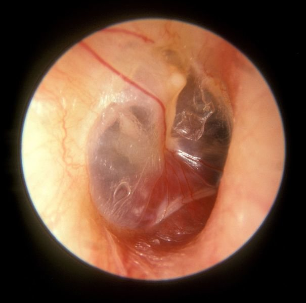

`Q9907, Q10007`

---

## 3. Referred Otalgia — Match the Nerve

**PEARL:** The ear receives sensation from **four cranial nerves (V, VII, IX, X) and C2–C3** — so pain from anywhere in their territories is referred to the ear with a **normal ear examination**. **Tonsil/tonsillar fossa → GLOSSOPHARYNGEAL (Jacobson's tympanic branch)**. **Vallecula, larynx, hypopharynx, oesophagus → VAGUS (Arnold's auricular branch)**.

**UNDERSTAND:** **A patient with severe otalgia and a completely normal ear must have a referred cause** — and the referring nerve tells you where to look. This is the single most useful clinical rule in ENT, because it converts an ear complaint into a **search for a head-and-neck malignancy**.

**MUST KNOW:**

- **Nerve → source map:** **V (auriculotemporal)** — teeth, TMJ (Costen syndrome), oral cavity, parotid, sinuses. **VII (nervus intermedius)** — geniculate herpes (**Ramsay Hunt**). **IX (Jacobson's)** — tonsil, tonsillar fossa, **post-tonsillectomy**, base of tongue, nasopharynx, **elongated styloid process (EAGLE SYNDROME)**. **X (Arnold's)** — larynx, hypopharynx, **vallecula, pyriform fossa**, oesophagus, and even **impacted cerumen or a foreign body touching the canal (Arnold's cough reflex)**. **C2–C3 (great auricular, lesser occipital)** — cervical spine disease.
- **The clinical imperative: persistent unilateral otalgia with a NORMAL ear in an adult SMOKER/tobacco chewer demands full ENT endoscopy to exclude a hypopharyngeal or laryngeal carcinoma.** Referred otalgia may be the **only** symptom of a supraglottic or pyriform fossa tumour.
- **Eagle syndrome** — elongated styloid process (>3 cm) or ossified stylohyoid ligament → throat pain on turning the head, referred otalgia, dysphagia.
- **Arnold's reflex** — coughing on ear syringing/cleaning, from vagal stimulation of the canal.

**EXAM CONNECTION:** The site in the stem names the nerve — **tonsil = IX, vallecula/larynx = X**.

**REMEMBER:** *Ear pain with a normal ear means look elsewhere — tonsil is IX, larynx is X, teeth and TMJ are V.*

**IMAGES:**
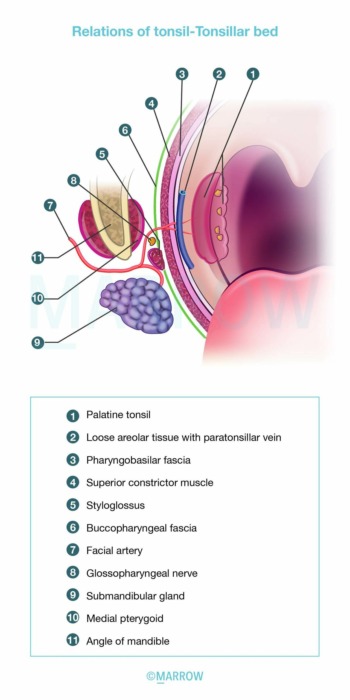
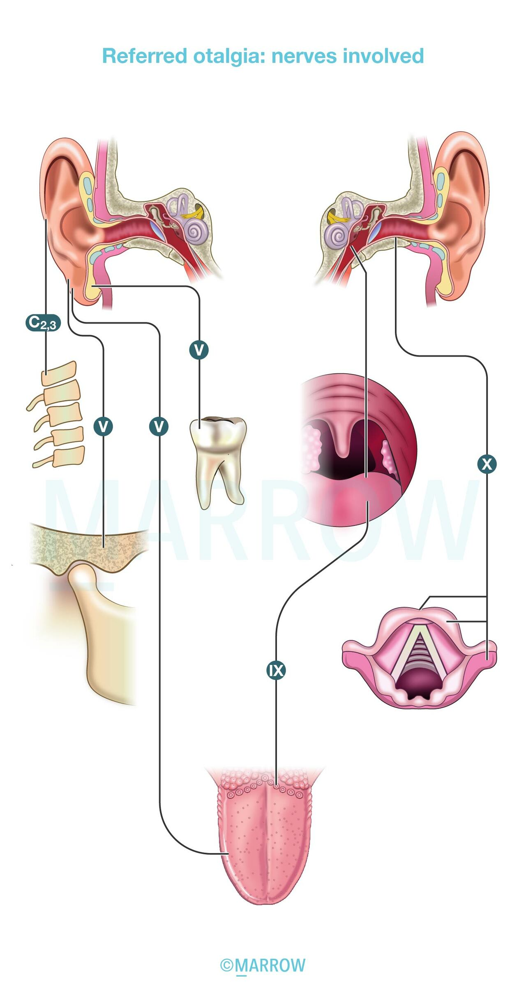

`Q9909, Q10048`

---

## 4. Occupational Sinonasal Malignancy

**PEARL:** **WOODWORKERS and furniture-industry workers develop ADENOCARCINOMA**, typically of the **ETHMOID sinus and upper nasal cavity**. **NICKEL refiners develop SQUAMOUS CELL and ANAPLASTIC carcinoma.**

**UNDERSTAND:** Hardwood dust particles deposit preferentially in the **ethmoid region and olfactory cleft** because of the airflow pattern there, and they impair mucociliary clearance — so the carcinogen sits in prolonged contact with **glandular (adenomatous) epithelium**, producing an adenocarcinoma rather than the squamous cancers seen elsewhere in the airway.

**MUST KNOW:**

- **Overall, squamous cell carcinoma is the commonest sinonasal malignancy** and the **MAXILLARY sinus is the commonest site** — but the **occupational associations above are what get examined**.
- **Other occupational/aetiological links:** **chrome and isopropyl alcohol → SCC**; **radium dial painters → osteosarcoma**; **thorotrast**; **HPV**; and **inverted papilloma** (which has a ~10% risk of harbouring or developing SCC and a high recurrence rate — hence wide excision).
- **Red flags for sinonasal malignancy:** **UNILATERAL nasal obstruction with blood-stained discharge**, epistaxis, facial swelling or numbness (**infraorbital nerve — V2**), loosening of teeth, proptosis and diplopia. **Unilateral symptoms in an adult are malignancy until proven otherwise.**
- **Ohngren's line** (medial canthus to angle of mandible) divides maxillary tumours into **suprastructure (poor prognosis — orbit and skull base) and infrastructure (better)**.
- **Sinonasal undifferentiated carcinoma and olfactory neuroblastoma (esthesioneuroblastoma — from olfactory epithelium, Kadish staging)** are the other important entities.

**EXAM CONNECTION:** "Carpenter with sinonasal carcinoma — histology?" → **adenocarcinoma**.

**REMEMBER:** *Wood dust makes adenocarcinoma in the ethmoid; nickel makes squamous cancer.*

`Q9917`

---

## 5. Juvenile Nasopharyngeal Angiofibroma

**PEARL:** An **adolescent MALE with recurrent profuse EPISTAXIS and progressive nasal obstruction**. **Radkowski staging: IA — nose/nasopharyngeal vault only · IB — extension into ≥1 SINUS · IIA — minimal pterygopalatine fossa · IIB — full pterygopalatine fossa ± orbital bone erosion · IIC — infratemporal fossa · IIIA/B — skull base erosion with intracranial extension.**

**UNDERSTAND:** JNA is **benign histologically but locally aggressive and extremely vascular**, arising near the **sphenopalatine foramen**. Its growth pattern — pushing into the pterygopalatine then infratemporal fossa — is what the staging tracks, and it determines the surgical approach.

**MUST KNOW:**

- **BIOPSY IS ABSOLUTELY CONTRAINDICATED** — catastrophic haemorrhage. **Diagnosis is radiological: CECT/MRI plus angiography.**
- **The pathognomonic radiological sign is the HOLMAN–MILLER SIGN** — anterior bowing of the posterior wall of the maxillary antrum.
- 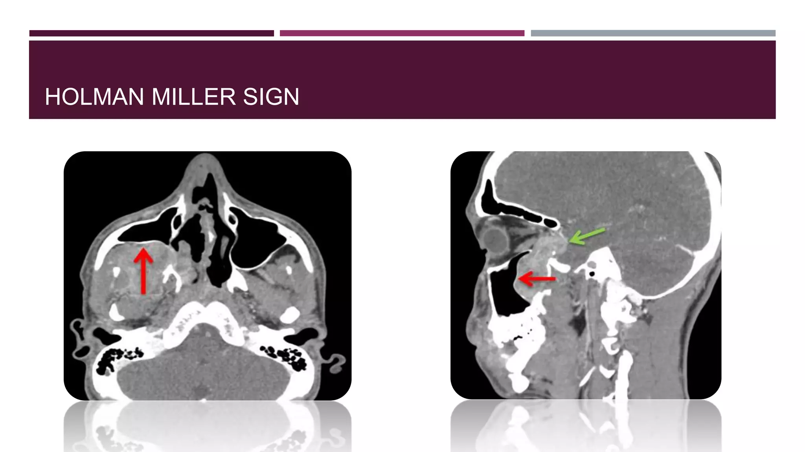
- **Blood supply: internal maxillary artery (a branch of the external carotid)** — hence **PREOPERATIVE EMBOLISATION 24–48 hours before surgery** to reduce blood loss. Watch for internal carotid supply in advanced tumours.
- **It occurs almost exclusively in males aged 10–25** — a testosterone-dependent tumour. **A "JNA" in a female should prompt a karyotype.**
- **Treatment is surgical excision** (endoscopic for early stages); radiotherapy for intracranial/unresectable disease. **Recurrence is common** if residual tumour is left at the pterygoid base.
- **The other staging system is FISCH**; both are used, so learn Radkowski's IA/IB split (nose only vs sinus involvement) since that is what is tested.

**EXAM CONNECTION:** The stem specifies **extent** — sinus involvement without lateral spread = **IB**.

**REMEMBER:** *Teenage boy, torrential epistaxis, Holman–Miller sign — image and embolise, never biopsy.*

`Q9925`

---

## 6. Paranasal Sinus Mucocele

**PEARL:** A **slow-growing, mucus-filled, epithelium-lined expansile cyst** from **chronic obstruction of the sinus ostium** — often **years after trauma or surgery**. The **FRONTAL sinus is the commonest site** (frontal > ethmoid > maxillary > sphenoid), presenting with **headache, NON-AXIAL PROPTOSIS, diplopia** and a **cystic swelling with EGGSHELL CRACKLING**.

**UNDERSTAND:** Trapped secretions accumulate under pressure and **remodel and thin the surrounding bone** — so the mass **displaces the globe rather than pushing it straight forward**, giving **non-axial (eccentric) proptosis**, which points to an **extraconal lesion**. Axial proptosis, by contrast, suggests an intraconal mass (e.g. optic nerve glioma, cavernous haemangioma).

**MUST KNOW:**

- **CT is diagnostic:** a **homogeneous, expansile, non-enhancing lesion with bone remodelling/thinning** (rather than the destruction of a malignancy).
- **A mucocele that becomes infected is a MUCOPYOCELE** — presenting acutely with pain, fever and cellulitis, and risking **orbital and intracranial complications**.
- **Treatment: marsupialisation/drainage, increasingly by ENDOSCOPIC sinus surgery** to re-establish drainage rather than complete excision.
- **Contrast POTT'S PUFFY TUMOUR:** subperiosteal abscess with **frontal bone OSTEOMYELITIS** and a boggy forehead swelling — a complication of frontal sinusitis that is a **CONTRAINDICATION to endoscopic sinus surgery** and needs **open drainage and prolonged IV antibiotics**, with imaging for intracranial extension.
- 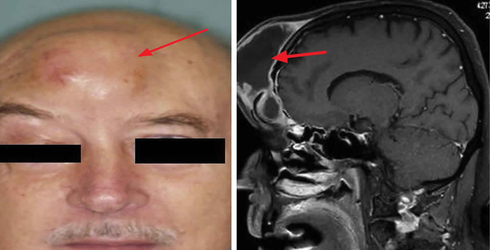
- **Indications for FESS:** recurrent/chronic bacterial sinusitis unresponsive to medical therapy, **antrochoanal polyp**, nasal polyposis, **fungal ball**, **mucocele of frontoethmoid or sphenoid sinus**, epistaxis control, foreign body removal. **Contraindications: osteomyelitis, and disease inaccessible endoscopically.**

**EXAM CONNECTION:** Old trauma + non-axial proptosis + CT cystic frontal lesion → **frontal mucocele**.

**REMEMBER:** *Blocked ostium, years later, an expanding cyst that pushes the eye sideways — and eggshell crackling.*

**IMAGES:**
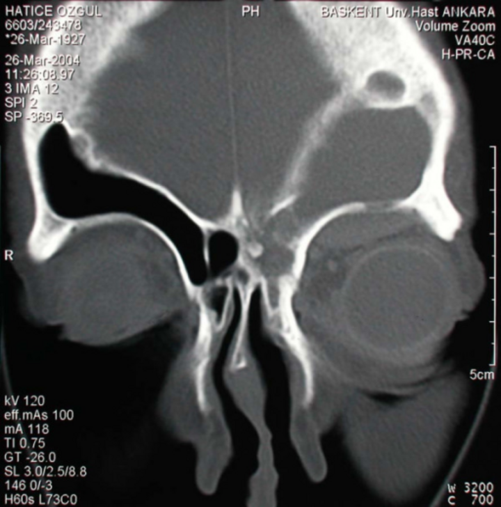
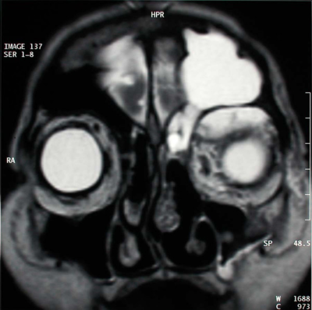

`Q9931, Q10000`

---

## 7. Stridor — Read the Phase, Find the Level

**PEARL:** **INSPIRATORY stridor → SUPRAGLOTTIS/pharynx** (laryngomalacia, retropharyngeal abscess, epiglottitis). **BIPHASIC stridor → GLOTTIS, SUBGLOTTIS and cervical trachea** (vocal cord palsy, subglottic stenosis, laryngeal papilloma, croup). **EXPIRATORY stridor → thoracic trachea and bronchi** (bronchial foreign body, tracheal stenosis, tracheomalacia).

**UNDERSTAND:** The physics is **extrathoracic vs intrathoracic**. On inspiration, negative intraluminal pressure **collapses an EXTRAthoracic airway** → inspiratory stridor. On expiration, positive intrathoracic pressure **compresses an INTRAthoracic airway** → expiratory stridor/wheeze. A lesion at the **fixed narrow point of the glottis/subglottis** obstructs in both phases → **biphasic**.

**MUST KNOW:**

- **LARYNGOMALACIA is the commonest cause of stridor in infants** — **inspiratory only**, worse when supine, feeding or crying, better when prone; caused by an **omega-shaped epiglottis with short aryepiglottic folds**; usually **self-limiting by 18–24 months**; treat severe cases with **aryepiglottoplasty (supraglottoplasty)**. **Associated with GERD.**
- **Recurrent respiratory papillomatosis** — **HPV 6 and 11**, acquired at birth from maternal genital warts; hoarseness plus biphasic stridor; treated with repeated debulking (**avoid tracheostomy — it seeds the tracheobronchial tree**).
- **The subglottis is the NARROWEST part of the paediatric airway** (the complete cricoid ring), hence croup and post-intubation subglottic stenosis.
- **ACUTE EPIGLOTTITIS (*H. influenzae* b)** — rapid onset, **drooling, tripod position, muffled "hot potato" voice, NO cough**, "thumb sign" on lateral X-ray. **DO NOT examine the throat or lie the child down — secure the airway in theatre.** Contrast **CROUP** (parainfluenza) — **barking cough, hoarseness, "steeple sign"**, treated with **nebulised adrenaline and dexamethasone**.
- **Unilateral vocal cord palsy → hoarseness; BILATERAL palsy → STRIDOR with a good voice**, needing urgent airway intervention.

**EXAM CONNECTION:** "Biphasic stridor — which can be ruled out?" → **laryngomalacia** (inspiratory only).

**REMEMBER:** *Inspiratory is above the cords, expiratory is in the chest, biphasic is the glottis and subglottis.*

**IMAGES:**
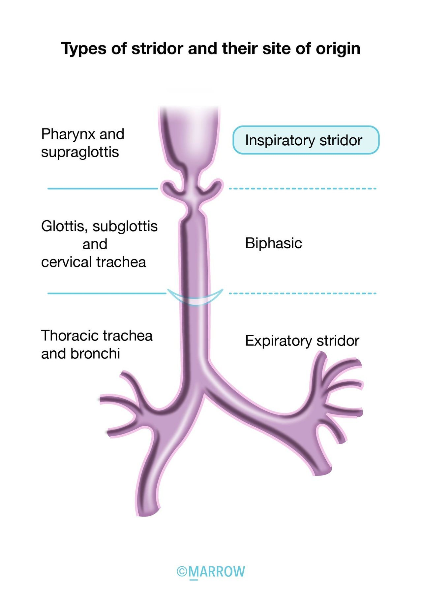

`Q9934`

---

## 8. Otitic Barotrauma

**PEARL:** Failure of the **eustachian tube to equalise middle-ear pressure**, classically on **DESCENT** (when ambient pressure rises and the collapsed tube resists opening). Prevent with a **VASOCONSTRICTOR NASAL SPRAY (oxymetazoline) half an hour before descent**, repeated swallowing, and intermittent **Valsalva**. **Sleeping through the descent and occlusive earplugs are both harmful.**

**UNDERSTAND:** The eustachian tube is a **passive one-way valve** — it vents easily when middle-ear pressure is **higher** than ambient (ascent) but must be **actively opened by swallowing** when ambient pressure is higher (descent). That asymmetry is why **descent, not ascent, causes the pain**, and why anything that reduces swallowing (**sleep**) makes it worse.

**MUST KNOW:**

- **Swallowing, yawning and chewing open the tube via TENSOR VELI PALATINI (V3)** — so **feeding an infant or giving a sweet during descent** is genuinely effective advice.
- **Occlusive earplugs are contraindicated** — they trap air in the external canal and cause **external ear barotrauma**.
- **Sequence of injury:** retraction of the drum → hyperaemia along the handle of malleus → **middle-ear effusion/haemotympanum** → drum rupture. Severe cases cause **round window rupture with a PERILYMPH FISTULA** (sudden SNHL, vertigo, tinnitus).
- **Do not fly (or dive) with an upper respiratory infection or allergic rhinitis** — the commonest predisposing factor.
- **Treatment: decongestants, antihistamines, analgesia, autoinflation; myringotomy** if effusion persists.
- **Related: alternobaric vertigo** (asymmetric pressure equalisation) and **inner ear decompression sickness** in divers.

**EXAM CONNECTION:** "Which measure prevents recurrence?" → **oxymetazoline nasal spray** (the distractors are all harmful).

**REMEMBER:** *Descent is the dangerous half — decongest, swallow, stay awake, and never plug the ear.*

`Q9950`

---

## 9. Peritonsillar Abscess (Quinsy)

**PEARL:** Pus collects in the **peritonsillar space — between the TONSILLAR CAPSULE and the SUPERIOR CONSTRICTOR muscle**. It is **almost always UNILATERAL**, with **severe odynophagia, drooling, trismus, a "HOT POTATO" muffled voice**, and **uvular deviation to the opposite side**. It **does not involve the floor of the mouth**.

**UNDERSTAND:** The tonsil is enclosed in a **fibrous capsule**, so infection that escapes it is trapped against the superior constrictor — a closed space. **Trismus occurs because the inflammation irritates the adjacent MEDIAL PTERYGOID muscle**, and that trismus is the single most useful sign distinguishing quinsy from severe tonsillitis.

**MUST KNOW:**

- **Management: needle aspiration or incision and drainage** (at the point of maximum bulge, or the junction of a line from the base of the uvula and the anterior pillar) **+ antibiotics covering anaerobes (co-amoxiclav or penicillin + metronidazole)** + analgesia and rehydration.
- **INTERVAL TONSILLECTOMY at 4–6 weeks** is traditionally advised, particularly after a **second episode** or in patients with prior recurrent tonsillitis. **"Quinsy tonsillectomy" (hot tonsillectomy)** is done in selected centres.
- **Complications:** spread to the **parapharyngeal space**, **Lemierre syndrome** (*Fusobacterium necrophorum* — internal jugular vein thrombophlebitis with septic pulmonary emboli), airway obstruction, and rarely carotid haemorrhage.
- **Contrast LUDWIG'S ANGINA** — bilateral cellulitis of the **submandibular and sublingual spaces (the FLOOR OF THE MOUTH)** with a raised, firm tongue and rapid airway compromise, usually of dental origin. This is exactly why "does not involve the floor of mouth" is a **true** statement about quinsy.
- **Tonsil blood supply: the TONSILLAR BRANCH OF THE FACIAL ARTERY is the main supply** (plus ascending palatine, ascending pharyngeal, dorsal lingual and descending palatine); the **paratonsillar vein** is the usual source of reactionary post-tonsillectomy bleeding.

**EXAM CONNECTION:** "False statement about quinsy" → "**commonly bilateral**".

**REMEMBER:** *One side, trismus, hot-potato voice, uvula pushed away — and the floor of the mouth is Ludwig's, not quinsy.*

**IMAGES:**
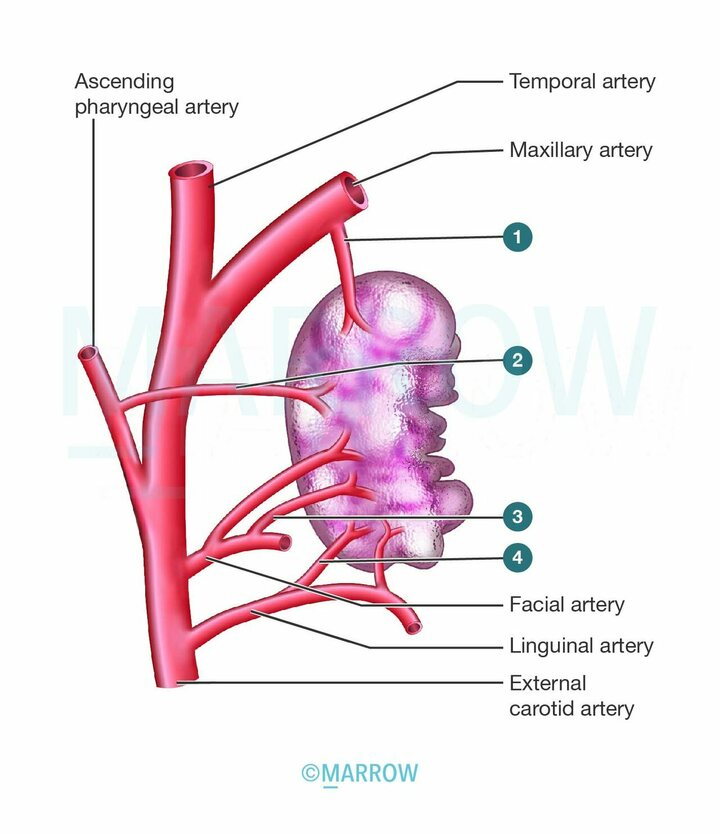
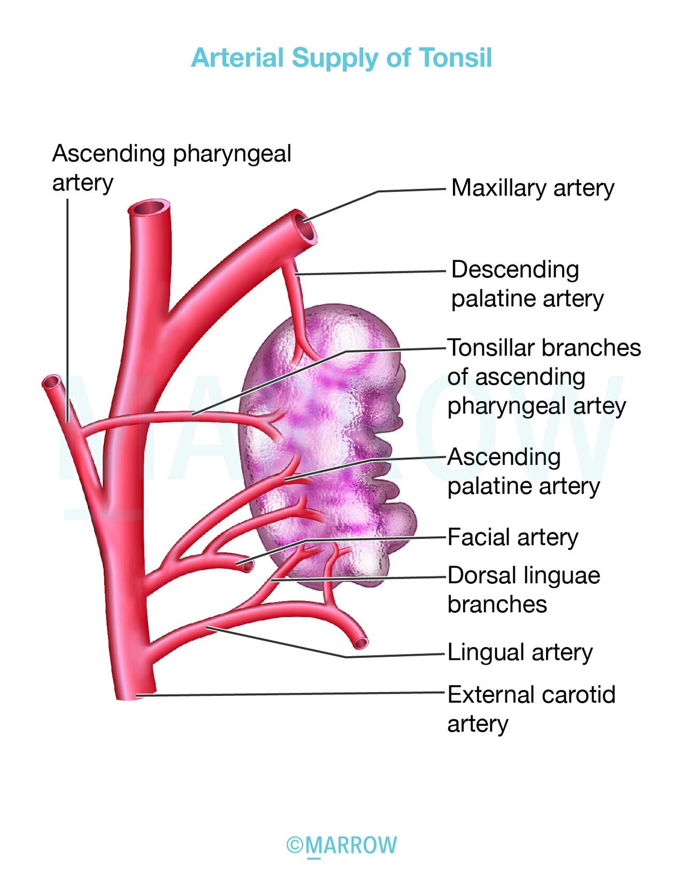

`Q9965, Q9968`

---

## 10. BPPV — Dix-Hallpike and Epley

**PEARL:** **Brief (<1 minute) episodic vertigo triggered by head position, with NO hearing loss.** **DIAGNOSTIC manoeuvre = DIX-HALLPIKE** (the gold standard). **THERAPEUTIC manoeuvre = EPLEY (canalith repositioning).**

**UNDERSTAND:** Otoconia (calcium carbonate crystals) dislodge from the **utricular macula** and fall into the **POSTERIOR semicircular canal** (the most dependent) — **canalolithiasis**. Head movement makes them shift, deflecting the cupula and generating a false sensation of rotation. **Epley's manoeuvre simply rolls them back out into the utricle**, which is why it is curative in a single session in most patients.

**MUST KNOW:**

- **The nystagmus of BPPV has a diagnostic signature: LATENCY of a few seconds, GEOTROPIC ROTATORY (torsional up-beating) direction, DURATION <60 seconds, FATIGABILITY on repetition, and REVERSAL on sitting up.** **Absence of latency, non-fatigability, pure vertical/down-beating nystagmus, or a lack of vertigo → suspect a CENTRAL lesion** (posterior fossa tumour, MS, cerebellar infarct) and image the brain.
- **Posterior canal is involved in ~85–90%**; for **horizontal (lateral) canal BPPV use the SUPINE ROLL (Pagnini–McClure) test and the BARBECUE/Lempert roll manoeuvre**.
- **Vertigo differential by DURATION — the single most useful framework:** **seconds to a minute, positional = BPPV** · **minutes to hours with fluctuating hearing loss, tinnitus and aural fullness = MÉNIÈRE'S** · **days, severe, no hearing loss = VESTIBULAR NEURITIS** · **days with hearing loss = LABYRINTHITIS** · **chronic progressive with unilateral SNHL and absent corneal reflex = ACOUSTIC NEUROMA**.
- **Ménière's** = endolymphatic hydrops; treat with **salt restriction, betahistine, diuretics**, then intratympanic steroids/gentamicin.
- **Brandt–Daroff exercises** are the home-based alternative for residual symptoms.

**EXAM CONNECTION:** "Diagnostic manoeuvre" → **Dix-Hallpike**. The question deliberately pairs it with Epley as the therapeutic one — do not swap them.

**REMEMBER:** *Dix-Hallpike diagnoses, Epley treats — seconds of vertigo, normal hearing, fatigable rotatory nystagmus.*

**IMAGES:**
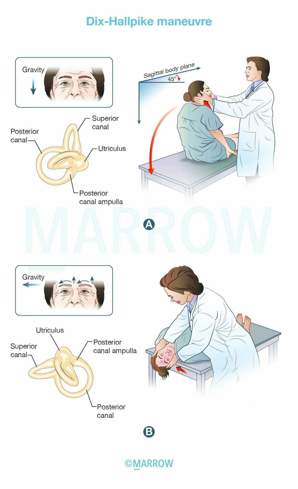

`Q9966`

---

## 11. MacEwen's (Suprameatal) Triangle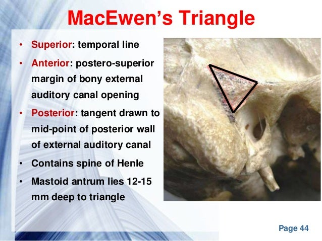

**PEARL:** The surface landmark for the **MASTOID ANTRUM** in mastoid surgery. Boundaries: **superiorly the TEMPORAL LINE**, **anteriorly the POSTEROSUPERIOR margin of the bony external auditory canal**, and **posteriorly a tangent drawn to the external canal**. The **processus cochleariformis is NOT a boundary** (it is a middle-ear landmark for the facial nerve).

**UNDERSTAND:** The antrum lies **directly deep to this triangle, about 1.5 cm deep in the adult** — so drilling perpendicular to its centre reaches the antrum reliably. In the **newborn the mastoid process is undeveloped and the antrum is very superficial (~2 mm)**, which is why the facial nerve is dangerously exposed in infant mastoid surgery.

**MUST KNOW:**

- **Key surgical landmarks in mastoidectomy:** the **LATERAL (horizontal) SEMICIRCULAR CANAL is the key landmark for the facial nerve** — the **tympanic segment of the facial nerve runs immediately BELOW and medial to it**. **The short process of the incus points to the facial nerve.** The **digastric ridge** points to the stylomastoid foramen.
- **Semicircular canal relations:** the **LATERAL canal is closest to the middle ear** (and is therefore the one eroded by cholesteatoma, giving a **positive FISTULA TEST — vertigo and nystagmus on pressing the tragus/raising canal pressure**). The superior and posterior canals share the **crus commune**.
- **The processus cochleariformis** (from which tensor tympani turns laterally) marks the **GENU of the facial nerve** on the medial wall of the middle ear — a middle-ear, not mastoid, landmark.
- **Trautmann's triangle** (bounded by the bony labyrinth, sigmoid sinus and superior petrosal sinus) is the route to the posterior cranial fossa; **Citelli's angle** (sinodural angle) between the sigmoid sinus and middle fossa dura.
- 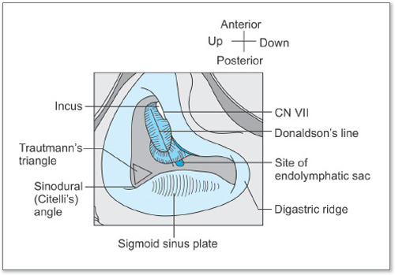
- **Floor of the middle ear is a thin plate of bone over the JUGULAR BULB** — which may be **dehiscent**, so a "blue mass" in the middle ear may be a high jugular bulb, and myringotomy there can be catastrophic.

**EXAM CONNECTION:** "All are boundaries EXCEPT" → **processus cochleariformis**.

**REMEMBER:** *Temporal line above, canal in front, tangent behind — drill there for the antrum. The lateral canal guards the facial nerve.*

**IMAGES:**
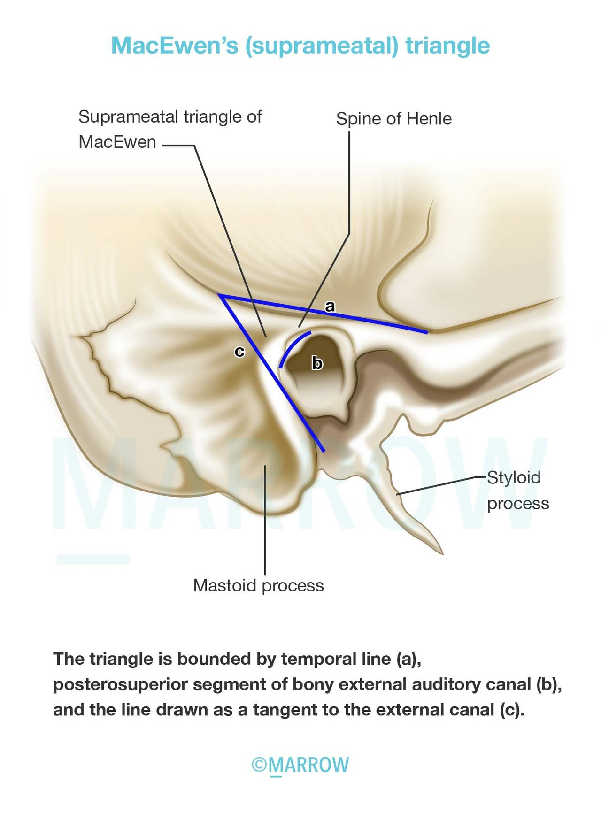
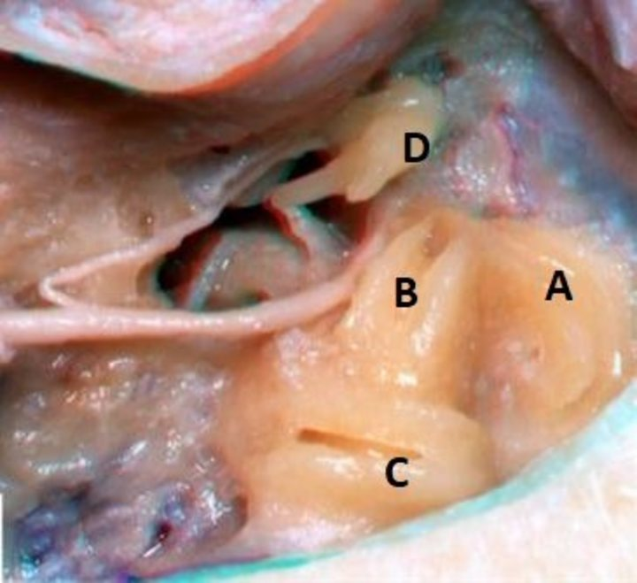
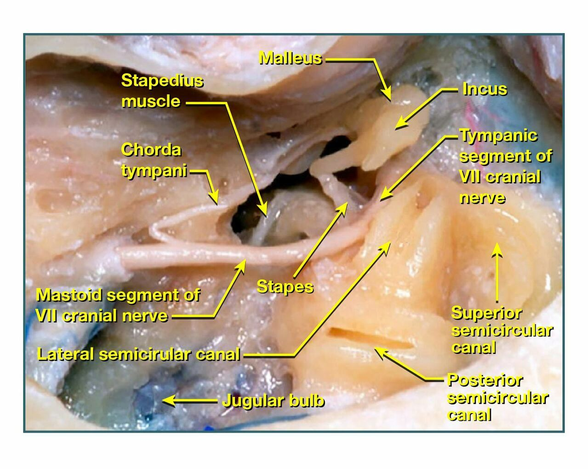
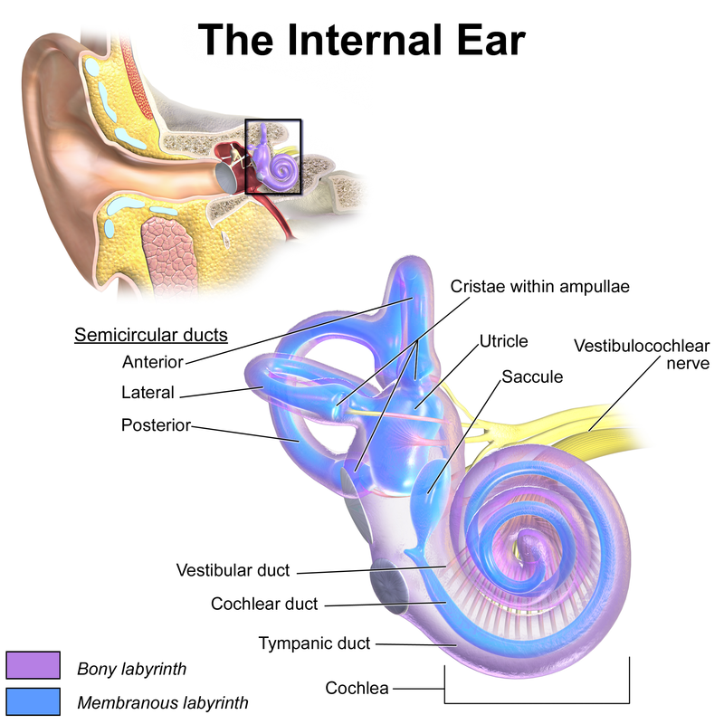
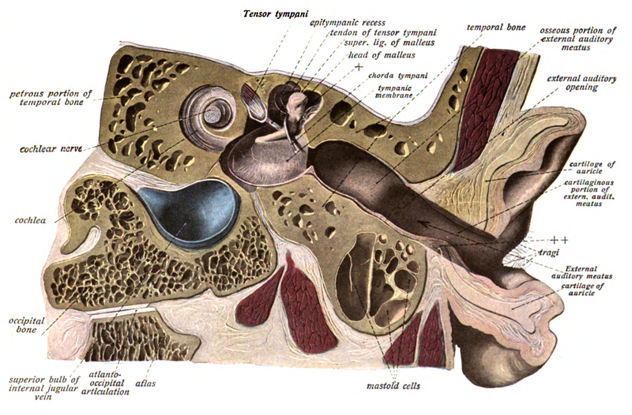

`Q9967, Q10124, Q10182`

---

## 12. Samter's Triad

**PEARL:** **NASAL POLYPOSIS + ASTHMA + ASPIRIN (NSAID) INTOLERANCE** — also called **aspirin-exacerbated respiratory disease (AERD)**. **Allergic rhinitis is NOT part of it.**

**UNDERSTAND:** COX inhibition **shunts arachidonic acid down the LIPOXYGENASE pathway**, overproducing **cysteinyl leukotrienes (LTC4, D4, E4)** which drive both bronchoconstriction and eosinophilic nasal polyposis. That mechanism explains why these patients respond particularly well to **leukotriene modifiers (montelukast, zileuton)**.

**MUST KNOW:**

- **Nasal polyps in a CHILD demand investigation** — they are abnormal at that age: think **CYSTIC FIBROSIS (do a sweat chloride test)**, allergic fungal sinusitis, or **antrochoanal polyp**.
- **Other causes/associations of ethmoidal polyps:** **NARES (non-allergic rhinitis with eosinophilia)**, allergic fungal sinusitis, **Kartagener syndrome** (bronchiectasis + sinusitis + situs inversus), **Young syndrome** (sinopulmonary disease + azoospermia), **Churg–Strauss (EGPA)**, and nasal mastocytosis.
- **ETHMOIDAL vs ANTROCHOANAL POLYP** — the classic comparison: **ethmoidal are BILATERAL, MULTIPLE, in ADULTS, arising from the ethmoids, and RECUR frequently**; **antrochoanal (Killian's) polyp is UNILATERAL, SINGLE, in CHILDREN/young adults, arises from the MAXILLARY antrum and grows through the ostium into the choana and nasopharynx**, and is cured by complete removal including its antral origin.
- **Treatment of polyposis: intranasal corticosteroids first-line**, short oral steroid courses, then **FESS**; **anti-IL-4/IL-5/IgE biologics (dupilumab, mepolizumab, omalizumab)** are now used in severe recurrent disease.
- **Aspirin desensitisation** is an established therapy in AERD.
- **Unilateral polyp in an adult = biopsy** (inverted papilloma, malignancy).

**EXAM CONNECTION:** "Not a component of Samter's triad" → **allergic rhinitis**.

**REMEMBER:** *Polyps, asthma, aspirin — block COX and the leukotrienes take over.*

`Q10056, Q10077`

---

## 13. Nasopharyngeal Carcinoma

**PEARL:** The commonest site of origin is the **FOSSA OF ROSENMÜLLER** (the lateral pharyngeal recess). Classic presentation: a **PAINLESS UPPER NECK LUMP** (often the first sign), **unilateral serous otitis media in an adult**, nasal obstruction and **blood-stained nasal discharge**.

**UNDERSTAND:** The fossa of Rosenmüller lies **just behind the eustachian tube opening**, which is why the tumour causes **UNILATERAL CONDUCTIVE HEARING LOSS from eustachian tube obstruction** — and why **a unilateral middle-ear effusion in an adult must prompt nasopharyngeal examination**. Its rich lymphatic network explains the very early nodal spread.

**MUST KNOW:**

- **"Unilateral glue ear in an adult = nasopharyngeal carcinoma until proven otherwise."** This is the single highest-yield clinical rule in the topic.
- **Aetiology: EBV (EBV DNA titres are used for screening, prognosis and monitoring), genetic susceptibility (southern Chinese, north-east Indian populations — Nagaland/Manipur), salted fish and nitrosamines.**
- **Histology: WHO type III — UNDIFFERENTIATED (lymphoepithelioma) is the commonest and the most radiosensitive**, and the most strongly EBV-associated.
- **RADIOTHERAPY (± concurrent chemotherapy) is the primary treatment — NOT surgery**, because of the site's inaccessibility and the tumour's radiosensitivity. Neck nodes are irradiated too.
- **Late presentations to recognise:** **cranial nerve palsies** (V and VI first, via the foramen lacerum — **Trotter's triad = conductive deafness, ipsilateral immobility of the soft palate, and trigeminal neuralgia**), and **retropharyngeal/level V node** involvement.
- **Contrast the levels:** posterior triangle (**level V**) nodes are characteristic of NPC.

**EXAM CONNECTION:** "Where will a mass most commonly originate?" → **fossa of Rosenmüller**.

**REMEMBER:** *A neck node plus one blocked ear in an adult — look in the fossa of Rosenmüller.*

**IMAGES:**
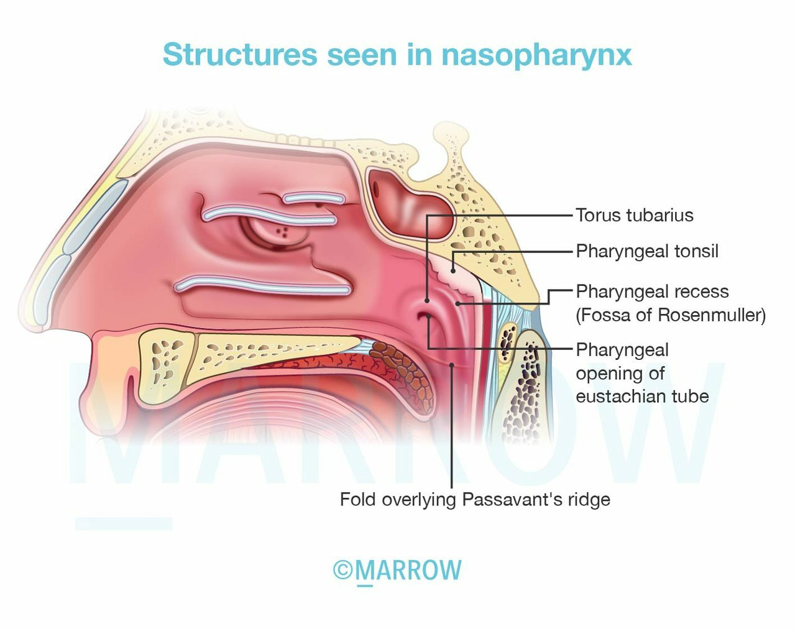

`Q10082`

---

## 14. Glue Ear and Adenoids

**PEARL:** A child with **recurrent URTI, adenoid facies (high-arched palate, open mouth, elongated face), poor growth and hearing loss**, with a **TYPE B (flat) tympanogram**, has **otitis media with effusion secondary to ADENOID HYPERTROPHY**. The correct management is **ADENOIDECTOMY WITH GROMMET INSERTION** — treat both the cause and the effect.

**UNDERSTAND:** Grommets alone **relieve the effusion but not the eustachian tube obstruction**, so it recurs when the tube is extruded. **Adenoidectomy removes the obstruction**; the grommet gives immediate hearing restoration while the tube recovers. Treating only one half is the trap in the question.

**MUST KNOW:**

- **Tympanometry patterns: TYPE A normal · TYPE As (shallow) — otosclerosis/ossicular fixation · TYPE Ad (deep) — ossicular discontinuity or a flaccid drum · TYPE B (flat, no peak) — MIDDLE EAR EFFUSION or a perforation (distinguished by canal volume: high volume = perforation/patent grommet) · TYPE C (negative peak) — eustachian tube dysfunction/retraction.**
- **Glue ear peaks at 5–8 years**; the effusion is **non-purulent and often asymptomatic apart from hearing loss** — hence **school failure, inattention and delayed speech** are the presenting complaints. **Conductive loss is typically 20–40 dB.**
- **Watchful waiting for 3 months** is standard before intervening in bilateral OME, since most resolve spontaneously.
- **Other consequences of adenoid hypertrophy:** **rhinolalia clausa (denasal speech), mouth breathing, snoring and OBSTRUCTIVE SLEEP APNOEA, and — if long-standing — COR PULMONALE.**
- **Grommet (ventilation tube) counselling: keep the ear dry**, extrudes spontaneously in 6–12 months; complications are otorrhoea, tympanosclerosis, and persistent perforation.

**EXAM CONNECTION:** The stem gives both **adenoid features and a type B curve** — so the answer must address **both**: adenoidectomy **with** grommet.

**REMEMBER:** *Flat tympanogram plus adenoid facies — take out the adenoids AND put in the grommet.*

**IMAGES:**
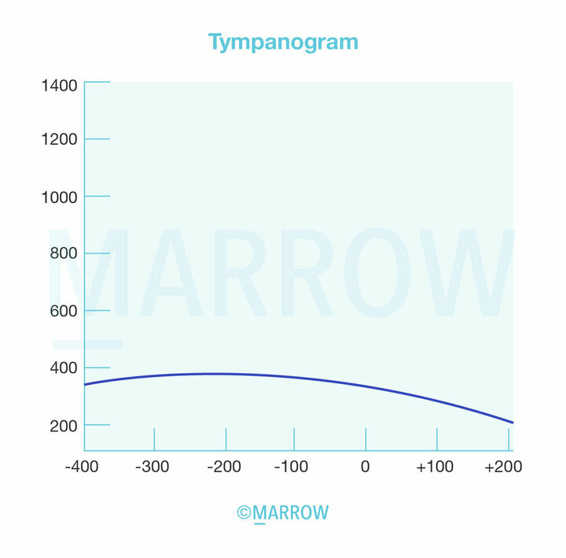
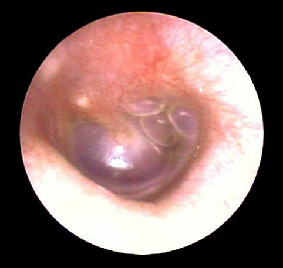

`Q10143`

---

## 15. Rinne's Test — Estimating the Air–Bone Gap

**PEARL:** The frequency at which Rinne becomes **positive** estimates the air–bone gap: **Rinne negative at 256 Hz only ≈ 15–30 dB** · **negative at 256 and 512 Hz ≈ 30–45 dB** · **negative at 256, 512 and 1024 Hz ≈ >45–60 dB**.

**UNDERSTAND:** **Lower-frequency tuning forks are heard more readily by bone conduction**, so a **small** conductive loss reverses only the 256 Hz fork. As the gap widens, **progressively higher frequencies also reverse** — so the number of forks that are "negative" is a crude audiometer.

**MUST KNOW:**

- **Rinne POSITIVE (AC > BC) is NORMAL — and is also found in SENSORINEURAL loss.** **Rinne NEGATIVE (BC > AC) means CONDUCTIVE loss** and implies a gap of at least **15–20 dB**.
- **FALSE-NEGATIVE RINNE is the classic trap:** in **severe unilateral SENSORINEURAL loss (dead ear)**, the patient hears the bone-conducted sound **in the opposite, normal cochlea** — appearing "negative" in a nerve-deaf ear. **Prevent it by masking the other ear (Barany noise box)** — and **Weber will lateralise AWAY**, giving the answer.
- **WEBER lateralises TO the ear with CONDUCTIVE loss and AWAY from the ear with SENSORINEURAL loss.**
- **ABC (absolute bone conduction) test** compares the patient's bone conduction to the examiner's — **reduced in sensorineural loss**.
- **512 Hz is the ideal fork**: lower frequencies are felt as vibration, higher ones decay too quickly.
- **SCHWABACH** (prolonged in conductive, shortened in sensorineural) and **Gelle's test** (for stapes fixation) complete the classical set.

**EXAM CONNECTION:** The stem lists which forks are negative — count them and read off the gap.

**REMEMBER:** *More forks negative = bigger gap. And always suspect a false negative Rinne in a dead ear — check Weber.*

`Q10188`

---

## 16. Membrane Over the Tonsil — Vincent's Angina vs Diphtheria

**PEARL:** **VINCENT'S ANGINA — the membrane is EASILY REMOVED, revealing an IRREGULAR ULCER**, with low-grade fever and relatively little systemic upset. Caused by **fusiform bacilli (*Fusobacterium*) + spirochaetes (*Borrelia vincentii*)** — a **fusospirochaetal** symbiosis. **DIPHTHERIA — the membrane is ADHERENT, and removal leaves a BLEEDING surface**; it is **dirty grey, EXTENDS BEYOND THE TONSIL onto the soft palate/uvula**, with **marked toxaemia out of proportion to the local findings**.

**UNDERSTAND:** The difference is **depth of invasion**. Diphtheria's toxin causes **necrosis with fibrin welding the pseudomembrane to the underlying tissue**; Vincent's is a **superficial ulcerative process**, so its slough lifts off. That single bedside manoeuvre — trying to remove the membrane — separates them.

**MUST KNOW:**

- **Diphtheria: the danger is the TOXIN — myocarditis (2nd week) and palatal/ocular/peripheral neuropathy.** **Give ANTITOXIN IMMEDIATELY on clinical suspicion — do NOT wait for culture** — plus **penicillin or erythromycin**. Note **"BULL NECK"** appearance, and the **toxin-mediated block of eEF-2**.
- **Culture on Loeffler's serum slope, tellurite and Albert-stained smears (metachromatic granules)**; toxigenicity by **Elek's test**.
- **The full membranous tonsillitis differential:** **infectious mononucleosis** (EBV — bilateral massive tonsils with membrane, **posterior cervical lymphadenopathy, hepatosplenomegaly, atypical lymphocytes, positive Paul–Bunnell/Monospot; giving AMPICILLIN/amoxicillin causes a florid maculopapular rash**), **agranulocytosis and acute leukaemia** (ulceration with neutropenia — always do a full blood count), **candidiasis**, and **traumatic/aphthous ulcers**.
- **Vincent's angina** is associated with **poor oral hygiene, malnutrition, smoking and immunosuppression**; treat with **penicillin/metronidazole and oral hygiene**.

**EXAM CONNECTION:** The stem's phrase "**came off easily revealing an irregular ulcer**" is the entire answer → **Vincent's angina**.

**REMEMBER:** *Wipes off easily = Vincent's. Sticks and bleeds and spreads beyond the tonsil = diphtheria — give antitoxin now.*

**IMAGES:**
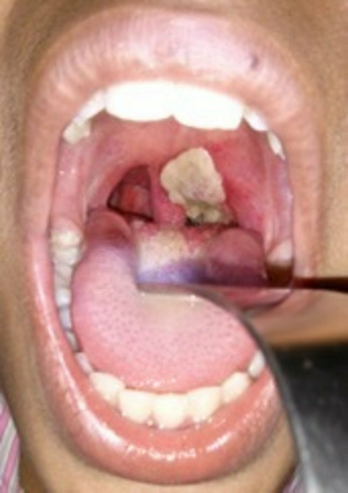

`Q10195`

---

## 17. Thyroplasty — The Four Types

**PEARL:** **Type I — MEDIALISATION** (for vocal cord palsy/glottic incompetence). **Type II — LATERALISATION** (for adductor spasmodic dysphonia and bilateral palsy). **Type III — SHORTENING/relaxation → LOWERS pitch** (female-to-male voice). **Type IV — LENGTHENING/tightening → RAISES pitch** (male-to-female voice). Mnemonic: **"MLSL"**.

**UNDERSTAND:** Pitch is determined by **vocal cord TENSION and LENGTH** — exactly as in a stringed instrument. **Tighter and longer = higher frequency.** Type IV thyroplasty mimics the action of the **cricothyroid muscle**, the natural tensor and the physiological pitch-raiser.

**MUST KNOW:**

- **Type I medialisation thyroplasty** is the workhorse — used for **unilateral recurrent laryngeal nerve palsy** causing a breathy voice and aspiration; alternatives are **injection laryngoplasty** (fat, calcium hydroxyapatite).
- **The natural pitch mechanism: the CRICOTHYROID muscle (external laryngeal nerve, from the vagus) is the ONLY TENSOR of the vocal cord** — which is why external laryngeal nerve injury during thyroidectomy causes **loss of high notes and vocal fatigue**, most disabling in singers.
- **Bilateral recurrent laryngeal nerve palsy** leaves both cords adducted → **stridor with a good voice** → may need tracheostomy, or a lateralisation procedure (cordotomy/arytenoidectomy).
- **Voice feminisation surgery** may also use **cricothyroid approximation** (raising pitch) and is combined with speech therapy, which remains first-line.
- **Phonation basics:** the **myoelastic-aerodynamic theory** — subglottic pressure blows the cords apart and the **Bernoulli effect plus elastic recoil** snaps them shut; **frequency depends on length, tension and mass**.

**EXAM CONNECTION:** Male-to-female voice → raise the pitch → **lengthening/tightening (Type IV)**.

**REMEMBER:** *Tight and long makes it high. Type IV lengthens for a female voice; Type III shortens for a male one.*

`Q10207`

---

## 18. Epistaxis — The Stepwise Approach

**PEARL:** **Trotter's method first** (sit up, lean **forward**, pinch the soft part of the nose for 5–10 minutes, spit out blood, breathe through the mouth). If bleeding continues: **cautery of the bleeding point**, then **anterior nasal packing — MEROCEL is the first-line packing material**, then posterior packing/balloon, then surgical or endovascular intervention.

**UNDERSTAND:** **Leaning FORWARD, not backward**, is essential — tipping the head back sends blood into the pharynx, causing swallowing, vomiting, aspiration and a false impression that the bleeding has stopped. **Merocel** is a compressed polyvinyl sponge that **expands on wetting**, applying even circumferential pressure without the trauma of ribbon gauze.

**MUST KNOW:**

- **ANTERIOR epistaxis (~90%) arises from LITTLE'S AREA / KIESSELBACH'S PLEXUS** on the anteroinferior septum — an anastomosis of the **anterior ethmoidal, sphenopalatine, greater palatine and superior labial arteries**. **POSTERIOR epistaxis** comes from **Woodruff's plexus** and the **sphenopalatine artery**, is commoner in the **elderly and hypertensive**, and is more dangerous.
- **Any patient needing a POSTNASAL pack must be ADMITTED** — risks include **hypoxia (naso-pulmonary reflex), aspiration, pressure necrosis and dislodgement**; monitor with pulse oximetry. **Prophylactic antibiotics** are given for packs left >48 hours because of the risk of **sinusitis and TOXIC SHOCK SYNDROME**.
- **Definitive surgery: endoscopic SPHENOPALATINE ARTERY LIGATION (first-line for refractory posterior bleeds)**, anterior ethmoidal artery ligation, or **embolisation** (maxillary artery — never the anterior ethmoidal, which arises from the ophthalmic/ICA).
- **Always look for a cause:** trauma/nose-picking (commonest in children), hypertension, **anticoagulants and antiplatelets**, **hereditary haemorrhagic telangiectasia (Osler–Weber–Rendu)**, thrombocytopenia, liver disease, and — critically — **JNA in a teenage boy** and **malignancy in an adult with unilateral bleeding**.
- Correct coagulopathy, replace volume, and check haemoglobin in significant bleeds.

**EXAM CONNECTION:** "Correct regarding the next best step" → **Merocel is used as a first-line packing agent** (the distractors misstate admission and oxygen requirements).

**REMEMBER:** *Lean forward and pinch the soft part; Little's area bleeds in the young, sphenopalatine in the old.*

**IMAGES:**
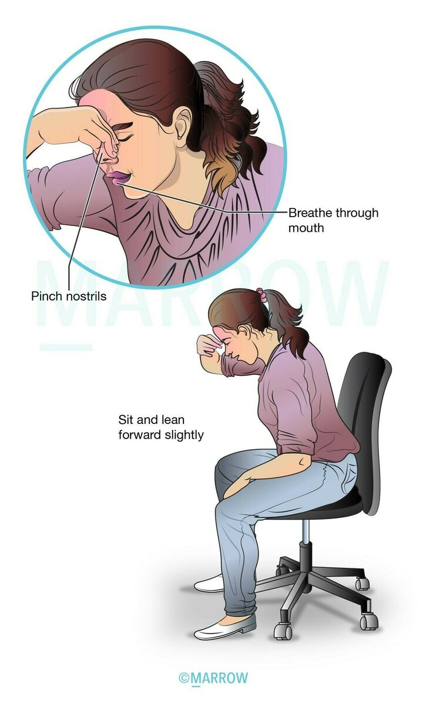
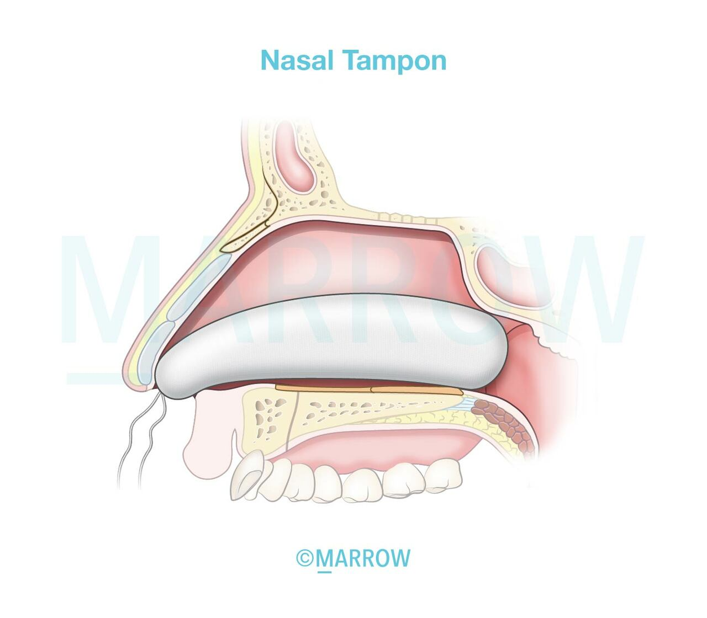
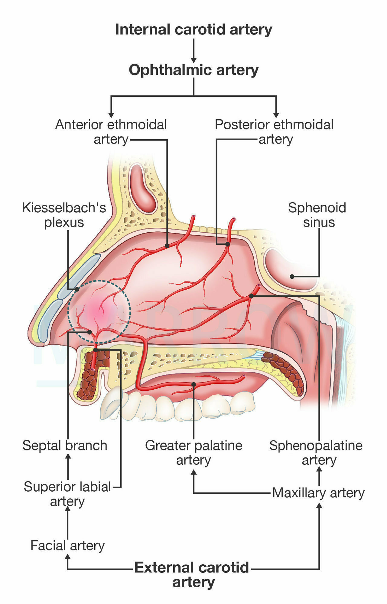

`Q10235`

---

## 19. Cochlear Tonotopy

**PEARL:** **HIGH frequencies are represented at the BASE of the cochlea (near the OVAL WINDOW); LOW frequencies at the APEX (near the HELICOTREMA).** So **age-related high-frequency hearing loss reflects damage to the BASAL turn.**

**UNDERSTAND:** **Von Békésy's travelling wave theory:** the basilar membrane is **narrow and stiff at the base, wide and floppy at the apex**. A **stiff short structure resonates at high frequency**; a **wide floppy one at low frequency** — exactly like the strings of a piano. Every sound wave travels from base to apex and peaks at the point matching its frequency.

**MUST KNOW:**

- **This explains why the base is damaged first in almost everything:** **presbycusis, noise-induced hearing loss, ototoxic drugs (aminoglycosides, cisplatin, loop diuretics)** — all produce **high-frequency loss first**, because the basal turn is exposed to every travelling wave and has the highest metabolic demand.
- **NOISE-INDUCED hearing loss produces a characteristic 4000 Hz (4 kHz) NOTCH** on the audiogram, with recovery at 8 kHz.
- **Cochlear anatomy for the same question:** the **modiolus** is the bony core transmitting the cochlear nerve; **scala vestibuli and scala tympani contain PERILYMPH (high Na⁺, like ECF)** and communicate at the **helicotrema**; **scala media (cochlear duct) contains ENDOLYMPH (high K⁺, like ICF)**, secreted by the **STRIA VASCULARIS**.
- **The ORGAN OF CORTI sits on the BASILAR MEMBRANE** (separating scala media from scala tympani); **REISSNER'S membrane** separates scala media from scala vestibuli. (**Shrapnell's membrane is the pars flaccida of the eardrum** — a deliberate distractor.)
- The **endocochlear potential (+80 mV)** generated by the stria vascularis is what powers hair cell transduction — and its loss is the basis of ototoxicity.

**EXAM CONNECTION:** High-frequency loss → basal turn → "which structure lies nearby?" → **oval window**.

**REMEMBER:** *Base is stiff and hears high notes — and it is the first to die from noise, age and drugs.*

**IMAGES:**
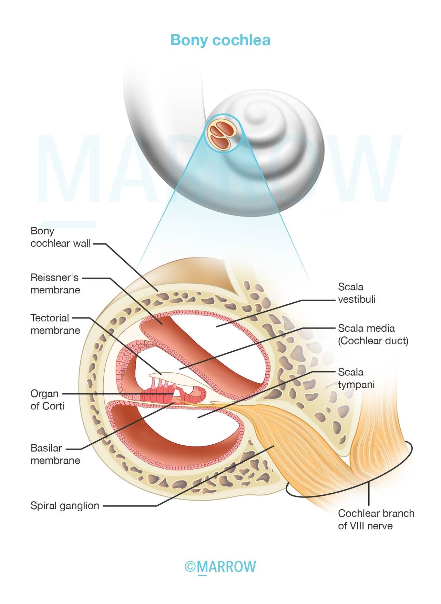
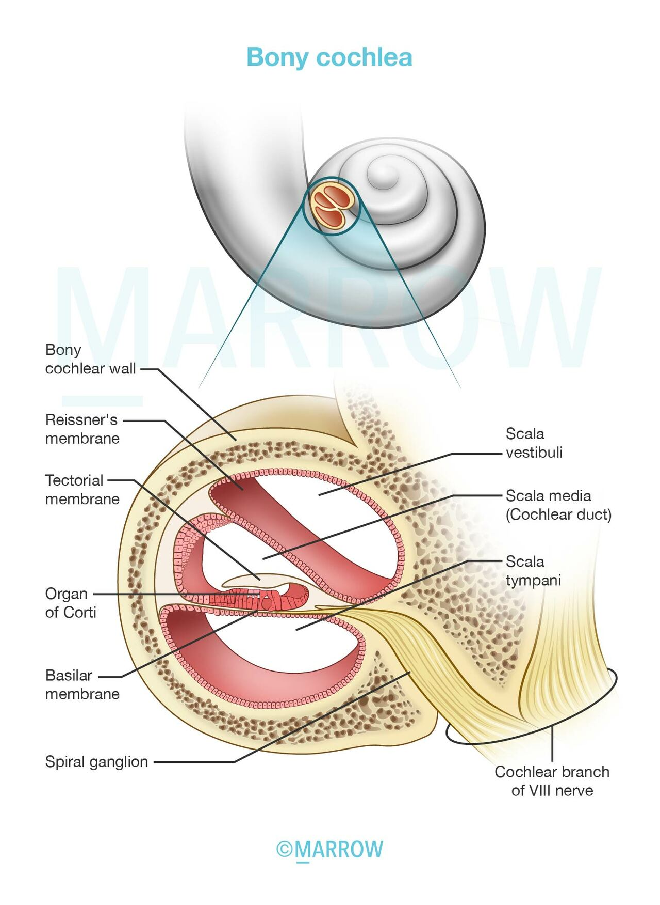

`Q10241, Q9915`

---

## 20. Septoplasty vs Submucous Resection

**PEARL:** **SEPTOPLASTY is CONSERVATIVE** — **FREER'S incision**, a **mucoperichondrial flap raised on ONE SIDE only**, retaining as much cartilage as possible, and it **can be done in children**. **SUBMUCOUS RESECTION (SMR)** — **KILLIAN'S incision**, flaps raised on **BOTH sides**, extensive cartilage removal, **not done under 18 years**.

**UNDERSTAND:** Raising flaps on **both** sides deprives the intervening cartilage of its blood supply and, combined with removing it, produces the classic SMR complications. Preserving one side's mucoperichondrium keeps the cartilage vascularised and supported — which is why septoplasty has fewer complications and permits easier revision.

**MUST KNOW:**

- **Complications of SMR (largely avoided by septoplasty): SEPTAL PERFORATION, SADDLE NOSE DEFORMITY, columellar retraction, flapping/floppy septum, and septal haematoma.**
- **SEPTAL HAEMATOMA is the emergency to know** — bilateral obstruction and a boggy swelling after trauma; it must be **drained immediately** because the septal cartilage depends entirely on the perichondrium for its blood supply → **avascular necrosis → SADDLE NOSE**; and it may become a **septal abscess** with risk of cavernous sinus thrombosis.
- **Septal surgery is avoided before ~17 years** in general, because of the **growth centres of the nasal septum**, which is precisely why the age limit distinguishes the two operations.
- **Indications:** symptomatic **nasal obstruction from a deviated septum**, recurrent epistaxis from a septal spur, as **access** for other procedures (e.g. pituitary surgery, sinus surgery, DCR), and headache from septal spur pressure.
- **Other causes of saddle nose to keep in mind:** trauma, **congenital syphilis, leprosy, granulomatosis with polyangiitis, relapsing polychondritis, and cocaine abuse.**

**EXAM CONNECTION:** "False regarding septoplasty" → "**mucoperiosteal flap raised on both sides**".

**REMEMBER:** *Septoplasty: Freer's incision, one flap, conservative, any age. SMR: Killian's, both flaps, adults, and it perforates.*

`Q10243`

---

## 21. Malignant (Necrotising) Otitis Externa

**PEARL:** **NOT a malignancy — it is an INFECTIVE, locally invasive OSTEOMYELITIS of the temporal bone**, almost always due to ***PSEUDOMONAS AERUGINOSA***, in **elderly DIABETICS and the immunocompromised**. It presents with **severe, deep, unremitting ear pain (worse at night), otorrhoea and GRANULATION TISSUE AT THE BONY–CARTILAGINOUS JUNCTION** of the canal.

**UNDERSTAND:** The name is historical — it reflects the **relentless, destructive clinical course** rather than neoplasia. In diabetics, **microangiopathy of the ear canal and impaired neutrophil function** allow Pseudomonas to breach the cartilage and spread along the skull base, producing **progressive cranial nerve palsies**.

**MUST KNOW:**

- **GRANULATION TISSUE IN THE FLOOR OF THE CANAL AT THE BONY–CARTILAGINOUS JUNCTION is the diagnostic clinical sign.**
- **BIOPSY IS MANDATORY — to exclude a true carcinoma of the ear canal**, which presents identically.
- **The FACIAL NERVE is the first and commonest cranial nerve involved** (at the stylomastoid foramen); progression to **IX, X, XI, XII** signals skull base spread and a poor prognosis.
- **Imaging: CT shows bone erosion (but lags); Tc-99m bone scan is POSITIVE EARLY (before CT changes); GALLIUM-67 or Indium-111 labelled leucocyte scans are used to MONITOR RESOLUTION** and decide when to stop antibiotics, because gallium normalises with healing whereas technetium stays positive for months. **MRI** best shows soft tissue and intracranial spread.
- **Treatment: prolonged (6–8 weeks) systemic ANTI-PSEUDOMONAL therapy — ciprofloxacin (oral is effective) or an antipseudomonal beta-lactam ± aminoglycoside — plus aggressive glycaemic control, aural toilet and debridement of granulations.** Surgery is reserved for abscess or sequestrum.
- **ESR is a useful marker of activity and response.**

**EXAM CONNECTION:** "Malignant otitis externa is ___" → an **infective condition**.

**REMEMBER:** *An old diabetic with agonising night ear pain and granulations in the canal floor — Pseudomonas eating the skull base. Biopsy it, gallium-scan it, treat for weeks.*

`Q10246`

---

## 22. Facial Nerve — The Labyrinthine Segment

**PEARL:** The **LABYRINTHINE segment is the SHORTEST (~4 mm) and NARROWEST (0.6–0.7 mm)** part of the facial nerve, running from the fundus of the internal acoustic meatus to the **geniculate ganglion**. Its **bony canal is also narrowest here** — so oedema readily compresses the nerve.

**UNDERSTAND:** This anatomical bottleneck is the reason **BELL'S PALSY happens at all**. Any inflammatory swelling (**HSV-1 reactivation**) in a canal with **no room to expand** produces a compartment syndrome of the nerve — compression, ischaemia and conduction block. The same geometry explains why **decompression, when performed, targets the labyrinthine segment and the meatal foramen**.

**MUST KNOW:**

- **Segments in order: intracranial (CPA) → meatal (IAM) → LABYRINTHINE (shortest/narrowest) → tympanic (horizontal, longest intratemporal, runs BELOW the LATERAL SEMICIRCULAR CANAL and is the segment most often DEHISCENT — hence at risk in middle ear surgery) → mastoid (vertical) → extracranial.**
- **The branches, in order, localise the lesion — a favourite topographical exercise:** **greater petrosal nerve (lacrimation) at the geniculate ganglion** → **nerve to stapedius (hyperacusis)** → **chorda tympani (taste, anterior 2/3 tongue; submandibular/sublingual secretion)** → then the **stylomastoid foramen** and motor branches. **A lesion above the geniculate ganglion loses lacrimation; below the stapedial branch, hearing is normal.**
- **Bell's palsy: LMN palsy involving the FOREHEAD** (a UMN lesion spares it, because of bilateral cortical supply to the upper face). Treat with **oral corticosteroids within 72 hours** (± antivirals in severe cases), **eye protection with lubricants and taping** to prevent exposure keratitis.
- **Always exclude a cause before calling it "Bell's":** otitis media/cholesteatoma, **Ramsay Hunt syndrome** (vesicles, worse prognosis), parotid malignancy, trauma, **Lyme disease (bilateral)**, sarcoidosis, Guillain–Barré, and **diabetes**.
- **House–Brackmann grading (I–VI)** documents severity; **electroneuronography (ENoG) >90% degeneration within 2 weeks** is the criterion for considering surgical decompression.

**EXAM CONNECTION:** "Shortest and narrowest segment" → **labyrinthine**.

**REMEMBER:** *The narrowest 4 mm of the nerve in the narrowest bit of canal — that is where Bell's palsy strangles it.*

**IMAGES:**
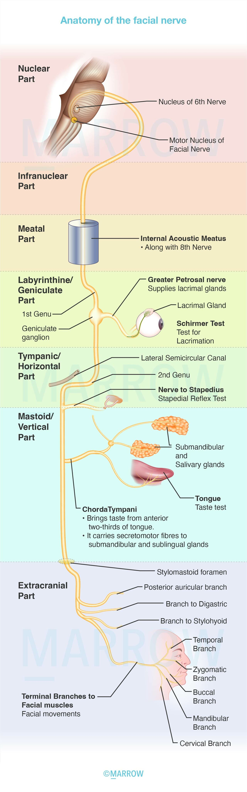

`Q10248`

---

## 23. Radiographic Views of the Paranasal Sinuses

**PEARL:** **WATER'S (occipitomental, nose-chin) — best for the MAXILLARY sinus.** **CALDWELL'S (occipitofrontal, nose-forehead) — best for the FRONTAL and ETHMOID sinuses.** **SUBMENTOVERTICAL (basal) — SPHENOID sinus, zygomatic arches and skull base.** **TOWNE'S — occipital bone, foramen magnum and mandibular condyles.**

**UNDERSTAND:** Each view exists to **project the petrous temporal bone away from the sinus of interest**. In Water's view the head is tilted so the **petrous ridges are thrown below the maxillary antra**, allowing them to be seen clearly; in Caldwell's the smaller angulation brings the **frontal and ethmoid** sinuses into view instead.

**MUST KNOW:**

- **Water's view: X-ray beam at 37° to the orbitomeatal line.** **Caldwell's: 15°.** Water's also shows **frontal sinus, zygoma and zygomatic arch, nasal bone**, and the **sphenoid through an open mouth**.
- **Water's view is the standard for facial trauma** — it demonstrates the **orbital floor ("hanging drop"/teardrop sign of a blowout fracture), fluid level in the antrum, and the four "elephant" lines** used to detect zygomatic fractures.
- **A fluid level or complete opacification of the maxillary antrum on Water's view** suggests sinusitis or, after trauma, haemosinus.
- **CT is now the investigation of choice for sinus disease** (especially **coronal CT before FESS**, to map the **osteomeatal complex, lamina papyracea, cribriform plate and Onodi/Haller cells**) — plain films are largely of exam interest, but the views remain heavily examined.
- **Lateral soft-tissue neck X-ray** for adenoids, epiglottitis (**thumb sign**), croup (**steeple sign**), and retropharyngeal abscess.

**EXAM CONNECTION:** Pure matching of image to view — anchor on **Water's = maxillary, Caldwell's = frontal/ethmoid**.

**REMEMBER:** *Nose-chin sees the maxilla (Water's); nose-forehead sees the frontal (Caldwell's); looking up from below sees the sphenoid.*

**IMAGES:**
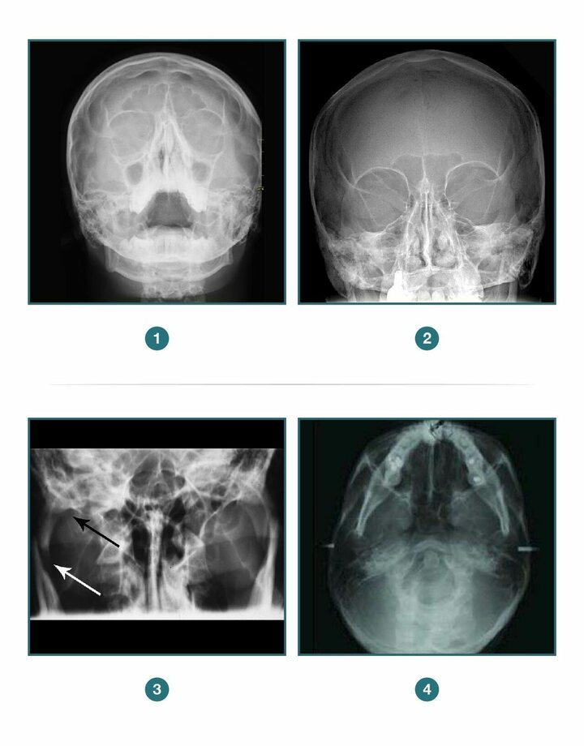
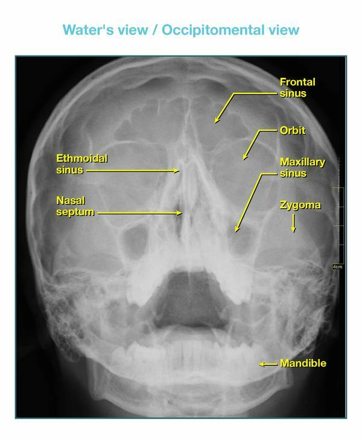
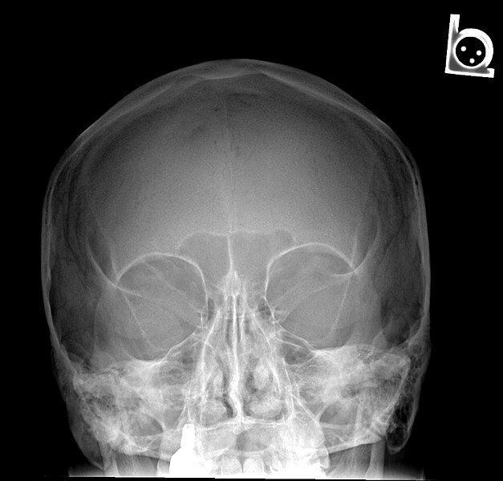
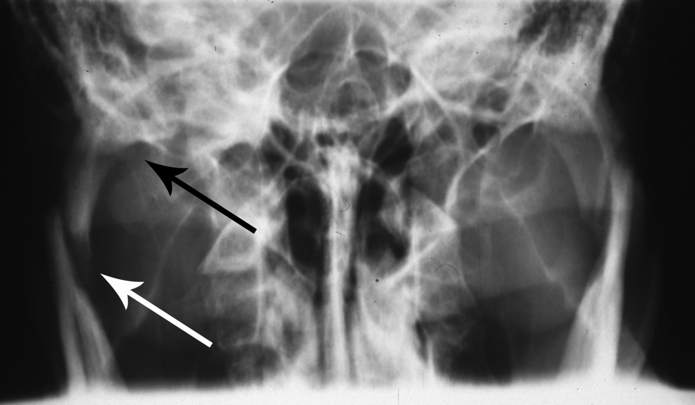
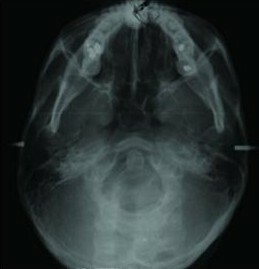

`Q10255`

---

## 24. The Auditory Pathway

**PEARL:** **SPIRAL GANGLION → COCHLEAR NUCLEI → SUPERIOR OLIVARY complex → LATERAL LEMNISCUS → INFERIOR COLLICULUS → MEDIAL GENICULATE BODY → AUDITORY CORTEX.** Mnemonic: **E.C.O.L.I.M.A.**

**UNDERSTAND:** The critical property is that the pathway is **BILATERAL from the superior olivary complex onward** — fibres cross via the **trapezoid body** at that level. This is why **a UNILATERAL lesion ABOVE the cochlear nuclei does NOT cause significant deafness**, and why **clinically significant unilateral sensorineural hearing loss must arise in the cochlea, the VIII nerve or the cochlear nucleus** — never in the cortex.

**MUST KNOW:**

- **The superior olivary complex is the first site of BINAURAL convergence** — it compares **interaural time and intensity differences** and is therefore the basis of **SOUND LOCALISATION**.
- **The superior olive also gives the efferent OLIVOCOCHLEAR bundle** to the outer hair cells, and mediates the **STAPEDIAL (ACOUSTIC) REFLEX** — afferent VIII, efferent VII, bilateral. **Testing acoustic reflexes requires an IMPEDANCE audiometer, not a pure-tone audiometer.**
- **Inferior colliculus → auditory startle reflex and the tectospinal pathway**; **medial geniculate body → thalamic relay**; **primary auditory cortex = Heschl's gyri (Brodmann 41, 42) in the superior temporal gyrus**, and it is **tonotopically organised** like the cochlea.
- **Outer hair cells act as a "cochlear amplifier" and generate OTOACOUSTIC EMISSIONS** — the basis of **UNIVERSAL NEWBORN HEARING SCREENING (OAE), with BERA (ABR) as the confirmatory test**. **In auditory neuropathy, OAEs are PRESENT but ABR is absent** — an important pattern.
- **Uses of a pure-tone audiometer:** measure air and bone conduction thresholds, determine type and degree of loss, predict the **speech reception threshold**, prescribe hearing aids, and medicolegal assessment — but **NOT acoustic reflexes**.

**EXAM CONNECTION:** Sequencing question — start at the **spiral ganglion**, not the cochlear nucleus.

**REMEMBER:** *ECOLIMA — and everything above the olive is bilateral, so cortical lesions never make you deaf in one ear.*

**IMAGES:**
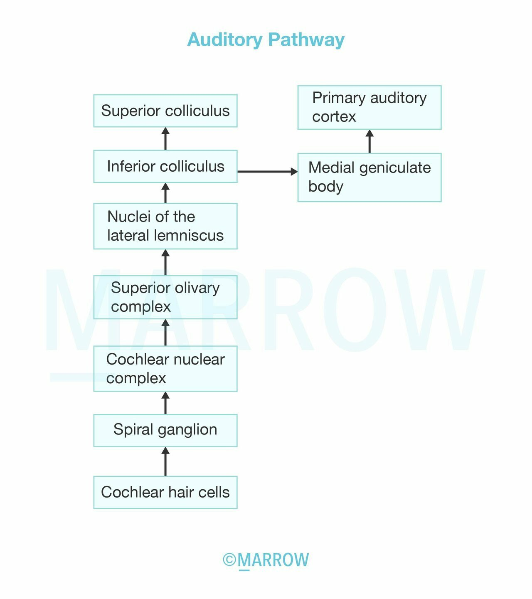
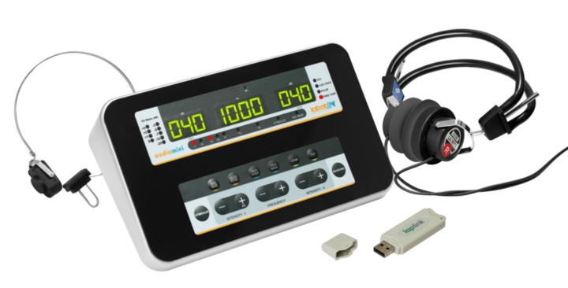

`Q10305, Q9923`

---

## 25. Tracheostomy — High, Mid and Low

**PEARL:** **HIGH tracheostomy — at the 1st tracheal ring — is performed ONLY for CARCINOMA OF THE LARYNX** (where the larynx will be removed anyway). **MID (normal) — 2nd/3rd rings — for all routine indications.** **LOW — 3rd/4th rings — for laryngotracheal stenosis and crush injury to the larynx.**

**UNDERSTAND:** **High tracheostomy is normally forbidden** because a tube at the 1st ring lies against the **CRICOID CARTILAGE**, and pressure there causes **perichondritis and subglottic stenosis** — a permanent airway disaster. It is acceptable only when the larynx is diseased and destined for removal, so the complication is irrelevant.

**MUST KNOW:**

- **Standard indications for tracheostomy: respiratory obstruction, retained secretions (bronchial toilet), respiratory insufficiency/prolonged ventilation, and as an elective adjunct to head and neck surgery.**
- **Complications by timing — a favourite exam structure:** **Immediate** — haemorrhage, apnoea, **pneumothorax (especially in children, whose pleural dome is higher)**, injury to the recurrent laryngeal nerve or oesophagus, **cardiac arrest**. **Intermediate** — tube blockage or displacement, subcutaneous emphysema, infection, **tracheitis**. **Late** — **TRACHEAL STENOSIS, tracheo-oesophageal fistula, TRACHEO-INNOMINATE ARTERY FISTULA (catastrophic bleeding — suspect with a sentinel bleed), persistent tracheocutaneous fistula, difficult decannulation**.
- **In children, avoid a high tracheostomy absolutely** and keep the incision midline — the pleura and innominate vein are higher, and the trachea is soft and mobile.
- **Cricothyroidotomy** is the emergency surgical airway of choice in adults (fast, superficial), converted to a formal tracheostomy within 24–48 hours; **avoid in children under 12** (use needle cricothyroidotomy).
- **The isthmus of the thyroid overlies rings 2–4** — hence it is retracted, divided or ligated during the procedure.

**EXAM CONNECTION:** "Indication for HIGH tracheostomy" → **carcinoma larynx**.

**REMEMBER:** *Never cut at the first ring — the cricoid will stenose — unless the larynx is coming out anyway.*

`Q10342`

---

## 26. Le Fort Fractures

**PEARL:** **Le Fort I — a transverse fracture above the alveolus ("floating palate").** **Le Fort II — pyramidal, through the nasofrontal suture, the INFERIOR ORBITAL RIM and FLOOR, and the maxilla ("floating maxilla").** **Le Fort III — CRANIOFACIAL DISJUNCTION: through the nasofrontal suture, ethmofrontal junction, MEDIAL and LATERAL orbital walls, superior orbital fissure and zygomatic arch — but NOT the inferior orbital wall/floor.**

**UNDERSTAND:** All three run **through the pterygoid plates posteriorly** — that is the defining common feature of a true Le Fort fracture. The levels then differ by **how high the face is separated from the skull base**. Le Fort III passes **transversely across the orbit** at a high level, so it takes the **medial and lateral walls and the superior orbital fissure**, whereas **Le Fort II is the one that involves the orbital FLOOR**.

**MUST KNOW:**

- **All Le Fort fractures involve the PTERYGOID PLATES.** If they do not, it is not a Le Fort fracture.
- **Clinical signs: Le Fort I — mobile upper alveolus and palate on grasping. Le Fort II — mobile maxilla and nose together, with infraorbital paraesthesia (V2) and periorbital ecchymosis. Le Fort III — the whole face moves as one unit with the "DISH FACE"/elongated face deformity, and often CSF RHINORRHOEA** from cribriform plate involvement.
- **CSF rhinorrhoea confirmation: BETA-2 TRANSFERRIN (the most specific test)**, and the **"double ring/HALO" sign** on filter paper. **Do NOT pass a nasogastric or nasotracheal tube** in these patients.
- **Airway comes first** in mid-face trauma — bleeding, oedema and a posteriorly displaced maxilla can obstruct rapidly; **orotracheal intubation** (never nasal), with a surgical airway if needed.
- **Fix with open reduction and internal fixation, re-establishing the vertical and horizontal facial buttresses**, after restoring **dental occlusion** (which guides reduction).
- **NOE (naso-orbito-ethmoid) fractures** are associated with **telecanthus and lacrimal injury**.

**EXAM CONNECTION:** "Le Fort III does NOT pass through" → **the inferior wall (floor) of the orbit** — that belongs to Le Fort II.

**REMEMBER:** *All three break the pterygoid plates. II takes the orbital floor; III takes the medial and lateral walls and floats the whole face off the skull.*

`Q10353`

---

## 27. Plummer–Vinson Syndrome and Post-Cricoid Carcinoma

**PEARL:** **Triad: IRON DEFICIENCY ANAEMIA + upper OESOPHAGEAL WEB + DYSPHAGIA** (also called Paterson–Brown–Kelly syndrome). It is a **PREMALIGNANT condition**, and the cancer it predisposes to is **POST-CRICOID CARCINOMA — characteristically in WOMEN**.

**UNDERSTAND:** **Post-cricoid carcinoma is the one head-and-neck squamous cancer that is commoner in FEMALES** and **not primarily driven by smoking** — because its risk factor is **chronic iron deficiency**, which causes atrophy of the mucosa and impaired regeneration of a rapidly dividing epithelium. Everything else in the hypopharynx is a male smoker's disease.

**MUST KNOW:**

- **Hypopharyngeal subsites and their patterns:** **PYRIFORM FOSSA is the commonest hypopharyngeal site overall** (male smokers, and it presents late with nodes); **POST-CRICOID** (females, Plummer–Vinson); **posterior pharyngeal wall** (least common).
- **Hypopharyngeal cancers have the WORST prognosis of all head and neck cancers** — the region is silent, richly lymphatic, and presents with **advanced nodal disease, referred otalgia (vagus) and hoarseness** when the recurrent laryngeal nerve is involved.
- **Barium swallow shows the web as a thin shelf-like filling defect**; **endoscopy with biopsy** is essential to exclude carcinoma at diagnosis and on follow-up.
- **Treatment of the web itself is IRON REPLACEMENT** (often sufficient) ± **oesophageal dilatation**. Correcting the anaemia is also the preventive measure.
- **Other causes of dysphagia to keep in the differential:** achalasia, oesophageal carcinoma, benign stricture, **pharyngeal (Zenker's) pouch — through KILLIAN'S DEHISCENCE between thyropharyngeus and cricopharyngeus**, and globus pharyngeus.

**EXAM CONNECTION:** Barium showing a web + fatigue and weight loss in a woman → "commonest site of carcinoma" → **post-cricoid region**.

**REMEMBER:** *Iron deficiency, a web and dysphagia — the one hypopharyngeal cancer that picks women, and it sits behind the cricoid.*

**IMAGES:**
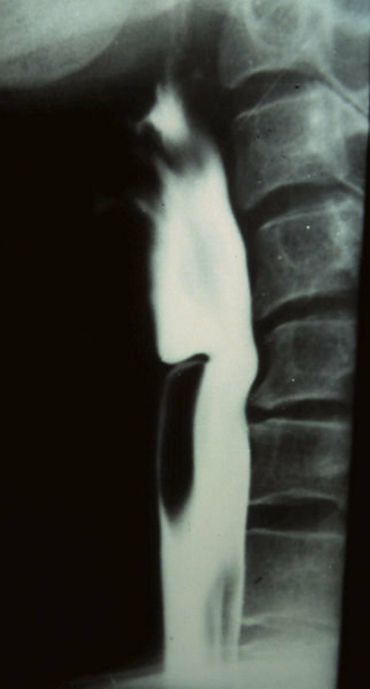
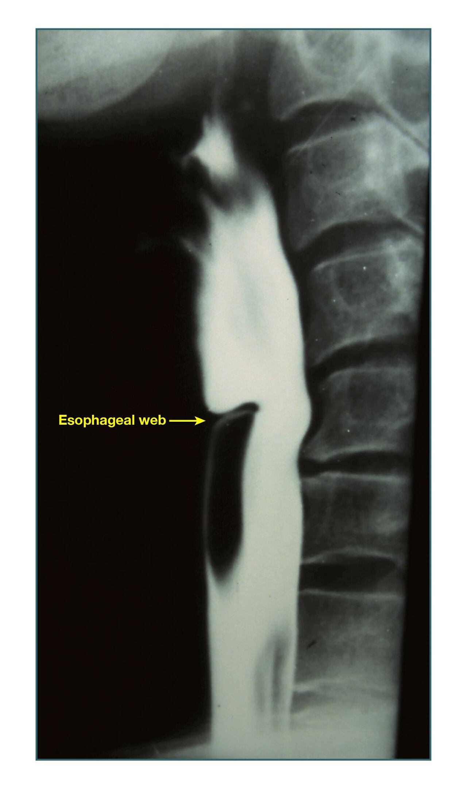

`Q10362`

---

## 28. Intrinsic Laryngeal Muscles — The Two Exceptions

**PEARL:** **CRICOTHYROID is the only TENSOR of the vocal cord and the only muscle supplied by the EXTERNAL LARYNGEAL nerve.** **POSTERIOR CRICOARYTENOID is the only ABDUCTOR** — the "safety muscle of the larynx". Everything else is adductor and supplied by the recurrent laryngeal nerve.

**UNDERSTAND:** The names give the actions away. **"Postero-lateral" cricoarytenoid**: the **POSTERIOR** one pulls the muscular process backward, swinging the vocal process **out** (abduction); the **LATERAL** one pulls it forward, swinging the cord **in** (adduction). Cricothyroid tilts the thyroid cartilage forward, lengthening and tensing the cord — hence its role in **pitch**.

**MUST KNOW:**

- **External laryngeal nerve injury** — during thyroidectomy while **ligating the superior thyroid pedicle** (the nerve runs with the superior thyroid artery) → **loss of high notes, voice fatigue, monotonous voice**. Prevent it by ligating the superior pedicle **close to the gland capsule**.
- **Unilateral RLN palsy** → hoarseness with the cord in the **paramedian** position; often compensated by the other cord.
- **BILATERAL RLN palsy is the emergency** — both cords lie in adduction/paramedian, giving **inspiratory STRIDOR and airway obstruction, often with a good voice** → may need **immediate intubation or tracheostomy**.
- **Semon's law:** in a progressive lesion, **abductor fibres (posterior cricoarytenoid) are affected before adductors** — which is why the cord ends up adducted.
- **RLN runs in the tracheo-oesophageal groove**, closely related to the **inferior thyroid artery** — identify and preserve it in thyroid surgery; **check cords pre- and post-operatively**.

**EXAM CONNECTION:** "Tensor of the vocal cord" → cricothyroid. "Only abductor" → posterior cricoarytenoid. Both are near-guaranteed one-liners.

**REMEMBER:** *Cricothyroid tenses (external laryngeal); posterior cricoarytenoid is the only one that opens the airway.*

**IMAGES:**
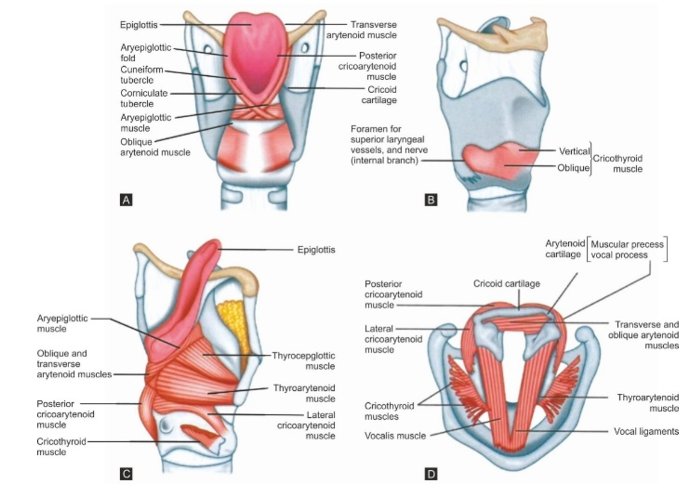
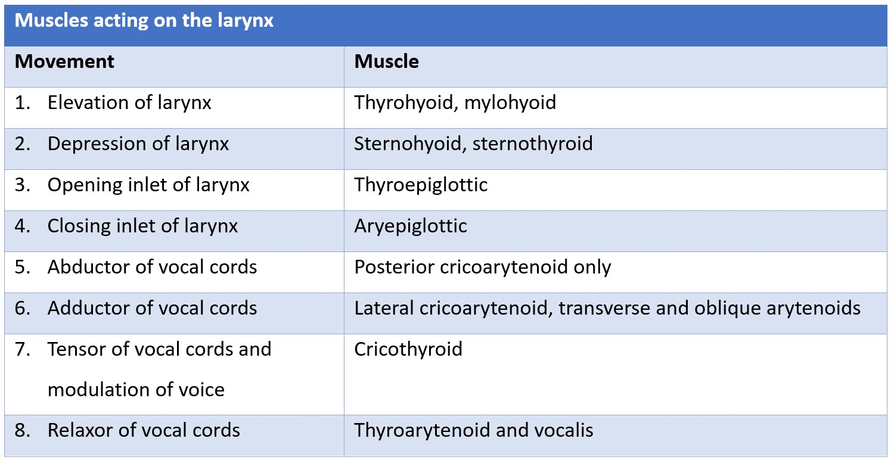

`Q11647`

---

## 29. Laryngomalacia

**PEARL:** **Low-pitched INSPIRATORY stridor from the first weeks of life, worse on crying
and supine, RELIEVED BY PRONE positioning**, with an **omega (Ω)-shaped epiglottis** on
laryngoscopy = **laryngomalacia**. Management is **expectant observation** — it resolves
spontaneously by ~2 years.

**UNDERSTAND:** The supraglottic cartilage is abnormally soft, so **negative inspiratory
pressure sucks the aryepiglottic folds and epiglottis inward** — a dynamic collapse. That
explains every clinical feature: it is **inspiratory** (only inspiration generates the
negative pressure), it worsens with **crying, feeding and supine posture** (higher flow,
gravity pulling the tissues back), and it improves **prone** (gravity pulls them forward).
It settles as the cartilage stiffens with growth — hence observation, not intervention.

**MUST KNOW:**

- **Commonest congenital laryngeal anomaly** and the commonest cause of stridor in infants (~60%).
- Laryngoscopy: **elongated, curled, omega-shaped epiglottis, short aryepiglottic folds, prominent/bulky arytenoids** that prolapse on inspiration.
- **Red flags requiring intervention:** failure to thrive, feeding difficulty, cyanosis, apnoea, severe retractions, pulmonary hypertension, cor pulmonale → **supraglottoplasty** (division of the aryepiglottic folds); tracheostomy only rarely.
- **Associated GERD is common** — treat reflux; it worsens the oedema of the supraglottis.
- **Stridor localisation:** **inspiratory = supraglottic/glottic** (laryngomalacia, vocal cord palsy, epiglottitis); **biphasic = glottic/subglottic** (croup, subglottic stenosis, haemangioma, foreign body); **expiratory = tracheobronchial** (tracheomalacia, bronchial foreign body).
- Differentials in the exam: **subglottic haemangioma** (appears at 3–6 weeks, worsens over months, **cutaneous haemangiomas in a beard distribution**), **vocal cord palsy** (weak cry, aspiration), **croup** (6 months–3 years, **barking cough, steeple sign**, treat **dexamethasone ± nebulised adrenaline**), **acute epiglottitis** (toxic, drooling, **thumb sign**, do NOT examine the throat — secure the airway first).

**EXAM CONNECTION:** The give-aways are **prone relief** and the **omega epiglottis**; the
question then asks for the next step — **observation**, with intubation/antibiotics/racemic
adrenaline offered as tempting but wrong interventions.

**REMEMBER:** *Floppy larynx sucked in on inspiration — turn the baby over and wait.*

**IMAGES:**
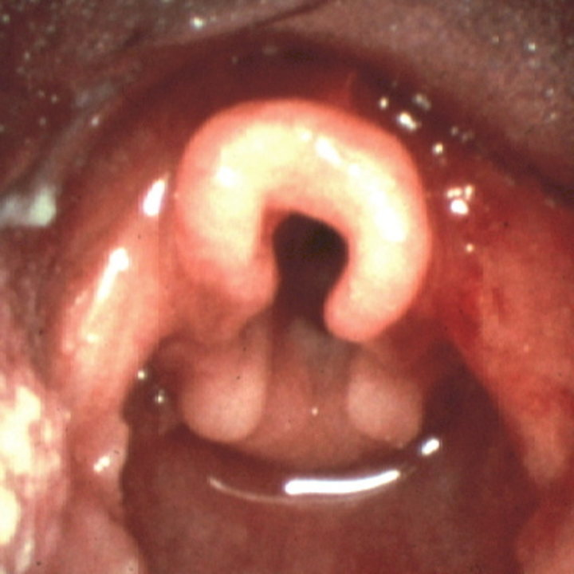

`Q10844`

---

## 30. The Middle Ear Transformer Mechanism

**PEARL:** The transformer ratio has two components: the **areal (hydraulic) ratio of the
tympanic membrane to the stapes footplate = 14:1** (the dominant one) and the **ossicular
lever ratio = 1.3:1**, giving a total of ~**18:1 (≈25–30 dB)**. After a **TORP (total
ossicular replacement prosthesis)** the **ossicular lever is lost but the areal ratio is
preserved — so the effective ratio becomes 14:1**.

**UNDERSTAND:** The middle ear exists to overcome the **impedance mismatch** between air
and cochlear fluid; without it, ~99.9% of sound energy would be reflected (a 30 dB loss).
It solves this by **concentrating the force collected over the large tympanic membrane onto
the tiny stapes footplate** (pressure = force/area — the areal ratio) and by the **lever
action of the longer malleus handle against the shorter incus long process**. A TORP is a
straight strut from **drum to footplate**: it bypasses the malleus–incus lever entirely,
so only the area-based amplification remains.

**MUST KNOW:**

- **Areal ratio 14:1** (effective vibrating area of the drum ~55 mm² vs footplate ~3.2 mm²); **lever ratio 1.3:1**; **total ~18:1 ≈ 25–30 dB**. The **curved-membrane (catenary) effect** of Helmholtz contributes a little more.
- **PORP (partial ossicular replacement prosthesis)** connects the **drum/malleus to the stapes SUPERSTRUCTURE** (head intact) → the lever is partly retained. **TORP** connects the **drum to the FOOTPLATE** (superstructure absent) → lever lost, results slightly poorer.
- **Maximum conductive hearing loss is ~60 dB** — the sum of the lost transformer mechanism (~30 dB) plus loss of the round-window **phase differential**.
- **Ossicular discontinuity** gives a **maximum conductive loss with a very compliant (Ad) tympanogram**; **otosclerosis** gives a **shallow As curve, absent stapedial reflex and Carhart's notch at 2000 Hz** on bone conduction.
- **Type A** tympanogram normal, **B** flat (effusion or perforation — check ear canal volume), **C** negative pressure (Eustachian tube dysfunction).
- Tympanoplasty types (Wullstein) I–V; the goal is a **dry, safe ear first, hearing second**.

**EXAM CONNECTION:** A calculation dressed as a concept question: strip the lever ratio
when the ossicular chain is replaced by a TORP → **14:1**.

**REMEMBER:** *Big drum onto a small footplate does most of the work; the ossicles only add
a third.*

**IMAGES:**
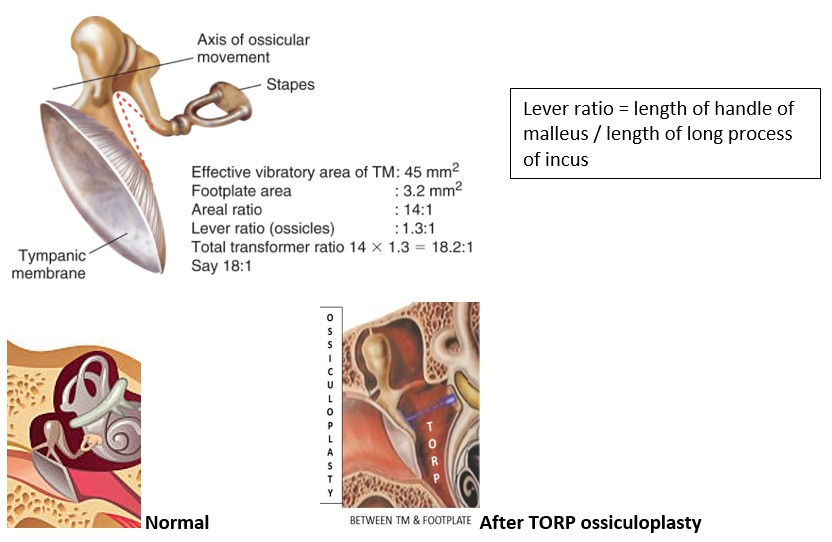

`Q10900`

---

## 31. Rinne and Weber Tests

**PEARL:** **Rinne POSITIVE = AC > BC = NORMAL hearing OR sensorineural loss.** **Rinne
NEGATIVE = BC > AC = CONDUCTIVE deafness.** In conductive loss, **bone conduction exceeds
air conduction** — the defining abnormality.

**UNDERSTAND:** Air conduction must traverse the **entire mechanism — canal, drum,
ossicles, cochlea**; bone conduction **bypasses the outer and middle ear and vibrates the
skull directly into the cochlea**. So blocking or stiffening the conducting apparatus
reduces AC while leaving BC intact (indeed BC seems relatively better, because ambient
masking noise is also excluded — the **occlusion effect**). A cochlear or nerve lesion
damages the **common final pathway**, degrading both routes equally, so the **normal AC >
BC relationship is preserved** — which is why a sensorineural ear is still "Rinne
positive", just quieter.

**MUST KNOW:**

- Use a **512 Hz** tuning fork (256 Hz is too easily felt as vibration; 1024 Hz decays too fast).
- **Weber test** — fork on the vertex: **lateralises TO the deaf ear in conductive loss**, and **AWAY from the deaf ear (to the better ear) in sensorineural loss**. Together, Rinne and Weber localise the lesion.
- **FALSE-NEGATIVE RINNE** — the crucial trap: in **severe unilateral sensorineural (dead ear) loss**, the patient hears the bone-conducted sound **through the skull in the opposite, normal cochlea**, so BC appears greater than AC and mimics a conductive loss. **Prevent it by masking the good ear (Barany noise box)**; the Weber (lateralising away) exposes the true picture.
- **Absolute bone conduction (ABC) test** compares the patient's BC with the examiner's — **reduced ABC = sensorineural loss**; normal ABC with a negative Rinne = conductive.
- **Rinne becomes negative when the air–bone gap exceeds about 15–20 dB**; the degree of gap can be estimated: negative at 256 Hz only ≈ 20–30 dB gap; negative at 256 and 512 ≈ 30–45 dB; negative at all three ≈ >45 dB.
- **Pure tone audiometry** quantifies what the tuning forks screen for; an **air–bone gap** is the audiometric signature of conductive loss.

**EXAM CONNECTION:** Multi-statement true/false. The false statement is nearly always
"**AC > BC in conductive loss**" — that relationship is exactly what is reversed.

**REMEMBER:** *Negative Rinne is the abnormal one — and it means the sound is stuck in the
middle ear.*

`Q10902`

---

## 32. WHO Grades of Hearing Impairment

**PEARL:** A patient who can hear **only when words are SHOUTED into the better ear** has
**SEVERE hearing loss — 61–80 dB (WHO grade 3)**. Normal conversational speech is about
**60 dB**, so needing a shout means the threshold has passed that level.

**UNDERSTAND:** The WHO grades are deliberately anchored to **functional speech tasks**, not
to abstract decibels, so that a health worker with no audiometer can classify hearing loss
in the field. Each grade corresponds to the loudness of a real-world sound: **a whisper
(~25 dB), normal conversation (~60 dB), a shout (~80 dB)**. Working backwards from what the
patient can just hear gives the grade.

**MUST KNOW (WHO grades, better ear, average of 500/1000/2000/4000 Hz):**

| Grade            | Threshold    | Performance                                                                                   |
| ---------------- | ------------ | --------------------------------------------------------------------------------------------- |
| **0 — none**     | **≤25 dB**   | Hears whispers                                                                                |
| **1 — slight**   | **26–40 dB** | Hears and repeats **normal voice at 1 m**                                                     |
| **2 — moderate** | **41–60 dB** | Hears **raised voice at 1 m**; hearing aid usually needed                                     |
| **3 — SEVERE**   | **61–80 dB** | Hears **some words when SHOUTED** into the better ear; needs a hearing aid, teach lip-reading |
| **4 — profound** | **≥81 dB**   | Cannot hear/understand even a shout; **consider cochlear implantation**                       |

- **Disabling hearing impairment: >40 dB in adults, >30 dB in children.**
- **Cochlear implantation** is indicated for **bilateral severe-to-profound sensorineural loss with inadequate benefit from hearing aids**; earlier implantation gives better speech outcomes in **prelingual** deafness (ideally before 2–3 years).
- **Universal newborn hearing screening: OAE (otoacoustic emissions) first, then BERA/ABR** for those who refer — because untreated congenital deafness costs language development.
- **Causes of childhood deafness in India: otitis media with effusion, chronic suppurative otitis media, congenital rubella and CMV, ototoxic drugs, meningitis, consanguinity/genetic (GJB2/connexin 26)**.
- **NPPCD** — the National Programme for Prevention and Control of Deafness.

**EXAM CONNECTION:** Convert the functional description into decibels. **Shout = 61–80 dB =
severe.** Note that the option "severe hearing loss >70%" uses loose wording — match on
"severe/shouted".

**REMEMBER:** *Whisper 25, conversation 60, shout 80 — a shout means severe.*

`Q10995`

---

## 33. Audiogram Shapes

**PEARL:** A **RISING (ascending) audiogram — LOW frequencies affected first — is the
audiogram of early MÉNIÈRE DISEASE (endolymphatic hydrops)**. A **DOWNSLOPING
high-frequency loss** is seen in **presbycusis and ototoxicity**; a **4000 Hz "notch" with
recovery at 8000 Hz** is the signature of **noise-induced hearing loss**.

**UNDERSTAND:** Frequency is mapped along the cochlea, so the **shape of the audiogram is a
map of where the damage is**. **High frequencies are coded at the BASE**, which is the
first part reached by sound energy, is metabolically most active, and receives the highest
concentration of ototoxic drugs — hence noise, drugs and ageing all cause **high-frequency
loss**. In Ménière disease the pathology is **distension of the endolymphatic compartment**,
which most affects the compliant **apex, where LOW frequencies are coded** — producing the
opposite, rising curve. As hydrops progresses, the audiogram flattens and then becomes
downsloping.

**MUST KNOW:**

- **Ménière disease tetrad: episodic ROTATORY VERTIGO lasting 20 minutes to 24 hours, FLUCTUATING sensorineural hearing loss, TINNITUS, and AURAL FULLNESS.** Usually unilateral; **fluctuation** is the key word.
- **Investigations: pure tone audiometry (rising curve, recruitment positive, SISI >70%), electrocochleography (raised SP/AP ratio), glycerol dehydration test, and MRI to exclude a vestibular schwannoma.**
- **Treatment: acute — vestibular sedatives (prochlorperazine), antiemetics; long term — SALT RESTRICTION and diuretics, betahistine, avoidance of caffeine/alcohol/nicotine; refractory — intratympanic steroids or GENTAMICIN (chemical labyrinthectomy), endolymphatic sac decompression, vestibular neurectomy.**
- **Ototoxicity: aminoglycosides (streptomycin and gentamicin are vestibulotoxic; amikacin, kanamycin and neomycin are cochleotoxic), CISPLATIN, loop diuretics, vancomycin, erythromycin, quinine, aspirin** — starts above 8000 Hz, so **high-frequency audiometry detects it before speech frequencies are lost**.
- **Presbycusis** — bilateral, symmetrical, gradual **high-frequency sensorineural loss with disproportionately poor speech DISCRIMINATION** ("I can hear but I can't understand"), worst in noisy rooms; the sensory type involves loss of **outer hair cells at the basal turn**.
- **Noise-induced loss: a dip at 4 kHz**, initially with recovery at 8 kHz; **temporary threshold shift** becomes permanent with repeated exposure — entirely **preventable** with ear protection.
- **Carhart's notch (a dip in BONE conduction at 2 kHz)** indicates **otosclerosis** — a conductive, not sensorineural, pattern.

**EXAM CONNECTION:** Read the **slope**. Rising = Ménière; falling = presbycusis/ototoxicity;
notched at 4 kHz = noise.

**REMEMBER:** *Hydrops swells the apex and steals the low notes first.*

**IMAGES:**
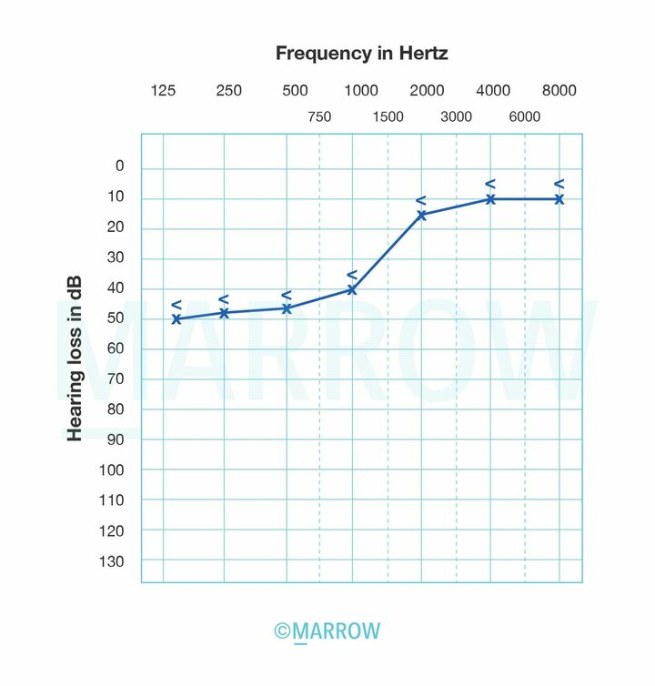
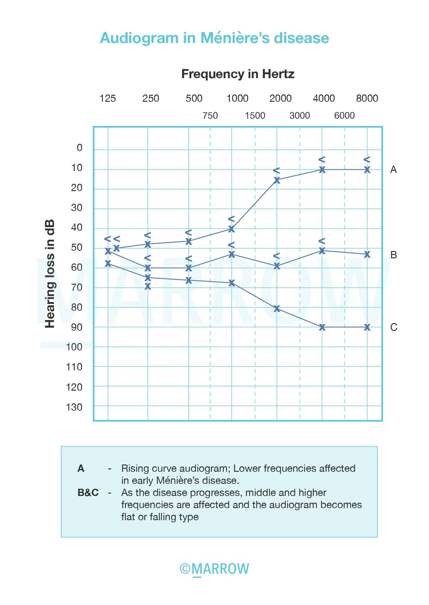
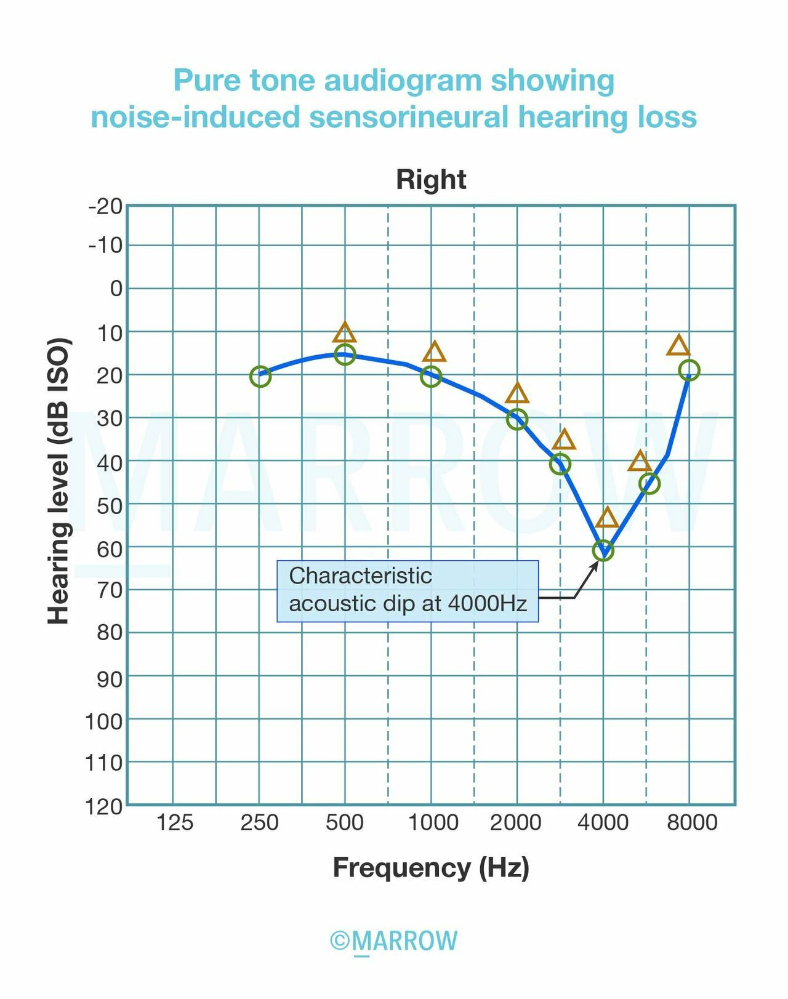

`Q11029`

---

## 34. The Caloric Test

**PEARL:** **COLD water irrigation produces nystagmus with the FAST phase beating TOWARD
THE OPPOSITE (contralateral) ear; WARM water beats toward the SAME side** — the mnemonic
**COWS: Cold Opposite, Warm Same** (referring to the fast phase).

**UNDERSTAND:** Irrigation sets up a **convection current in the endolymph of the horizontal
semicircular canal**. **Warm water makes endolymph rise, producing AMPULLOPETAL flow that
EXCITES the crista** — mimicking a head turn toward that side, so the eyes drift slowly
away and the corrective fast phase beats **toward** the irrigated ear. **Cold water does the
reverse (ampullofugal, inhibitory)**, so the fast phase beats **away**. Since nystagmus is
named for its **fast (corrective, cortical) phase**, all the confusion in this question
comes from forgetting that the **slow phase is the true vestibular response**.

**MUST KNOW:**

- **Position the patient supine with the head raised 30°** — this brings the **horizontal (lateral) semicircular canal into the vertical plane**, maximising the convection effect. (In an unconscious patient tested for brainstem function, the head is at 30° too.)
- **Fitzgerald–Hallpike bithermal test: 30 °C and 44 °C water for 40 seconds each ear**, measuring the duration of nystagmus. Results: **CANAL PARESIS (reduced response on one side — a peripheral vestibular lesion, e.g. vestibular schwannoma, Ménière disease, vestibular neuritis) or DIRECTIONAL PREPONDERANCE (a central or compensating lesion).** A **dead labyrinth gives no response at all** to ice-water.
- **In the COMATOSE patient (oculovestibular reflex): an INTACT brainstem gives tonic DEVIATION of the eyes TOWARD the cold-irrigated ear with NO fast phase** (the cortex generates the fast phase, so it is absent in coma). **No response at all = brainstem death** (part of the apnoea/brainstem testing battery). **Always check the tympanic membrane is intact first.**
- Related bedside tests: **DIX–HALLPIKE manoeuvre — diagnoses BPPV (posterior canal), showing rotatory geotropic nystagmus with LATENCY, FATIGABILITY and adaptation; treated with the EPLEY repositioning manoeuvre.** **Head impulse test (HINTS examination) distinguishes peripheral vestibular neuritis from a central (stroke) cause of acute vertigo.**
- **Peripheral nystagmus: unidirectional, horizontal-rotatory, suppressed by visual fixation, with severe vertigo. CENTRAL nystagmus: may be vertical or direction-changing, NOT suppressed by fixation, with milder vertigo but other neurological signs.**

**EXAM CONNECTION:** Two facts must be right — the **plane (horizontal)** and the
**direction (opposite for cold)**. Vertical nystagmus options are always wrong for caloric
testing.

**REMEMBER:** *COWS — Cold Opposite, Warm Same.*

`Q11214`

---

## 35. Superior Semicircular Canal Dehiscence Syndrome

**PEARL:** Superior semicircular canal dehiscence causes a **CONDUCTIVE hearing loss with
NORMAL middle ear function — not sensorineural loss.** The classic features are
**TULLIO's phenomenon (sound-induced vertigo/nystagmus), a POSITIVE FISTULA TEST
(pressure-induced vertigo — Hennebert's sign), autophony, pulsatile tinnitus, and
gaze-evoked/oscillopsia**.

**UNDERSTAND:** The labyrinth normally has exactly **two mobile windows** — oval and round.
A dehiscence in the bone over the superior canal creates a **THIRD MOBILE WINDOW**, and this
single fact explains every feature. Sound energy entering the oval window now **leaks out
through the dehiscence instead of driving the cochlea**, so air conduction thresholds rise
(**conductive loss**), while **bone conduction actually IMPROVES (thresholds can be
supranormal, better than 0 dB)** — producing a large air–bone gap **with an intact ossicular
chain and NORMAL acoustic reflexes**, which is precisely what distinguishes it from
otosclerosis. Sound and pressure now also deflect the superior canal's cupula, causing
**vertigo and vertical-torsional nystagmus in the plane of that canal**.

**MUST KNOW:**

- **The key discriminator from OTOSCLEROSIS: in dehiscence the STAPEDIAL (acoustic) REFLEXES are PRESENT and the tympanogram is normal; in otosclerosis the reflexes are ABSENT.** Missing this leads to an unnecessary stapedectomy.
- **VEMP (vestibular evoked myogenic potentials) show LOWERED thresholds and increased amplitudes** — a hallmark. **Diagnosis is confirmed by HIGH-RESOLUTION CT of the temporal bone with reformats in the plane of the superior canal (Pöschl and Stenver views).**
- **Autophony** — hearing one's own voice, heartbeat, eye movements or footsteps abnormally loudly — is the symptom patients find most distressing. (Contrast the autophony of a **patulous Eustachian tube**, which varies with posture and improves when lying down.)
- **Treatment: reassurance and avoidance of triggers for mild cases; surgical PLUGGING or RESURFACING of the canal (middle fossa or transmastoid approach) for disabling symptoms.**
- **Fistula test:** pressure applied to the external canal (tragal pressure or a Siegle speculum) produces vertigo/nystagmus — positive in **a labyrinthine fistula from cholesteatoma, post-stapedectomy, and third-window lesions**. A **false-negative** occurs when a fistula is sealed by granulation tissue or the labyrinth is dead.

**EXAM CONNECTION:** "Which is NOT a feature?" — the answer is **sensorineural hearing
loss**; the loss is **conductive with an intact middle ear**.

**REMEMBER:** *A third window lets sound escape — air conduction fails while bone conduction
gets better than normal.*

`Q11253`

---

## 36. Reinke Oedema

**PEARL:** **Bilateral, diffuse, translucent "bag-like" or fusiform swelling of the whole
membranous vocal cords** in a **middle-aged smoker with progressive DEEPENING of the voice
and hoarseness** = **REINKE OEDEMA (polypoid chorditis)**. After failed voice therapy and
smoking cessation, the treatment is **DECORTICATION (microflap removal of a strip of
epithelium with evacuation of the oedema), done as a STAGED procedure — one cord at a
time.**

**UNDERSTAND:** The oedema collects in **Reinke's space — the potential subepithelial layer
of the lamina propria that is normally acellular and avascular**, and whose looseness is what
allows the mucosal wave of phonation. Chronic irritation (**smoking, voice abuse, reflux,
hypothyroidism**) makes its capillaries leak, and because the space has **no lymphatics**,
the fluid cannot clear. The added mass **lowers the frequency of vibration**, which is why
the voice **deepens** — women may be mistaken for men on the telephone.

**MUST KNOW:**

- **Staging the surgery (never operate on both cords at the same sitting) prevents an ANTERIOR GLOTTIC WEB from raw opposing surfaces.**
- **Smoking cessation is essential** — the oedema recurs if it continues; also treat reflux and hypothyroidism.
- **Reinke oedema is NOT premalignant in itself, but the smoking history means any suspicious area must be biopsied** — leukoplakia or an irregular cord raises the question of carcinoma.
- Differential of hoarseness lasting **more than 3 weeks in a smoker over 40 = LARYNGEAL CARCINOMA until proven otherwise → urgent laryngoscopy.** **Glottic tumours present earliest (hoarseness) and have the best prognosis** — the cords have almost **no lymphatics**, so nodal spread is late; **supraglottic tumours present late with nodes**.
- Other benign cord lesions: **vocal NODULES ("singer's nodes") — bilateral, at the junction of the anterior and middle thirds, in voice abusers and children, treated with SPEECH THERAPY; vocal POLYP — usually unilateral, pedunculated, after a single episode of vocal strain, treated surgically; contact ulcer/granuloma — posteriorly, from reflux or intubation.**

**EXAM CONNECTION:** "Deepening of the voice" plus **bilateral translucent bag-like cords**
is unique to Reinke oedema. Laryngectomy and radiotherapy options are traps for a **benign**
condition.

**REMEMBER:** *Smoke fills the floppy space under the epithelium — the cords get heavy and
the voice drops.*

**IMAGES:**
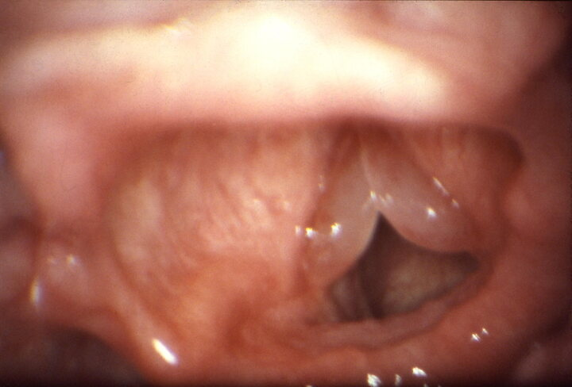

`Q11815`

---

## 37. Gradenigo Syndrome (Petrous Apicitis)

**PEARL:** The triad of **(1) persistent ear discharge, (2) deep-seated retro-orbital or
temporal pain (trigeminal, V1) and (3) SIXTH NERVE PALSY with failure of abduction and
diplopia** = **GRADENIGO SYNDROME from PETROUS APICITIS** — spread of chronic middle ear
infection into the petrous apex.

**UNDERSTAND:** The anatomy explains all three components. Infection reaching the **petrous
apex** inflames two structures that lie immediately adjacent to it: the **abducens nerve as
it passes through DORELLO'S CANAL beneath the petroclinoid (Gruber's) ligament** — producing
an isolated VI palsy — and the **trigeminal (Gasserian) ganglion in MECKEL'S CAVE** on the
anterior surface of the petrous apex — producing severe deep facial and retro-orbital pain.
Only at this one point do the two nerves lie together on inflamed bone, which is why the
triad is so specific.

**MUST KNOW:**

- **Pneumatised petrous apices (in ~30% of people) are what allow the infection to spread there**, via a postero-superior tract (around the labyrinth) or an antero-inferior tract (around the cochlea).
- **Investigation: HRCT of the temporal bone (bone destruction, opacified apex cells) and contrast MRI** (to detect intracranial extension). **Treatment: high-dose intravenous antibiotics with mastoidectomy and surgical drainage of the petrous apex if there is no response.**
- **Other complications of CHRONIC SUPPURATIVE OTITIS MEDIA (especially the unsafe/atticoantral type with CHOLESTEATOMA): mastoiditis, facial nerve palsy, labyrinthitis and labyrinthine fistula, LATERAL SINUS THROMBOPHLEBITIS (picket-fence fever, GRIESINGER's sign — tenderness over the mastoid emissary vein; positive TOBEY–AYER test), extradural and subdural abscess, MENINGITIS (the commonest intracranial complication) and BRAIN ABSCESS (temporal lobe or cerebellum — the commonest cause of death).**
- **A cholesteatoma is keratinising squamous epithelium in the middle ear — it erodes bone by pressure and enzymes, so it is "unsafe" and requires SURGERY (mastoidectomy), never medical management alone.**
- **Any new cranial nerve palsy, severe pain, vertigo, headache or fever in a patient with chronic ear discharge means a COMPLICATION until proven otherwise** — image urgently.

**EXAM CONNECTION:** The image of failed abduction plus ear discharge and retro-orbital pain
completes the triad. Lateral sinus thrombophlebitis gives fevers and rigors; brain abscess
gives raised ICP and focal signs.

**REMEMBER:** *Discharge, deep pain and a lazy lateral rectus — the infection has reached
the petrous apex.*

**IMAGES:**
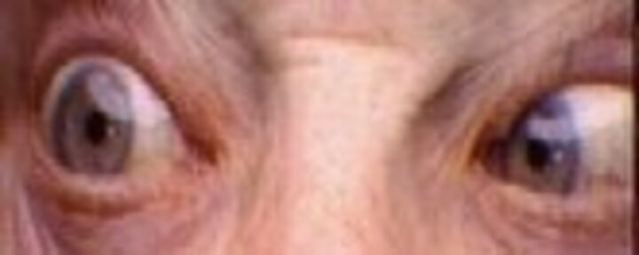

`Q11818`

---

## 38. Interpreting Rinne and Weber Together

**PEARL:** **Rinne POSITIVE (AC > BC) in BOTH ears + Weber LATERALISING TO THE RIGHT =
SENSORINEURAL hearing loss in the LEFT ear.** Neither test alone is sufficient — Rinne
establishes that neither ear has a conductive defect, and Weber then identifies which ear is
the abnormal one.

**UNDERSTAND:** Weber lateralises by one of two rules: **toward the ear with CONDUCTIVE loss**
(ambient masking noise is excluded, so bone-conducted sound seems louder there) or **away
from the ear with SENSORINEURAL loss** (that cochlea simply hears less). Since both Rinnes
are positive, conduction is intact bilaterally — so the lateralisation must obey the second
rule, and the sound going **to the right means the LEFT cochlea is the deaf one**.

**MUST KNOW:**

| Rinne                     | Weber                            | Interpretation                                                                                    |
| ------------------------- | -------------------------------- | ------------------------------------------------------------------------------------------------- |
| **Positive both ears**    | **Central**                      | **Normal** (or equal bilateral SNHL)                                                              |
| **Positive both ears**    | **Lateralised to one side**      | **SNHL in the OPPOSITE ear**                                                                      |
| **NEGATIVE in one ear**   | **Lateralised to THAT ear**      | **CONDUCTIVE loss in that ear**                                                                   |
| **"Negative" in one ear** | **Lateralised to the OTHER ear** | **FALSE-NEGATIVE RINNE — a DEAD/severely deaf ear** (sound crosses the skull to the good cochlea) |

- **Rinne is "positive" when AC > BC — which is NORMAL.** It turns **negative only when the air–bone gap exceeds about 15–20 dB**, so a mild conductive loss can be missed.
- **Always MASK the opposite ear (Barany noise box)** when a false-negative Rinne is suspected.
- **Absolute bone conduction (ABC) test** compares the patient's bone conduction with the examiner's: **reduced ABC = sensorineural loss**; normal ABC with a negative Rinne = conductive.
- Use a **512 Hz fork**; confirm and quantify with **pure tone audiometry** (an air–bone gap defines conductive loss).
- **Common causes: CONDUCTIVE — wax, otitis media with effusion, perforation, ossicular discontinuity, OTOSCLEROSIS (Carhart's notch at 2 kHz, absent stapedial reflexes); SENSORINEURAL — presbycusis, noise, ototoxicity, Ménière disease, vestibular schwannoma (unilateral SNHL with poor speech discrimination → MRI).**

**EXAM CONNECTION:** Work through the two tests in order — **Rinne first (is there a
conductive component?), then Weber (which side?)** — and apply the "away from" rule for
sensorineural loss.

**REMEMBER:** *Both Rinnes normal means the problem is the nerve — and Weber runs away from
the bad cochlea.*

**IMAGES:**
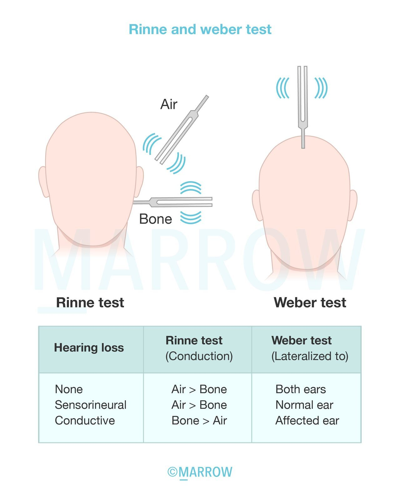

`Q11842`

---

## 39. Benign Paroxysmal Positional Vertigo and the Epley Manoeuvre

**PEARL:** **Brief (<1 minute) positional vertigo triggered by turning over in bed, with NO
hearing loss or tinnitus and a positive DIX–HALLPIKE test = BPPV of the POSTERIOR
semicircular canal.** The **EPLEY (canalith repositioning) manoeuvre** cures it by moving the
otoconia **FROM the POSTERIOR SEMICIRCULAR CANAL BACK INTO THE UTRICLE**.

**UNDERSTAND:** The otoconia are **calcium carbonate crystals that normally sit on the
utricular macula**. When they break free and fall into the **posterior canal (the most
dependent canal in the upright head)**, any head movement in that canal's plane makes them
slide, dragging endolymph and deflecting the cupula — so the canal signals rotation that is
not happening. The Epley manoeuvre simply uses **gravity through a sequence of head positions
to walk the crystals around the canal loop and tip them back into the utricle**, where they
are harmless and reabsorbed. It is a mechanical cure for a mechanical problem — which is why
drugs do not work.

**MUST KNOW:**

- **Dix–Hallpike (diagnostic): rapid movement from sitting to supine head-hanging with the head turned 45° to the tested side; a positive test produces, after a LATENCY of 2–20 seconds, transient TORSIONAL, UP-BEATING (geotropic) nystagmus lasting <60 seconds, with FATIGABILITY on repetition and reversal on sitting up.**
- **LATERAL (horizontal) canal BPPV is diagnosed by the SUPINE ROLL (Pagnini–McClure) test and treated by the BARBECUE ROLL (Lempert) manoeuvre.** **Brandt–Daroff exercises** are the home alternative.
- **Vestibular suppressants (betahistine, prochlorperazine) are NOT the treatment** — they may relieve nausea but hinder central compensation; the repositioning manoeuvre is definitive (>80% success).
- **Peripheral vs central nystagmus: PERIPHERAL — unidirectional, horizontal-rotatory, WITH latency and fatigability, SUPPRESSED by visual fixation, severe vertigo. CENTRAL — may be vertical or direction-changing, NO latency, NOT fatigable, NOT suppressed by fixation, mild vertigo but with other neurological signs.** **Vertical or purely torsional nystagmus without latency demands imaging for a posterior fossa lesion.**
- Differentiate from **vestibular neuritis (a single prolonged attack over days, no hearing loss), labyrinthitis (with hearing loss), and MÉNIÈRE disease (episodic vertigo lasting 20 min–24 h WITH fluctuating hearing loss, tinnitus and aural fullness).**

**EXAM CONNECTION:** The direction of transfer is the answer — **canal → utricle**, not the
reverse (which is how the disease starts).

**REMEMBER:** *Crystals fell into the canal; Epley rolls them home to the utricle.*

**IMAGES:**
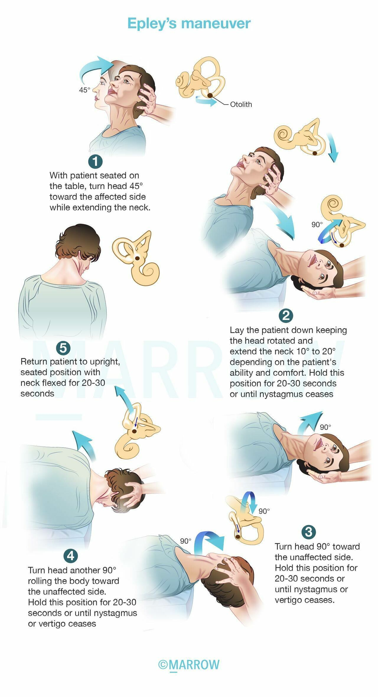

`Q11849`

---

## 40. Reading Vestibular Nystagmus

**PEARL:** In peripheral vestibular disease the **FAST phase beats AWAY from the hypoactive (diseased) labyrinth**. Horizontal nystagmus with the **slow phase to the left** means the fast phase is to the **right** → **left hypoactive labyrinth**.

**UNDERSTAND:** The two labyrinths push the eyes in opposite directions and normally balance. Kill one side and the intact side's unopposed tonic drive **slowly deviates the eyes toward the dead ear**; the brainstem then snaps them back with a **fast corrective saccade toward the healthy ear**. The slow phase is the vestibular lesion; the fast phase is just the correction — but by convention **nystagmus is named after the fast phase**.

**MUST KNOW:**

- **Hypoactive (destructive) lesions:** vestibular neuronitis, labyrinthitis, vestibular schwannoma, labyrinthectomy — fast phase to the **healthy** side.
- **Hyperactive (irritative) lesions:** early Ménière's, BPPV — fast phase **toward** the affected side.
- **Canal determines the plane:** **horizontal (lateral) canal → horizontal nystagmus**; **posterior and superior canals → vertical/torsional nystagmus**. So a purely horizontal nystagmus **excludes** posterior-canal BPPV.
- **Alexander's law** — the nystagmus intensifies on gaze toward the fast phase.
- **Peripheral nystagmus** is unidirectional, horizontal-torsional, **suppressed by visual fixation**, with severe vertigo. **Central nystagmus** may be **vertical or direction-changing**, is **not suppressed by fixation**, and has milder vertigo with prominent neurological signs.
- **Caloric mnemonic COWS** — **C**old **O**pposite, **W**arm **S**ame (direction of the **fast** phase).

**EXAM CONNECTION:** The stem gives the **slow** component to bait an error. Convert to the fast phase first, then apply "fast beats away from the dead ear."

**REMEMBER:** *The fast phase runs away from the sick ear.*

`MF4984`

---

## 41. Recurrent Respiratory Papillomatosis

**PEARL:** **Grape-like/verrucous pink projections on the vocal cords = laryngeal papillomatosis**, caused by **HPV 6 and 11**, with a **high recurrence rate and low malignant potential**.

**UNDERSTAND:** HPV 6 and 11 are the **low-risk** genotypes — they drive **epithelial proliferation** but do not efficiently inactivate p53/Rb. That is exactly why the disease **recurs relentlessly but rarely transforms**. The same two serotypes cause **condyloma acuminatum**, and the juvenile form is acquired by **vertical transmission during vaginal delivery**.

**MUST KNOW:**

- **Juvenile-onset (2–5 years)** — more aggressive, multiple lesions, involves **supraglottis and glottis**, may need repeated debulking; **adult-onset (30–50 years, male)** — less aggressive, favours the **anterior vocal cords**.
- Presents with **progressive hoarseness → aphonia → stridor and dyspnoea**.
- Treatment: **microlaryngeal surgery with CO₂ laser or microdebrider**. **Avoid tracheostomy** — it seeds the disease distally into the trachea. Adjuncts: **cidofovir, bevacizumab, interferon**; **HPV vaccination** reduces incidence.
- **Iatrogenic seeding** happens during intubation and instrumentation — a genuine exam point.
- Contrast the other cord lesions: **vocal nodules** (bilateral, junction of anterior 1/3–posterior 2/3, "singer's nodules"); **polyp** (unilateral, pedunculated); **Reinke's oedema** (diffuse, bilateral, smoker's, low-pitched voice); **leukoplakia/carcinoma** (white plaque, fixed cord).

**EXAM CONNECTION:** Image → identify. Then a follow-up on serotypes (**6 and 11**) or on why tracheostomy is avoided.

**REMEMBER:** *Low-risk HPV — comes back forever, turns malignant almost never.*

`MC7498`

---

## 42. Ménière's Disease — The Treatment Ladder

**PEARL:** **Labyrinthectomy is the definitive treatment for intractable vertigo** in Ménière's — the **highest vertigo-control rate (> 95%)** — but it **destroys all hearing** in that ear.

**UNDERSTAND:** Vertigo control is proportional to how completely the vestibular input is abolished. Labyrinthectomy removes the **end organ itself**, so nothing remains to misfire — hence the best control. The price is total sensorineural deafness, which is why it is reserved for the ear that has **no serviceable hearing left**.

**MUST KNOW:**

- Stepwise: **low-salt diet + diuretics (acetazolamide/thiazide) + betahistine + vestibular sedatives** → **intratympanic steroid** → **intratympanic gentamicin** (chemical ablation; **selectively toxic to type I hair cells**, hearing-sparing in most) → **endolymphatic sac decompression** → **vestibular neurectomy** (78–90% control, **hearing preserved**) → **labyrinthectomy** (> 95%, **hearing destroyed**).
- Choose by hearing: **serviceable hearing → vestibular neurectomy**; **no useful hearing → labyrinthectomy**.
- Pathology is **endolymphatic hydrops**. Classic tetrad: **episodic vertigo (20 min–12 h), fluctuating low-frequency SNHL, tinnitus, aural fullness**.
- **Recruitment is positive** (cochlear pathology); **glycerol test** and **electrocochleography (raised SP/AP ratio)** support the diagnosis.
- **Lermoyez syndrome** (hearing improves as vertigo starts) and **Tumarkin's otolithic crisis** (drop attacks) are Ménière's variants.

**EXAM CONNECTION:** Read the qualifier: **"definitive"** → labyrinthectomy; **"first-line"** → salt restriction and diuretics; **"hearing-preserving surgery"** → vestibular neurectomy.

**REMEMBER:** *Take out the labyrinth and the vertigo has nothing left to come from.*

`MC5283`

---

## 43. Parapharyngeal Space — Pre-Styloid vs Post-Styloid

**PEARL:** **Trismus belongs to the PRE-styloid compartment** (medial pterygoid spasm). The **post-styloid** compartment gives **cranial nerve IX–XII palsies, Horner's syndrome and torticollis** — but **no trismus**.

**UNDERSTAND:** The **styloid process and its fascia** split the space into a **muscular/glandular anterior** part and a **neurovascular posterior** part. The contents dictate the signs exactly: the pre-styloid compartment abuts the **medial pterygoid and tonsil**, the post-styloid contains the **carotid sheath, lower cranial nerves and sympathetic chain**.

**MUST KNOW:**

- **Pre-styloid contents:** fat, **deep lobe of parotid**, internal maxillary artery, lymph nodes. Signs: **trismus, medial displacement of tonsil and tonsillar fossa, marked odynophagia, external swelling at the angle of the jaw**. Tumours here are typically **pleomorphic adenoma**.
- **Post-styloid contents:** **internal carotid artery, internal jugular vein, CN IX, X, XI, XII, sympathetic chain**. Signs: bulge **behind the posterior pillar**, **vocal cord palsy (X), dysphagia, tongue deviation (XII), shoulder weakness (XI), Horner's syndrome, torticollis**. Tumours here are typically **paraganglioma/schwannoma**.
- Complications: **internal jugular thrombosis, carotid blowout, Lemierre syndrome** (*Fusobacterium necrophorum*, septic IJV thrombophlebitis with pulmonary emboli).
- The space is shaped like an **inverted pyramid** — skull base to hyoid.

**EXAM CONNECTION:** "Which is NOT a feature of post-styloid infection" → **trismus**. The reasoning is purely anatomical — no muscle of mastication lies behind the styloid.

**REMEMBER:** *Muscles in front, nerves behind — trismus is a muscle sign.*

`MB5373`

---

## 44. Objective vs Subjective Hearing Tests

**PEARL:** **Objective (no patient response needed): BERA, OAE, tympanometry/impedance audiometry, acoustic reflex.** **Subjective: pure-tone audiometry, speech audiometry, tuning fork tests, free-field audiometry.**

**UNDERSTAND:** The dividing line is whether the result depends on the patient **volunteering a response**. Objective tests record a **physiological signal** — a brainstem potential, a cochlear emission, an eardrum compliance measurement — so they work in **neonates, malingerers and the unconscious**. That is precisely why newborn screening uses OAE and BERA.

**MUST KNOW:**

- **OAE** tests **outer hair cell** function; the sound generated travels **backwards** through cochlea → ossicles → ear canal. Therefore an **absent OAE could be middle ear disease, not cochlear** — which is why you add **tympanometry** (to clear the middle ear) and **speech audiometry** (to separate cochlear from retrocochlear).
- **BERA waves (E-COLI-MA): I** distal cochlear nerve, **II** proximal cochlear nerve, **III** cochlear nucleus, **IV** superior olivary complex, **V** lateral lemniscus, **VI–VII** inferior colliculus. **Wave V is the most robust** and is used for threshold estimation.
- BERA interpretation: **conductive/cochlear → wave I delayed but I–V interpeak latency normal**; **retrocochlear (acoustic neuroma) → prolonged I–V interpeak latency (> 4.4 ms) or interaural difference > 0.2 ms**.
- **Tympanogram types: A** normal; **As** shallow (**otosclerosis**); **Ad** deep (**ossicular discontinuity, flaccid TM**); **B** flat (**glue ear / effusion / perforation**); **C** negative pressure (**Eustachian tube dysfunction**).
- **Auditory pathway (E-COLI-MA):** **Eighth nerve/spiral ganglion → Cochlear nucleus → superior Olivary complex → Lateral lemniscus → Inferior colliculus → Medial geniculate body → Auditory cortex**.

**EXAM CONNECTION:** Asked as a grouping question (which are objective) and as a sequencing question (order the auditory pathway). Both are pure recall — memorise the mnemonic.

**REMEMBER:** *If the patient has to answer, it is subjective.*

`MD6949, MF9109, MD6951, MF7320`

---

## 45. Cochlear Hair Cells — Inner vs Outer

**PEARL:** **One row of INNER hair cells, three rows of OUTER.** The **inner hair cells transmit hearing** (**95% of afferent spiral ganglion fibres**); the **outer hair cells are the amplifier**, receiving mainly **efferent** olivocochlear supply.

**UNDERSTAND:** It seems backwards that the minority cell type carries nearly all the signal. The resolution: **outer hair cells are motors, not sensors** — they contract via **prestin** to amplify basilar membrane motion (the **cochlear amplifier**, ~40–50 dB of gain), sharpening the tuning that the inner hair cells then report to the brain.

**MUST KNOW:**

- **Inner hair cells:** ~3,500, single row, **flask-shaped**, **95% afferent** innervation — the true sensory receptor.
- **Outer hair cells:** ~12,000–20,000, three rows, **cylindrical**, mainly **efferent** (olivocochlear bundle) — the source of **otoacoustic emissions**.
- Because OAEs come from outer hair cells, **OAE is absent early in noise-induced and ototoxic damage** — outer hair cells die first. This is what makes OAE a sensitive screening test.
- **Auditory neuropathy/dyssynchrony:** **OAE present but BERA absent** — outer hair cells alive, neural transmission failed. A crucial pattern to recognise in a child failing screening.
- **Tonotopy:** **high frequencies at the base**, **low frequencies at the apex** of the cochlea.
- **Recruitment** (abnormal growth of loudness — "speak up, don't shout") is a **cochlear** sign, tested by **ABLB**; **tone decay and acoustic reflex decay** indicate **retrocochlear** disease. **SISI 70–100% = cochlear; 0–20% = retrocochlear.**

**EXAM CONNECTION:** The false statement is always the one that credits **outer hair cells with initiating the signal to the brain** — they modulate; the inner cells transmit. Separately, the "speak louder / stop shouting" stem → **recruitment → cochlear pathology**.

**REMEMBER:** *Inner cells listen, outer cells amplify.*

`MG1166, MB8894`

---

## 46. Onodi Cells and FESS Complications

**PEARL:** **Onodi cells** are the **posterior-most ethmoidal cells that pneumatise laterally/superiorly around the sphenoid** — the **optic nerve runs in their lateral wall**, so operating on them risks **blindness**.

**UNDERSTAND:** The danger is a mismatch between expectation and anatomy. The surgeon expects to be in the ethmoid, safely away from the optic nerve; an Onodi cell **carries the ethmoid air cell up beside the optic canal**, so the nerve is suddenly a millimetre from the instrument, sometimes with **dehiscent bone**. Recognition on preoperative CT is the only protection.

**MUST KNOW:**

- **Haller (infraorbital) cells** — in the **floor of the orbit / roof of the maxillary sinus**; narrow the infundibulum → **recurrent maxillary sinusitis**.
- **Agger nasi cell** — the most anterior ethmoid cell, just **anterior to the middle turbinate attachment**; obstruction → **frontal sinusitis**.
- **Ethmoid bulla** — largest anterior ethmoid cell, forms the **posterior boundary of the hiatus semilunaris**.
- **Ostiomeatal complex** — the common drainage pathway of **maxillary, anterior ethmoid and frontal** sinuses; the target of FESS.
- Other FESS complications: **CSF leak** (thin **lateral lamella of the cribriform plate**, graded by **Keros classification**), **orbital haematoma** and **medial rectus injury** (lamina papyracea breach), **internal carotid injury** in the sphenoid.
- **Pott's puffy tumour** = **subperiosteal abscess of the FRONTAL bone** from frontal sinusitis with osteomyelitis; a doughy forehead swelling. Adults only — infants have no frontal sinus. **CT** is the investigation; needs **drainage plus prolonged antibiotics** because of the risk of **subdural/epidural abscess and dural sinus thrombosis**.

**EXAM CONNECTION:** Match the cell to its complication: **Onodi → optic nerve/blindness; Haller → maxillary sinusitis; Agger nasi → frontal sinusitis**.

**REMEMBER:** *Onodi hides the optic nerve; Haller blocks the maxilla.*

`MC6411, MC7584`

---

## 47. Atrophic Rhinitis (Ozaena)

**PEARL:** **Roomy nasal cavity + greenish-grey foul crusts + MERCIFUL ANOSMIA** = atrophic rhinitis. The patient cannot smell their own stench.

**UNDERSTAND:** The turbinate bones and mucosa **atrophy and resorb**, so the airway is paradoxically **wide open yet the patient feels blocked** — because the sensation of patency depends on **normal mucosal airflow receptors**, which are gone. The same atrophy destroys the olfactory epithelium, which is why the anosmia is "merciful."

**MUST KNOW:**

- Typically affects **young women**, worse at puberty, may improve after menopause; associated with **Klebsiella ozaenae**, iron deficiency, poor nutrition, and post-surgical/post-radiation causes (**secondary/"empty nose syndrome"**).
- Epistaxis follows **removal of crusts** — a classic detail.
- Treatment: **nasal douching (alkaline solution — sodium bicarbonate : sodium biborate : sodium chloride = 1:1:2)**, **Kemicetine antiozaena** (chloramphenicol + oestradiol + vitamin D₂), **25% glucose in glycerine**, systemic **streptomycin**. Surgery: **Young's operation (nostril closure)** or **submucosal implants** to narrow the cavity.
- Contrast **rhinitis medicamentosa** (rebound from topical decongestants) and **rhinitis sicca** (anterior, in dusty occupations).
- **Rhinosporidiosis** is a separate nasal-mass entity: **Rhinosporidium seeberi**, now classified as an **aquatic protist (Mesomycetozoea/DRIP clade), NOT a fungus** — **cannot be cultured**. Gives a **friable, vascular, strawberry-like polypoid mass studded with white sporangia** on the septum, bleeding easily; treated by **excision with cautery of the base** + dapsone.

**EXAM CONNECTION:** "What else would you see" → **roomy nasal cavity** — counter-intuitive against the complaint of obstruction, which is exactly why it is asked. Rhinosporidium's classification (**protist, not fungus**) is a separate favourite.

**REMEMBER:** *A wide nose that feels blocked and smells terrible to everyone but the patient.*

`MF1488, MB4740`

---

## 48. Laryngeal Nerves — Which Injury Causes What

**PEARL:** **Internal laryngeal nerve = sensation ABOVE the cords → its injury abolishes the cough reflex and causes aspiration, with a NORMAL voice.** **Bilateral recurrent laryngeal nerve injury → stridor and failed extubation**, needing emergency tracheostomy.

**UNDERSTAND:** The two nerves split the larynx at the cords. The **internal laryngeal (from superior laryngeal) is purely sensory above the cords** — the afferent limb of the cough reflex. The **recurrent laryngeal is motor to every intrinsic muscle except cricothyroid, plus sensory below the cords**. Lose both recurrent nerves and only the **cricothyroid (external laryngeal supply)** survives — it is an **adductor/tensor**, so the cords are pulled to the **median/paramedian** position and the airway shuts.

**MUST KNOW:**

- **Unilateral RLN palsy** → **hoarseness**, often compensated and sometimes asymptomatic; airway safe.
- **Bilateral RLN palsy** → cords in **median/paramedian** position → **stridor and dyspnoea with a surprisingly good voice**; **failure to extubate after thyroidectomy** is the classic stem. Manage with **tracheostomy**, later **cordotomy/arytenoidectomy or lateralisation**.
- **External laryngeal nerve** (to cricothyroid) → loss of high-pitched voice and vocal fatigue — the "**singer's nerve**", closely related to the **superior thyroid artery**.
- The **RLN is closely related to the inferior thyroid artery** — the key surgical relation.
- Non-surgical causes of bilateral palsy: **thyroid and cervical oesophageal carcinoma, cervical lymphadenopathy**.
- **Tensor tympani** is supplied by the **nerve to medial pterygoid, from the MAIN TRUNK of the mandibular nerve** — the same branch supplies **tensor veli palatini**; both are **first-arch** muscles.
- **High tracheostomy** (above the thyroid isthmus, at the 1st tracheal ring) is indicated **only in laryngeal carcinoma** planned for later laryngectomy — otherwise avoided because of **subglottic stenosis and cricoid perichondritis**.

**EXAM CONNECTION:** The discriminator is always **voice vs airway**: aspiration with normal voice → internal laryngeal; stridor after thyroidectomy → bilateral RLN; weak high notes → external laryngeal.

**REMEMBER:** *Sensation above, motor below — and both recurrents gone means the airway closes.*

`MD2326, MF1506, MA7135, MC2264`

---

## 49. Congenital Cholesteatoma — Levenson's Criteria

**PEARL:** A **white pearly mass behind an INTACT tympanic membrane** in the **anterosuperior quadrant** of a child = **congenital cholesteatoma**, diagnosed by **Levenson's criteria**.

**UNDERSTAND:** Congenital cholesteatoma arises from an **embryonic epidermoid rest** in the middle ear, not from retraction or perforation of the drum. Every one of Levenson's criteria therefore exists to **exclude an acquired origin** — an intact drum, no discharge, no previous surgery.

**MUST KNOW:**

- **Levenson's criteria:** white mass behind a **normal TM**; **normal pars tensa and pars flaccida**; **no history of otorrhoea or perforation**; **no previous otological surgery**; exclusion of canal atresia. **Previous otitis media does NOT exclude the diagnosis** — the point most often tested.
- Presents with **painless conductive hearing loss** at low/middle frequencies; the drum is intact so there is no discharge.
- **Acquired cholesteatoma:** **primary** (attic retraction pocket, pars flaccida — Wittmaack's/Sadé theory) or **secondary** (through a marginal/attic perforation — migration or metaplasia).
- Cholesteatoma is **keratinising squamous epithelium in the middle ear** — it erodes bone through **osteoclast activation and collagenase**, causing **ossicular erosion, lateral canal fistula, facial palsy, and intracranial complications**.
- Management is **surgical** — canal wall up/down mastoidectomy; it does not resolve medically.

**EXAM CONNECTION:** Image of a white mass behind an intact drum → the follow-up is the **eponymous criteria (Levenson)**. Bent and Kuhn is for **allergic fungal sinusitis**; AAO-HNS for **Ménière's**.

**REMEMBER:** *Pearl behind an intact drum, born there, not migrated.*

`MA6024`

---

## 50. Allergic Rhinitis — The Named Signs

**PEARL:** **Allergic shiners, allergic salute (transverse nasal crease) and Dennie–Morgan lines** are signs of allergic rhinitis. **Otto Veraguth's fold** is a sign of **depression**, not allergy.

**UNDERSTAND:** Each allergic sign is a **mechanical or venous consequence** of chronic disease: shiners from **venous stasis in the infraorbital veins** caused by mucosal congestion; the crease from **months of upward nose-rubbing**; Dennie–Morgan lines from chronic **periorbital oedema and rubbing**. Understand the mechanism and none of them needs rote memory.

**MUST KNOW:**

- **ARIA classification** — **intermittent** (< 4 days/week **or** < 4 weeks) vs **persistent** (> 4 days/week **and** > 4 weeks); and **mild** vs **moderate–severe** (sleep disturbance, impairment of daily activity/school/work, troublesome symptoms).
- Type I **IgE-mediated** hypersensitivity; nasal smear shows **eosinophils**; diagnose with **skin prick testing** or **specific IgE**.
- Treatment ladder: **allergen avoidance → intranasal corticosteroid (most effective single agent) → oral/intranasal antihistamine → leukotriene antagonist → immunotherapy**.
- Associated with **asthma** ("one airway, one disease"), **allergic conjunctivitis** and **nasal polyps**.
- **Dennie–Morgan lines** are also a marker of **atopic dermatitis** — the shared atopic diathesis.

**EXAM CONNECTION:** Odd-one-out format. Otto Veraguth is the psychiatric intruder in a list of allergy signs.

**REMEMBER:** *Shiners, salute and Dennie–Morgan are allergic; Veraguth is depressed.*

`MG5831`

---

## 51. Ohngren's Line

**PEARL:** **Ohngren's line** runs from the **medial canthus to the angle of the mandible** and divides maxillary carcinoma into **suprastructure (above — poor prognosis)** and **infrastructure (below — better prognosis)**.

**UNDERSTAND:** The line is a **prognostic anatomical boundary**. Tumours above it sit next to the **orbit, ethmoids, skull base and pterygopalatine fossa** — they present late and are hard to clear surgically. Tumours below it grow into the **oral cavity and alveolus**, become symptomatic early (loose teeth, ill-fitting denture) and are resectable.

**MUST KNOW:**

- Suprastructure tumours present with **proptosis, diplopia, epiphora, cheek/facial numbness (infraorbital nerve)** — signs of orbital and skull base extension.
- Infrastructure tumours present with **loosening of teeth, alveolar swelling, oro-antral fistula, ill-fitting dentures**.
- **Ledermann's classification** uses the **two horizontal lines of Sébileau** to divide the region into suprastructure, mesostructure and infrastructure.
- Other named lines: **Frankfort plane** (infraorbital rim to superior border of EAC — the standard cephalometric horizontal); **Donaldson's line** (along the horizontal semicircular canal bisecting the posterior canal — the **endolymphatic sac lies inferior/posterior to it**); **spine of Henle** and **MacEwen's triangle** for the mastoid antrum.
- Maxillary sinus malignancy is usually **squamous cell carcinoma**; occupational risks include **hardwood dust (adenocarcinoma of the ethmoid)** and nickel.

**EXAM CONNECTION:** Image-based identification, then prognosis. Confusing Ohngren's with Donaldson's line is the usual error — one is oncological, one is otological.

**REMEMBER:** *Above the line is bad news; below the line is operable.*

`MA1180`

---

## 52. Eustachian Tube Measurements

**PEARL:** The adult Eustachian tube is **36 mm** long — **bony (lateral) 1/3 = 12 mm**, **cartilaginous (medial) 2/3 = 24 mm**. In the **infant it is 18 mm**, half the adult length.

**UNDERSTAND:** The paediatric tube is **shorter, wider and more horizontal (~10° vs 45°)** — which is precisely why **nasopharyngeal secretions reflux into the middle ear** and why **otitis media is a childhood disease**. Anatomy explains the epidemiology entirely.

**MUST KNOW:**

- Runs **downward, forward and medially at ~45°** to the horizontal in adults.
- Opens in the **anterior wall of the middle ear**, and in the nasopharynx **1–1.25 cm behind the posterior end of the inferior turbinate**.
- **Isthmus** — the narrowest part, at the bony–cartilaginous junction.
- Opened by **tensor veli palatini** (mandibular nerve) — assisted by levator veli palatini and salpingopharyngeus; hence swallowing and yawning equalise pressure. **Cleft palate → tensor palati dysfunction → persistent glue ear**.
- Compare the **external auditory canal: 24 mm total**, bony **16 mm (2/3)** and cartilaginous **8 mm (1/3)** — the **reverse proportion** to the Eustachian tube.
- **Glue ear with adenoid hypertrophy** (type B tympanogram, adenoid facies, high-arched palate) → **adenoidectomy WITH grommet insertion** — treat the obstruction *and* drain the ear; grommets alone leave the cause.

**EXAM CONNECTION:** Pure numbers. The trap is swapping the bony and cartilaginous proportions between the Eustachian tube and the ear canal.

**REMEMBER:** *Tube 36 with a cartilage majority; canal 24 with a bony majority.*

`MA6240, MF7475`

---

## 53. Choanal Atresia and CHARGE

**PEARL:** **Choanal atresia** results from persistence of the **bucconasal membrane** and is the "**A**" of **CHARGE syndrome**. **Renal angiomyolipoma is NOT part of CHARGE** — that belongs to **tuberous sclerosis**.

**UNDERSTAND:** Neonates are **obligate nasal breathers**, so **bilateral** atresia is immediately life-threatening: **cyclical cyanosis relieved by crying** (crying opens the mouth). Unilateral atresia causes only persistent unilateral discharge and may go unnoticed into adulthood.

**MUST KNOW:**

- **CHARGE: C**oloboma, **H**eart defects, **A**tresia of choanae, **R**etarded growth and development, **G**enital anomalies, **E**ar anomalies/deafness. Caused by **CHD7** mutation.
- **Bony atresia is commoner than membranous; unilateral commoner than bilateral.**
- Diagnosis: failure to pass a **catheter beyond 3–4 cm**; **CT scan is the investigation of choice** (define bony vs membranous and thickness).
- Emergency management of bilateral atresia: **oral airway (McGovern nipple)**, then transnasal endoscopic **surgical perforation with stenting**.
- Do not confuse with the other neonatal nasal obstructions: **pyriform aperture stenosis** and **nasolacrimal duct cyst**.

**EXAM CONNECTION:** "Not associated with" → **renal angiomyolipoma**. This tests whether you can separate the **CHARGE** acronym from the **tuberous sclerosis** feature list.

**REMEMBER:** *Cyanosis that improves when the baby cries — check the choanae.*

`MB4702`

---
